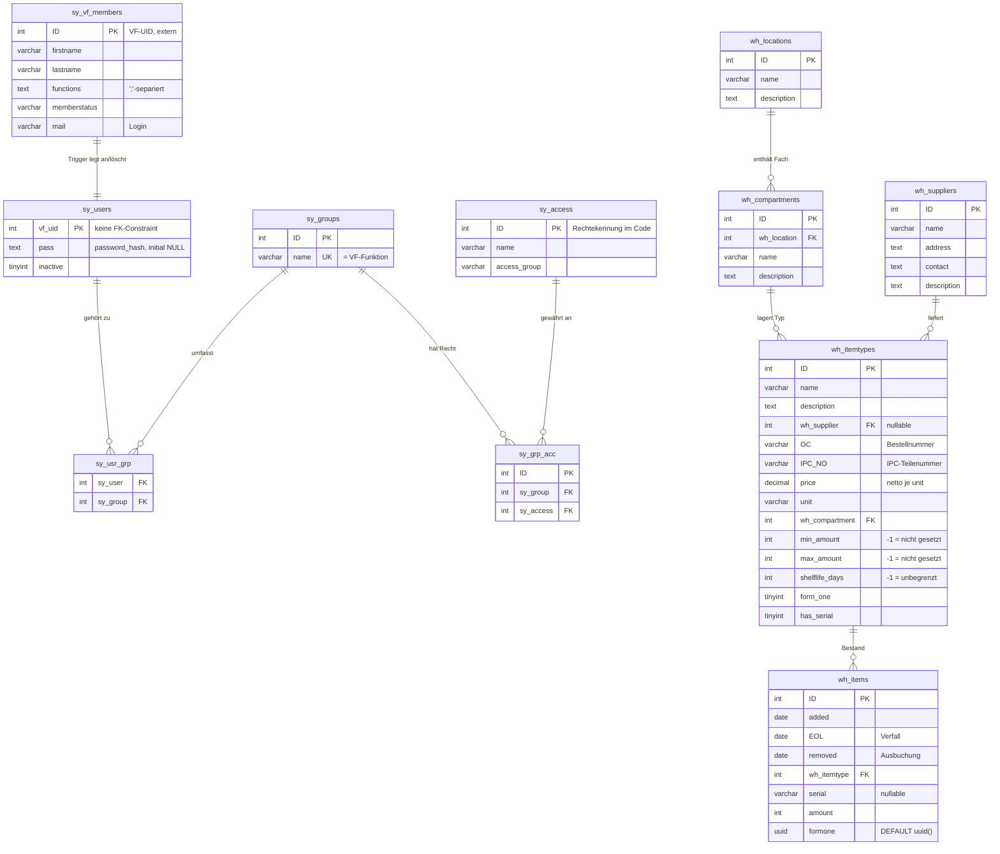

# Analyse des Bestandscodes (Phase 1)

**Stand:** 2026-07-28 · **Analysierter Zustand:** Working Tree auf `master`,
Commit `1168e8d` + nicht committete Änderungen (Lager-Seite in Arbeit)

**Beantwortet am 2026-07-28:** F1, F3, F6, F7, F13, F21, F22, F23, F24
(F5 teilweise). Daraus die Entscheidungen **E1** Bestandsbewegungen (4.4),
**E2** Break-glass über die Konsole (5.2), **E3** kein Löschen im Audit-Trail
(5.3) inkl. **E3a** Freigabedaten bleiben unverändert, **E4**
providerunabhängige Rollenzuordnung (5.4) sowie die Zielbilder
**Bestandsführung** (4.5) und **Rechte** (5.1).
**Ebenfalls am 2026-07-28:** F25–F28 und F31–F33 beantwortet, der regulatorische
Rahmen nach VO (EU) 1321/2014 recherchiert (**4.6**), daraus **E5** Klassen,
Dokumente und Zustände (**4.7**), **E6** Abgrenzung zur Warenwirtschaft (**4.8**)
und **E7** Bescheinigungsinhalt (**5.5**). Ebenfalls erledigt: F11, F14, F18,
F30, F34, F35; E3 auf **3 Jahre** korrigiert; der Form-1-Lebenszyklus
(**4.7 f**) und das Snapshot-Kriterium (**5.5**) nachgeschärft.
Dazu **E8** Qualifikationen als eigenes Konzept (**5.6**), der Form 1 als
1:n-Nachweis über mehrere Lebenslaufakten (**4.7 f**) und F29 abgeschlossen.
**Alle entwurfsrelevanten Fragen sind beantwortet; Phase 1 ist abgeschlossen.**
Das neue Projekt bekommt ein eigenes Repository (F14). Die verbliebenen offenen
Punkte betreffen ausschließlich den Bestandscode und sind für den Neubau ohne
Bedeutung.

**Zweck:** Domänenwissen aus dem bestehenden PHP/JS-Lagertool extrahieren, bevor
es durch die Laravel/Filament-Implementierung ersetzt wird. Bewertet wird der
Code nur so weit, wie es nötig ist, um „funktioniert / Stub / tot" zu
unterscheiden. **Am Bestandscode wurde nichts geändert.**

**Quellen:**

1. Quellcode (49 Dateien, ~4.400 Zeilen PHP/JS/CSS)
2. `.idea/dataSources/797df6a1-…` — DataGrip-Introspektions-Cache der lokalen
   Entwicklungsdatenbank. Enthält das **vollständige Ist-Schema** inklusive
   Trigger, Stored Procedure und Scheduled Event. Ohne diesen Cache wäre das
   Schema nur unvollständig aus dem Code rekonstruierbar gewesen — es gibt
   **keine SQL-Dumps oder Setup-Skripte im Repo** (auch nicht in der Historie).
3. Git-Historie (19 Commits, 2024-06 bis 2024-07)

> Auf die Datenbank selbst wurde **nicht** zugegriffen (CLAUDE.md: keine
> DB-Zugriffe ohne Anweisung). Alle Schemaangaben stammen aus dem
> Introspektions-Cache vom Stand der letzten DataGrip-Sitzung. Die Inhalte der
> Stammdatentabelle `sy_access` (Rechtekatalog) sind deshalb **nicht bekannt**
> und stehen als offene Frage F3.

---

## 1. Repo-Inventur

### Architektur in einem Satz

Eine einzige Seite (`index.php`) lädt per `fetch()` HTML-Fragmente aus
`includes/` nach und spricht für Daten JSON-Endpunkte in `handlers/` an —
klassisches „AJAX-Fragment-Nachladen" ohne Router, ohne Templating, ohne
Framework.

```
index.php                Single Entry Point: Session, Header, Menü, JS-Bundles
├── config/
│   └── config.inc.php   DB-Zugang, VF-Zugang, $ad_roles (Platzhalterwerte, committet)
├── handlers/            „Controller" — POST-Endpunkte, geben JSON zurück
│   ├── auth_check.php   Session-Timeout + checkAccess() (global genutzt)
│   ├── auth_handler.php Login, Passwortwechsel
│   ├── logout.php
│   ├── logging.php      logging($table, $action, $message)
│   ├── administration_handler.php  Rollen ↔ Rechte
│   ├── suppliers_handler.php       Lieferanten-CRUD
│   ├── compartments_handler.php    Lagerorte + Fächer-CRUD
│   ├── itemtypes_handler.php       Bauteiltypen-CRUD
│   ├── storage_handler.php         Bestand (UNFERTIG)
│   └── VereinsfliegerRestInterface.php  VF-REST-Client (nirgends verwendet)
├── includes/            HTML-Fragmente ohne eigene Logik
│   ├── header.php footer.php menu.php landing.php
│   ├── menu/menu_management.php menu_administration.php
│   ├── suppliers.php location.php itemtypes.php storage.php administration.php
│   ├── report.php reports.php sy_logs.php wh_logs.php   (Platzhalter)
│   └── forms/           Formular-Fragmente (login, ma_edit_*, st_edit_item, ad_edit_group)
├── js/                  ein File pro Seite, global geladen
│   ├── index.js         loadContent()/loadMenu(), Session-Keepalive
│   ├── filter.js        clientseitiges Filtern/Sortieren (generisch)
│   ├── select-search.js durchsuchbares Dropdown (generisch)
│   └── login.js logout.js administration.js suppliers.js compartments.js
│       itemtypes.js storage.js
└── assets/css/          style.css, login.css, filter.css, select-search.css
```

### Konventionen, die im Code durchgehalten werden

| Konvention | Bedeutung |
|---|---|
| Präfix `sy_` | System/Kern: Benutzer, Gruppen, Rechte, Logs |
| Präfix `wh_` | Warehouse/Lager: Lieferanten, Lagerorte, Fächer, Bauteiltypen, Bestand |
| Spalte `ID` | Primärschlüssel (Großbuchstaben), `AUTO_INCREMENT` |
| FK-Spalte = Zieltabelle | `wh_location`, `wh_supplier`, `wh_compartment`, `sy_group`, `sy_user` |
| `-1` als Sentinel | „nicht gesetzt" statt `NULL` (siehe Regel R5) |
| Handler-Protokoll | POST mit `action` = `get-*` \| `add` \| `edit` \| `delete`, Antwort JSON |
| `id = -1` | „neuer Datensatz" im Frontend |

Die Trennung `sy_` / `wh_` ist faktisch bereits **ein Kern-Modul und ein
Lager-Modul** — der in CLAUDE.md geforderte Modulschnitt ist im Bestand schon
angelegt und sollte übernommen werden.

---

## 2. Ist-Schema

Datenbank `clubwarehouse`, MariaDB **11.4.2**, durchgängig InnoDB /
`utf8mb4_unicode_ci`. 13 Tabellen, 2 Trigger, 1 Prozedur, 1 Event.

### 2.1 Kern (`sy_`)

**`sy_vf_members`** — Spiegel der Vereinsflieger-Mitgliederdaten. Kein
`AUTO_INCREMENT`: die `ID` ist die **VF-UID**, wird also von außen gesetzt.

| Spalte | Typ | Null | Bemerkung |
|---|---|---|---|
| `ID` | int(11) | NOT NULL | PK, = VF-UID (extern vergeben) |
| `firstname` | varchar(128) | NOT NULL | |
| `lastname` | varchar(128) | NOT NULL | |
| `functions` | text | NOT NULL | VF-Funktionen, **`;`-separierte Liste** |
| `memberstatus` | varchar(128) | NOT NULL | wird derzeit nirgends ausgewertet |
| `mail` | varchar(128) | NOT NULL | Login-Kennung; **kein UNIQUE-Index** |

Trigger: `auto add members` (AFTER INSERT), `auto remove members` (BEFORE DELETE)
→ Abschnitt 6.

**`sy_users`** — lokale Anmeldedaten zum VF-Mitglied.

| Spalte | Typ | Null | Bemerkung |
|---|---|---|---|
| `vf_uid` | int(11) | NOT NULL | PK, = `sy_vf_members.ID` (**keine FK-Constraint!**) |
| `pass` | text | NULL | `password_hash()`, per Trigger initial `NULL` |
| `inactive` | tinyint(1) | NOT NULL DEFAULT 0 | 1 = gesperrt |

**`sy_groups`** — Rollen. Werden **automatisch** aus den VF-Funktionen erzeugt.

| Spalte | Typ | Null | Bemerkung |
|---|---|---|---|
| `ID` | int(11) | NOT NULL | PK, AUTO_INCREMENT |
| `name` | varchar(128) | NOT NULL | UNIQUE (`uc_name`) — trägt den VF-Funktionsnamen |

**`sy_access`** — Rechtekatalog (Stammdaten, im Repo nicht geseedet).

| Spalte | Typ | Null | Bemerkung |
|---|---|---|---|
| `ID` | int(11) | NOT NULL | PK, AUTO_INCREMENT — **die ID ist die Rechtekennung im Code** |
| `name` | varchar(128) | NOT NULL | Anzeigename |
| `access_group` | varchar(128) | NOT NULL | Gruppierung für die Anzeige (`<h3>` in der Rechteverwaltung) |

**`sy_grp_acc`** — Zuordnung Rolle → Recht (n:m).
`sy_group` → `sy_groups.ID` und `sy_access` → `sy_access.ID`, beide
`ON DELETE CASCADE ON UPDATE CASCADE`. Eigene `ID` als PK; **kein
UNIQUE(sy_group, sy_access)** → Duplikate sind schemaseitig möglich und werden
nur anwendungsseitig via `WHERE NOT EXISTS` verhindert.

**`sy_usr_grp`** — Zuordnung Benutzer → Rolle (n:m). Kein eigener PK;
`UNIQUE(sy_user, sy_group)`.
`sy_user` → `sy_users.vf_uid` (CASCADE), `sy_group` → `sy_groups.ID`.

**`sy_logs`** / **`wh_logs`** — strukturgleiche Protokolltabellen.

| Spalte | Typ | Null |
|---|---|---|
| `ID` | int(11) | NOT NULL, AUTO_INCREMENT |
| `user` | int(11) | NOT NULL (= VF-UID; keine FK) |
| `name` | varchar(256) | NOT NULL (Klarname, redundant gespeichert) |
| `action` | varchar(128) | NOT NULL (Freitext, z. B. `'Added Location'`) |
| `message` | text | NOT NULL (Freitext, z. B. `'Name: X -> Y'`) |

> **Beide Log-Tabellen haben keinen Zeitstempel.** Für einen Audit-Trail
> (CLAUDE.md: „Audit-Trail von Tag eins", 145-tauglich) ist das der zentrale
> Mangel — siehe Abschnitt 9.

Die beabsichtigte Aufteilung — `sy_logs` = Systemänderungen, `wh_logs` =
Warenbuchungen — ist **nicht umgesetzt**: `wh_logs` wird ausschließlich vom
**Lieferanten**-Handler beschrieben (Stammdaten, keine Warenbewegung), während
Lagerorte, Bauteiltypen und Rechteänderungen alle nach `sy_logs` gehen. Da die
Warenbuchung selbst nie fertig wurde, ist `wh_logs` leer. Fachlich richtig war
die Absicht *„Bestandsbewegungen getrennt vom Systemprotokoll führen"* — sie ist
im neuen Modell als `stock_movements` umzusetzen (F7).

### 2.2 Lager (`wh_`)

**`wh_locations`** — Lagerort (Raum, Schrank, Halle).
`ID` (PK, AI), `name` varchar(128) NOT NULL, `description` text NOT NULL.
Kein UNIQUE auf `name` (nur anwendungsseitig geprüft).

**`wh_compartments`** — Fach innerhalb eines Lagerorts.
`ID` (PK, AI), `wh_location` int NOT NULL → `wh_locations.ID`
(`ON UPDATE CASCADE`, **kein `ON DELETE`** → Löschen des Lagerorts wird
anwendungsseitig kaskadiert), `name` varchar(128) NOT NULL,
`description` text NOT NULL.

**`wh_suppliers`** — Lieferant.
`ID` (PK, AI), `name` varchar(128) NOT NULL, `address` text NOT NULL,
`contact` text NOT NULL, `description` text NOT NULL.

**`wh_itemtypes`** — **Bauteiltyp / Teilestamm.** Die inhaltlich wichtigste
Tabelle.

| Spalte | Typ | Null | Bedeutung |
|---|---|---|---|
| `ID` | int(11) | NOT NULL | PK, AUTO_INCREMENT |
| `name` | varchar(128) | NOT NULL | Bezeichnung; anwendungsseitig eindeutig, Index (nicht unique) |
| `description` | text | NOT NULL | |
| `wh_supplier` | int(11) | **NULL** | → `wh_suppliers.ID`, `ON UPDATE CASCADE`; genau **ein** Lieferant |
| `OC` | varchar(128) | NOT NULL | **Bestellnummer** beim Lieferanten (*order code*) |
| `IPC_NO` | varchar(128) | NOT NULL | **Teilenummer aus dem Illustrated Parts Catalogue** |
| `price` | decimal(10,2) | NOT NULL | Einkaufspreis **netto** je `unit` |
| `unit` | varchar(15) | NOT NULL | Einheit; UI-Auswahl fix: `St`, `m`, `ft`, `l`, `kg` |
| `wh_compartment` | int(11) | NOT NULL | → `wh_compartments.ID`; **genau ein** Lagerfach je Bauteiltyp |
| `min_amount` | int(11) | NOT NULL | Mindestbestand, `-1` = nicht gesetzt |
| `max_amount` | int(11) | NOT NULL | Maximalbestand, `-1` = nicht gesetzt |
| `shelflife_days` | int(11) | NOT NULL DEFAULT -1 | max. Lagerzeit in Tagen, `-1` = unbegrenzt |
| `form_one` | tinyint(1) | NOT NULL DEFAULT 0 | Form-1-pflichtiges Teil |
| `has_serial` | tinyint(1) | NOT NULL | seriennummerngeführt |

**`wh_items`** — **Bestand / eingelagerte Menge bzw. Einzelteil.**

| Spalte | Typ | Null | Bedeutung |
|---|---|---|---|
| `ID` | int(11) | NOT NULL | PK, AUTO_INCREMENT |
| `added` | date | NOT NULL | Einlagerungsdatum |
| `EOL` | date | NULL | *End of Life* — Verfallsdatum, aus `added` + `shelflife_days` |
| `removed` | date | NULL | Ausbuchungsdatum |
| `wh_itemtype` | int(11) | NOT NULL | → `wh_itemtypes.ID` |
| `serial` | varchar(128) | NULL | Seriennummer (nur bei `has_serial`) |
| `amount` | int(11) | NOT NULL | Menge in `wh_itemtypes.unit` |
| `formone` | **uuid** | NOT NULL DEFAULT `uuid()` | Referenz auf das Form-1-Dokument |

> Zwei Auffälligkeiten mit Folgen fürs neue Datenmodell:
> **(a)** `amount` ist `int`, obwohl das Einbuchungsformular `step="0.1"` erlaubt
> und Einheiten wie `m`, `l`, `kg` gebrochene Mengen nahelegen.
> **(b)** `formone` ist `NOT NULL DEFAULT uuid()` — jede Zeile bekommt eine UUID,
> auch wenn gar kein Form-1-Dokument existiert. Es gibt keine Dateitabelle und
> keinen Upload-Code; wo die PDFs liegen sollen, ist offen (F5).

### 2.3 ERD



`sy_logs` und `wh_logs` stehen ohne Fremdschlüssel neben dem Modell (nur
`user` als lose VF-UID).

---

## 3. Datenlage — was müsste migriert werden?

Aus den `AUTO_INCREMENT`-Zählerständen des Introspektions-Caches (Stand
2024-06/07) lässt sich die Größenordnung der vorhandenen Daten ablesen:

| Tabelle | nächste ID | ⇒ maximal angelegte Datensätze |
|---|---|---|
| `sy_access` | 11 | 10 Rechte |
| `sy_groups` | 7 | 6 Rollen |
| `sy_grp_acc` | 34 | 33 Rechtezuweisungen |
| `sy_logs` | 83 | 82 Log-Einträge |
| `wh_suppliers` | 11 | 10 Lieferanten |
| `wh_locations` | 7 | 6 Lagerorte |
| `wh_compartments` | 17 | 16 Fächer |
| `wh_itemtypes` | 11 | 10 Bauteiltypen |
| `wh_items` | 4 | **3 Bestandssätze** |
| `wh_logs` | 1 | **0 — leer** |
| `sy_vf_members`, `sy_users`, `sy_usr_grp` | (kein AI) | unbekannt |

**Einschätzung:** Das ist eine Entwicklungs-/Testdatenbank, kein Produktivbestand.
Die einzigen fachlich potenziell wertvollen Daten sind die 10 Rechte in
`sy_access` (der Rechtekatalog als Fachwissen, nicht als Datensatz) und
`sy_vf_members` (reproduzierbar aus VF). **Eine Datenmigration ist nach
aktuellem Stand vermutlich nicht erforderlich** — zu bestätigen über F15.

---

## 4. Fachliche Entitäten und Regeln

### 4.1 Entitäten

| Entität | Tabelle | Bedeutung im Fach |
|---|---|---|
| Lagerort | `wh_locations` | physischer Ort: Raum, Halle, Schrankreihe |
| Lagerfach | `wh_compartments` | Unterteilung eines Lagerorts; die tatsächliche Ablagestelle |
| Lieferant | `wh_suppliers` | Bezugsquelle |
| Bauteiltyp | `wh_itemtypes` | Teilestamm — was ein Teil *ist* (Nummern, Preis, Lagerregeln) |
| Bestandssatz | `wh_items` | was tatsächlich *da ist* — Menge, Charge oder Einzelteil |

Die Trennung **Teilestamm ↔ Bestand** ist sauber getroffen und für das neue
Modell zu übernehmen. Die Lagerorts-Hierarchie ist genau **zweistufig**
(Ort → Fach) und über `wh_itemtypes.wh_compartment` fest am Teilestamm
verankert, nicht am Bestand.

### 4.2 Regeln aus dem Code

Die Einbuchungslogik (`handlers/storage_handler.php`, Zeilen 55–97) ist
unfertig, lässt die Absicht aber eindeutig erkennen:

| # | Regel | Fundstelle |
|---|---|---|
| **R1** | Bauteiltypen **ohne** Verfallsdatum (`shelflife_days = -1`) **und ohne** Seriennummernpflicht werden mengenmäßig auf **einem einzigen** Bestandssatz kumuliert (`amount = amount + neu`, `added` wird überschrieben). | storage_handler 60–92 |
| **R2** | Bauteiltypen **mit** `shelflife_days` bekommen **je Einbuchung einen eigenen Satz** mit `EOL = added + shelflife_days` → **Chargenführung**. | storage_handler 95–97 |
| **R3** | Seriennummerngeführte Teile: **ein Satz je Stück**, `amount` fix auf 1 und schreibgeschützt, Seriennummernfeld wird eingeblendet. | js/storage.js 156–164 |
| **R4** | Bei `form_one = 1` verlangt die Einbuchung ein **PDF** (`accept='.pdf'`); ohne Form-1-Kennzeichen kein Upload-Feld. | js/storage.js 142, 166–174 |
| **R5** | **`-1` bedeutet „nicht gesetzt"** bei `min_amount`, `max_amount`, `shelflife_days`; leere Formularfelder werden auf `-1` normalisiert (Preis auf `0`). Für `form_one`/`has_serial` schreibt der Code `1` / `-1`, während der DB-Default `0` ist — drei Zustände für ein Boolean. | itemtypes_handler 74–84 |
| **R6** | `max_amount` muss `>= min_amount` sein, sonst wird es auf `-1` (nicht gesetzt) zurückgesetzt. | itemtypes_handler 81 |
| **R7** | Preis ist **netto je Einheit**; Komma wird clientseitig zu Punkt normalisiert. | js/itemtypes.js 170–174, ma_edit_itemtype.php 32 |
| **R8** | Namen sind **eindeutig** bei Bauteiltyp, Lieferant und Lagerort (per `INSERT … WHERE NOT EXISTS`), bei Fächern **nur innerhalb ihres Lagerorts**. Erzwungen wird das nur in der Anwendung, nicht im Schema. | jeweils `add`-Zweig |
| **R9** | Löschen ist überall **hart** (`DELETE`). Löschen eines Lagerorts löscht seine Fächer mit. Kein Soft Delete, keine Prüfung auf verwendete Referenzen. | compartments_handler 179–195 |
| **R10** | „Kein Lieferant" ist zulässig: das Frontend sendet `-1`, der Handler mappt auf `NULL`. | itemtypes_handler 72 |
| **R11** | Der Bestand darf laut Schema **nicht negativ** werden — es gibt aber keine Prüfung, weil die Ausbuchung nicht implementiert ist. `wh_items.removed` deutet auf „Ausbuchung = Datum am Satz" hin, nicht auf Bewegungsbuchungen. | Schema `wh_items` |

**Auffällig:** Es gibt **keine Buchungstabelle**. Mengenänderungen überschreiben
`wh_items.amount` direkt; die Historie existiert nur als Freitext in `wh_logs`
(und die Tabelle ist leer). Für Traceability nach CLAUDE.md („Kette Teil →
Vorgang → Flugzeug muss immer abfragbar sein") ist das nicht ausreichend — das
neue Modell braucht echte, append-only Bestandsbewegungen.

> **Hinweis:** R1–R3 beschreiben, was der *Bestandscode* tut. Die fachliche
> Klärung in **Abschnitt 4.5** hat ergeben, dass es in Wirklichkeit nicht drei,
> sondern **zwei** Führungsarten gibt (Sammelbestand und Los) — R3
> (seriennummerngeführt) ist der Sonderfall „Los mit Menge 1". Für das neue
> Modell gilt 4.5, nicht R1–R3.

### 4.3 Vereinsgenerisch vs. Akaflieg-spezifisch

| Element | Einstufung |
|---|---|
| Lagerort/Fach/Lieferant/Bauteiltyp/Bestand, Mindest-/Maximalbestand, Lagerzeit | **generisch** — 1:1 in das Lagermodul |
| `IPC_NO`, `form_one`, `has_serial`, `EOL`, Form-1-PDF-Pflicht | **luftfahrtgenerisch** — gilt für jeden Verein mit Werkstatt, gehört ins Lager-/Flotten-Modul |
| Vereinsflieger als Identitätsquelle, `sy_vf_members`, VF-Funktionen als Rollen | **Akaflieg-typisch, aber vereinsgenerisch** — gehört als Identity-Provider-Modul gekapselt, nicht in den Kern |
| `$ad_roles = 'V1,V2'` (VF-Funktionscodes mit Adminrecht) | **instanzspezifisch** — muss Konfiguration werden, nicht Code |
| Einheitenliste `St, m, ft, l, kg` | **instanzspezifisch** — konfigurierbar machen (F17) |
| Deutsche UI-Beschriftungen fest im HTML | **zu ersetzen** — Sprachdateien (Open Source) |
| Datenbankname `clubwarehouse` hart in jedem Handler | **zu ersetzen** — `.env` |

### 4.4 Entscheidung E1 — Bestandsbewegungen statt Mengenfeld

*Freigegeben von Vorgabe vom 2026-07-28 (Antwort auf F7).*

Der Bestand wird im neuen Modell **nicht** als überschreibbares Mengenfeld
geführt, sondern als **append-only Bewegungsjournal**. Bestätigt ist, dass es
in einer früheren Fassung des Tools bereits eine Bestandstabelle mit
Ein-/Ausbuch-Log gab — die Richtung ist also keine Neuerfindung, sondern die
Rückkehr zu einem schon einmal getroffenen Entwurf.

| | Bestand heute | Zielbild |
|---|---|---|
| Menge | `wh_items.amount` wird überschrieben | Summe über `stock_movements.quantity` |
| Ausbuchung | `wh_items.removed` = Datum am Satz | Bewegung mit negativer Menge |
| Teilentnahme | nicht abbildbar | eine Bewegung je Entnahme |
| Historie | Freitext in `wh_logs` (leer) | das Journal *ist* die Historie |
| Korrektur | Überschreiben | Gegenbuchung, Original bleibt |

Damit fällt die Traceability-Anforderung („Kette Teil → Vorgang → Flugzeug muss
immer abfragbar sein") als Nebenprodukt ab, statt separat gebaut werden zu
müssen — und die Leitplanke „Unveränderlichkeit nach Freigabe" bekommt im Lager
schon dieselbe Mechanik, die später die Arbeitskarten brauchen.

Zu klären beim Schemaentwurf: Bewegungsarten (Zugang, Entnahme, Korrektur,
Umlagerung, Verschrottung) und ob eine materialisierte Bestandsspalte als
Performance-Cache mitgeführt wird — bei Vereinsgröße vermutlich unnötig.

### 4.5 Zielbild Bestandsführung — das Los ist die rückverfolgbare Einheit

*Fachliche Klärung durch Vorgabe vom 2026-07-28 (zu F5, F6, F24).*

die Beschreibung der tatsächlichen Lagerhaltung:

> „Es gibt *Standard Parts* wie Muttern, bei denen reicht ein Lagerbestand und
> die Info, wer wann wieviel genommen oder hinzugefügt hat. Andere Sachen müssen
> entweder zusammen mit ihrem Form 1 oder ggf. nach Shelflife gespeichert
> werden. Grundsätzlich kann ein Form 1 an einem Bauteil mit Seriennummer
> hängen oder an einer bestimmten Anzahl von Teilen (z. B. Schleppkupplung
> Nr. 1378X5V oder ‚4 Ölfilter Rotax')."

Damit ist die entscheidende Frage beantwortet, die aus dem Bestandscode nicht
zu klären war: **Rückverfolgbarkeit hängt nicht am Einzelstück, sondern am
Los.** Ein Form 1 gilt für *eine Lieferung einer bestimmten Menge* — und im
Sonderfall besteht diese Menge aus genau einem seriennummerierten Teil.

#### Die zwei Führungsarten

| | **Sammelbestand** | **Losgeführt** |
|---|---|---|
| Beispiel | Muttern, Schrauben, Unterlegscheiben | „4 Ölfilter Rotax"; Schleppkupplung Nr. 1378X5V |
| Auslöser | Standard Part | Form 1 **und/oder** Lagerzeit **und/oder** Seriennummer |
| Verfolgte Einheit | der Bauteiltyp | das einzelne Los |
| Bestand | Summe aller Bewegungen gegen den Typ | Summe der Bewegungen gegen jedes Los |
| Was dokumentiert wird | wer, wann, wieviel | zusätzlich: Herkunft, Form 1, Verfall, ggf. Seriennummer |

**Seriennummerngeführte Teile sind kein dritter Mechanismus**, sondern der
Sonderfall *„Los mit Menge 1 und Seriennummer"*. Das reduziert das Modell auf
zwei Fälle statt der drei, die ich aus dem Bestandscode abgeleitet hatte (alte
Regeln R1–R3) — und macht die Schleppkupplung und die vier Ölfilter zu
derselben Sache in unterschiedlicher Menge.

#### Konsequenzen fürs Schema

1. **`wh_items.formone uuid NOT NULL DEFAULT uuid()` fällt ersatzlos weg.** Das
   Form-1-Dokument hängt am Los, ist **optional**, und existiert genau einmal je
   Lieferung — nicht als automatisch erzeugte UUID auf jeder Bestandszeile.
2. **Neue Entität `stock_lots`** (Los/Charge) zwischen Bauteiltyp und Bewegung:
   Bauteiltyp, Eingangsdatum, Eingangsmenge, Lieferant, optional Seriennummer,
   optional Verfallsdatum, optional Form-1-Dokument.
3. **Bewegungen (E1) buchen gegen das Los**, bei Standard Parts direkt gegen den
   Bauteiltyp. Damit bleibt beides im selben Journal, ohne den Sammelbestand mit
   Pseudo-Losen zu belasten.
4. **Ein Los behält sein Form 1, solange noch etwas davon da ist.** Werden 1 von
   4 Ölfiltern entnommen, bleiben 3 im Los, mit demselben Dokument. Die Frage
   „woher kam dieser Ölfilter?" ist über Bewegung → Los → Form 1 beantwortbar —
   **genau die Traceability-Kette, die CLAUDE.md fordert.**
5. **Die Führungsart gehört an den Bauteiltyp**, nicht an den Bestand. Die
   heutigen drei Einzelflags (`form_one`, `has_serial`, `shelflife_days`) sind
   die Auslöser. die Entscheidung zu F25: **explizites Kennzeichen, Default
   aus, beim Anlegen abgefragt** — wie die bestehenden Haken.

---

### 4.6 Regulatorischer Rahmen — VO (EU) 1321/2014

*Recherchiert am 2026-07-28 auf der Hinweis („Hauptwerk ist die EASA-Norm
1321/2014").*

> **Belastbarkeit dieser Zusammenfassung:** Der direkte Abruf von EUR-Lex, EASA
> und der CAA-Regelbibliothek war aus dieser Umgebung netzseitig blockiert. Die
> folgenden Punkte stammen aus Suchmaschinen-Zusammenfassungen dieser Quellen,
> **nicht aus dem Verordnungswortlaut**. Sie sind gut genug, um das Datenmodell
> darauf auszurichten, aber **vor der Umsetzung am Primärtext zu verifizieren** —
> maßgeblich ist die konsolidierte Fassung auf EUR-Lex (aktuellster Stand dort:
> 2026-02-22) bzw. die EASA Easy Access Rules. 1321/2014 ist vielfach geändert
> worden; einzelne Punkte unten (insbesondere 21.A.307) stammen aus
> Änderungsverordnungen.

**Welcher Teil gilt für einen Luftsportverein?** 1321/2014 hat mehrere Anhänge.
Für Segelflug/Motorsegler/leichte Motorflugzeuge im nichtgewerblichen Betrieb
sind **Part-ML** (Anhang Vb, Instandhaltung leichter Luftfahrzeuge) und
**Part-CAO** (Anhang Vd, kombinierter Instandhaltungsbetrieb) einschlägig —
nicht Part-145, das für größere Betriebe gilt. Das passt zur Modularitätsvorgabe
aus CLAUDE.md: Das Lagermodul muss die ML/CAO-Welt abdecken, die 145-Bausteine
kommen später obendrauf.

#### Befund 1 — Klassifizierung ist eine Kategorie, kein Ja/Nein

Nach 145.A.42 (und sinngemäß ML.A.501) werden Bauteile in **fünf** Klassen
eingeteilt:

| Klasse | Bedeutung | Nachweis |
|---|---|---|
| **serviceable** | in einwandfreiem Zustand, freigegeben | EASA Form 1 oder gleichwertig |
| **unserviceable** | instandsetzungsbedürftig | — |
| **unsalvageable** | Lebensdauergrenze erreicht oder nicht reparabler Defekt | darf **nicht** zurück in den Bestand |
| **standard part** | Teil nach anerkannter Spezifikation | Konformitätsnachweis, rückverfolgbar zur Spezifikation |
| **raw / consumable material** | Roh- und Verbrauchsmaterial | Konformitätserklärung + Herkunft des Herstellers/Lieferanten |

Das ist der Punkt, an dem die Entscheidung zu F25 (ein Haken, Default aus)
und die Regulierung auseinanderlaufen: Ein Bauteiltyp ist nicht „Standard Part
ja/nein", sondern gehört in **eine von mehreren Klassen** — und
Verbrauchsmaterial (Öl, Dichtmittel, Klebstoff, Nieten) ist eine eigene Klasse
mit eigenem Nachweisbedarf, die im Bestandscode gar nicht vorkommt. Empfehlung
in F31; die Entscheidung bleibt die.

#### Befund 2 — „Kein Form 1" heißt nicht „kein Dokument"

Standard Parts brauchen keinen Form 1, aber sehr wohl einen **Konformitätsnachweis**
zur anerkannten Spezifikation (genannt werden NAS, AN, MS, SAE, ANSI, EN …), und
sie dürfen nur verbaut werden, **wenn die Instandhaltungsunterlagen genau diesen
Standard Part vorsehen**.

Seit 18.05.2022 (über VO 2021/699 in 21.A.307(b)) gibt es weitere Kategorien, die
ohne Form 1 eingebaut werden dürfen — u. a. vom Halter akzeptierte Teile und
Teile mit vernachlässigbarer Sicherheitsauswirkung. Für alle gilt: statt Form 1
ein **herstellerausgestelltes Dokument**, das das Teil identifiziert und zum
Hersteller zurückverfolgbar macht.

**Fürs Datenmodell heißt das:** Der Haken „Form One" wird zu einer
**Dokumentart am Los** (Form 1 / Certificate of Conformity / halterakzeptiert /
vernachlässigbare Sicherheitsauswirkung / keines). Ein Boolean bildet das nicht
ab — siehe F33.

#### Befund 3 — Der Form 1 ist selbst nach Losen aufgebaut

Der Vordruck (Anhang zu Part-M, Appendix II) hat u. a.:
**Block 8** Part-Nummer · **Block 9 Quantity** · **Block 10 Serial/Batch No.** ·
Block 11 Status/Work · Block 12 Remarks · Block 13 Freigabevermerk mit
Betriebsnummer, Datum, Name.

Damit ist die Aussage aus F24 **buchstäblich der Aufbau des Formulars**: Ein
Form 1 deckt eine **Menge** ab, identifiziert entweder über eine Seriennummer
**oder** eine Chargennummer. Das in 4.5 entworfene Los ist genau der
Geltungsbereich eines Form 1 — und die Felder des Lots sollten sich an den
Blöcken orientieren, damit ein Papierdokument 1:1 erfassbar ist.

Das erklärt auch die Antwort zu F26 („hängt quasi an der Nummer vom Form
One"): Solange die Form-1-Nummer am Los hängt, bleibt die Rückverfolgbarkeit
erhalten, egal welches Los der Mechaniker greift.

#### Befund 4 — Sperren und Trennen ist Pflicht, nicht Komfort

Zwei Anforderungen mit direkter Auswirkung auf das Lagerortmodell:

- **Trennung:** Unserviceable und unsalvageable Bauteile müssen von
  serviceable Bauteilen, Standard Parts und Material **getrennt** gelagert
  werden. Das System muss also einen Sperr-/Quarantänebereich abbilden können
  und darf daraus nicht ausbuchen lassen (F32).
- **Wann ist etwas unserviceable?** Nach ML.A.504 u. a. bei abgelaufener
  Lebensdauergrenze, Nichterfüllung von ADs, **Fehlen der Informationen zur
  Bestimmung des Lufttüchtigkeitsstatus**, Defektverdacht, oder Beteiligung an
  einem Vorfall.

Der dritte Punkt ist genau die F28-Fall: Ware ohne Form 1 ist nicht
„eingelagert, Papier kommt nach" — sie ist regelseitig **unserviceable**, bis
das Dokument da ist. Sein „dann ja" trifft die Regel.

Und: **unsalvageable Teile dürfen nicht zurück in den Bestand**, solange keine
Lebensdauerverlängerung oder genehmigte Reparatur vorliegt. Das ist eine harte
Zustandsübergangs-Regel, kein Hinweistext — ein ausgemustertes Teil muss im
System eine Einbahnstraße sein.

#### Befund 5 — Lebensdauergrenzen sind nicht nur Kalenderzeit

ML.A.503 kennt Grenzen in **Kalenderzeit, Flugstunden, Landungen oder Zyklen**.
Das heutige `shelflife_days` deckt nur die Kalenderzeit ab. Fürs **Lager** reicht
das im Wesentlichen (eingelagerte Teile altern kalendarisch); Stunden, Landungen
und Zyklen betreffen **eingebaute** Komponenten und gehören damit ins spätere
Flotten-/Komponentenmodul. Der Schnitt ist sauber, sollte aber bewusst gesetzt
sein: Das Lager führt Verfall, die Flotte führt Betriebszeiten.

#### Befund 6 — Aufbewahrung

Für Part-145-Betriebe gilt eine Aufbewahrung von **3 Jahren** ab Ausstellung der
Freigabebescheinigung für detaillierte Instandhaltungsaufzeichnungen (145.A.55);
für die Aufzehrhaltung der Lufttüchtigkeitsaufzeichnungen beim Halter gelten
nach M.A.305/ML.A.305 eigene, längere Regeln.

**Daraufhin wurde E3 auf 3 Jahre korrigiert** („legal limit reicht") — die
ursprünglich genannten 10 Jahre waren eine Schätzung ohne Bezugsgröße. Eine
Randbedingung dazu: Die Frist fürs Aktivitätsprotokoll sollte nicht kürzer sein
als die der Aufzeichnungen, über die es Auskunft gibt. Da für uns beides
dieselben 3 Jahre sind, passt das zusammen; sobald ein Verein längere Fristen
fährt, muss die Protokollfrist mitwandern — ein weiteres Argument für
**konfigurierbar statt fest verdrahtet** (F29).

#### Was daraus für das Lagermodul folgt

1. Bauteiltyp bekommt eine **Klassifizierung** (F31), nicht nur Haken.
2. Das Los bekommt eine **Dokumentart** statt eines Form-1-Booleans (F33).
3. Das Los bekommt einen **Zustand** (freigegeben / gesperrt / ausgemustert) mit
   geregelten Übergängen, und „ausgemustert" ist final (F28, F32).
4. Die Los-Felder orientieren sich an den **Form-1-Blöcken**, damit ein
   Papierdokument verlustfrei erfassbar ist.
5. Lagerorte brauchen einen **Sperrbereich**; aus ihm darf nicht ausgebucht
   werden (F32).

**Quellen:** [EUR-Lex, konsolidierte Fassung 1321/2014](https://eur-lex.europa.eu/eli/reg/2014/1321/2026-02-22/eng) ·
[EASA Easy Access Rules for Continuing Airworthiness](https://www.easa.europa.eu/en/document-library/easy-access-rules/online-publications/easy-access-rules-continuing-airworthiness) ·
[CAA Aviation Regulation Library, 145.A.42](https://regulatorylibrary.caa.co.uk/1321-2014/Content/Regs/01648%20145.A.42%20Components.htm) ·
[CAA Aviation Regulation Library, ML.A.504](https://regulatorylibrary.caa.co.uk/1321-2014/Content/Regs/03940_ML.A.504.htm) ·
[EASA FAQ zu 21.A.307 / VO 2021/699](https://www.easa.europa.eu/en/faq/136280) ·
[EASA Form 1 Completion Instructions](https://www.qcm.ch/wp-content/uploads/EASA-FORM1-COMPLETION-REV05-020620.pdf)

### 4.7 Entscheidung E5 — Klassen, Dokumente, Zustände

*Entschieden von Vorgabe vom 2026-07-28 (F28 präzisiert, F31, F32, F33).*

**Abgrenzung vorweg — der Modulschnitt ist bestätigt.** Vorgabe: „Das, was hier
bisher liegt, ist nur eine Lagerverwaltung. Die anderen Laufzeiten fangen erst
danach an." Damit ist Befund 5 aus 4.6 keine Vermutung mehr, sondern Vorgabe:
**Das Lagermodul kennt ausschließlich kalendarischen Verfall.** Flugstunden,
Landungen und Zyklen beginnen mit dem Einbau und gehören ins Flotten-/
Komponentenmodul. Für das Lager heißt das: kein Betriebszeitenzähler, keine
AD-Verwaltung, keine Lebensdauerüberwachung eingebauter Teile.

#### a) Klassifizierung am Bauteiltyp — nicht am Bestand

Verbrauchsmaterial kommt mit rein („Öl und Co. wäre auch nett zu haben"), und
Standard Parts sind das, was man erwartet: Schrauben, Muttern, Nieten.

Entscheidend ist die Zuordnung: **Das Kennzeichen hängt am Bauteiltyp, nicht am
eingelagerten Bauteil.** Das ist keine Formalie — es trennt eine
Stammdatenentscheidung mit regulatorischer Wirkung (welcher Klasse gehört dieses
Teil an, welcher Nachweis ist also nötig) von einer Routinehandlung
(Wareneingang buchen).

#### b) Zwei Tabellen, zwei Rechte

Vorgabe: „Das sind 2 Tabellen und 2 Berechtigungen. Das eine ist Ware einbuchen,
das andere neue Bauteiltypen anzulegen."

| Recht | Slug | Was es erlaubt |
|---|---|---|
| Bauteiltypen verwalten | `parts.types.manage` | Teilestamm anlegen/ändern — **inkl. Klassifizierung** |
| Ware einbuchen | `stock.receive` | Lieferung gegen einen **vorhandenen** Bauteiltyp buchen |

Wer Ware einbucht, darf damit **nicht** neue Bauteiltypen anlegen. Das ergänzt
den Rechtekatalog in 5.1 und entspricht der Trennung, die im Bestand schon
angelegt war (Menü „Verwaltung → Bauteile" = Recht 3 gegen Menü „Lager" =
Rechte 4–7) — nur diesmal begründet statt zufällig.

#### c) Dokumentart am Los

Drei Werte reichen: **Form 1**, **Konformitätsbescheinigung (CoC)**, **keines**.
Die weiteren Kategorien aus 21.A.307(b) (halterakzeptiert, vernachlässigbare
Sicherheitsauswirkung) werden nicht abgebildet — sie kommen in der Praxis der
Akaflieg nicht vor. Falls doch, ist es ein zusätzlicher Enum-Wert und keine
Modelländerung.

#### d) Zustände am Los, Sperrlager und Entsorgung

Das Sperrlager wird als **Lagerorttyp** geführt, „unter Beibehaltung der anderen
Informationen" — Sperren ist also eine **Umlagerung**, kein Datenverlust: Los,
Form 1, Herkunft und Historie bleiben unverändert, nur der Ort und der Zustand
ändern sich. Zusätzlich gewünscht: **Sperrzettel mit laufender Nummer**, gerne
direkt druckbar.

**Nummernformat (F34, entschieden am 2026-07-28):** Datecode aus Jahr und Monat,
danach dreistellig fortlaufend — `YYYYMM-NNN`, z. B. `202607-001`. Der Zähler
beginnt in jedem Monat neu bei `001`; 999 Sperrungen pro Monat sind bei
Vereinsgröße nicht erreichbar, ein Überlauf wäre schlicht eine vierte Stelle.

Zwei Umsetzungsdetails gehören dazu: Die Nummer wird **beim Sperren vergeben**
und **nie wiederverwendet**, auch wenn die Sperrung später aufgehoben wird — der
Zettel wurde gedruckt und hängt am Teil. Und die Vergabe muss **atomar**
erfolgen (Datenbanksequenz statt „letzte Nummer lesen, plus eins"), sonst
bekommen zwei gleichzeitige Sperrungen dieselbe Nummer.

Und: „Entsorgt" wird gebraucht — „ich behalte nicht jeden Müll da."

```
                    ┌──────────── freigeben (nach Klärung/Nachweis) ───────────┐
                    ↓                                                          │
            ┌──────────────┐   sperren    ┌──────────┐  ausmustern  ┌──────────────┐  entsorgen  ┌───────────┐
            │ freigegeben  │─────────────>│ gesperrt │─────────────>│ ausgemustert │────────────>│ entsorgt  │
            │ serviceable  │              │ unservi- │              │ unsalvage-   │             │ disposed  │
            └──────────────┘              │ ceable   │              │ able         │             └───────────┘
                                          └──────────┘              └──────────────┘
                                          Sperrzettel-Nr.            kein Rückweg     Menge 0, Satz bleibt
```

Drei Regeln, die daraus folgen:

1. **Aus dem Sperrlager wird nicht ausgebucht.** Der Zustand blockiert die
   Entnahme, unabhängig davon, wo das Teil physisch liegt.
2. **„Ausgemustert" ist eine Einbahnstraße** — ein unsalvageable Teil darf nicht
   zurück in den Bestand (4.6, Befund 4). Der Übergang zurück existiert nicht,
   auch nicht für Admins.
3. **„Entsorgt" ist eine Bewegung, keine Löschung.** Das Teil ist physisch weg,
   die Menge geht auf 0, der Datensatz und seine gesamte Historie bleiben
   erhalten (E1). Andernfalls verschwände mit dem Müll auch der Nachweis, dass
   er je da war — und genau das würde ein Audit interessieren.

#### e) F28 präzisiert — der Normalfall ist vollständige Papierlage

Klargestellt: In der Praxis kam es nie vor, dass ein Teil **ohne Lieferschein
und Form 1** ankam. Der Sperrfall bei fehlendem Dokument ist also theoretisch —
er wird gebaut, weil ML.A.504 ihn verlangt, bekommt aber keine Priorität in der
Oberfläche.

Die naheliegende Anschlussidee — den Lieferschein als Beleg mitzuführen — hat
Auf Nachfrage (F35) ausdrücklich verworfen. Daraus wurde E6.

#### f) Lebenszyklus des Form 1 — das Dokument bleibt nicht im Lager

*Korrektur von Vorgabe vom 2026-07-28 zu F29: „Form 1 darf nach vollständiger
Ausbuchung aus dem Lager weg, es wandert in die L-Akte. Wenn wir im 145-Modus
sind, wird es dort auf Dauer hinterlegt, sonst nicht."*

Das korrigiert eine stillschweigende Annahme in 4.5: Das Form-1-Dokument gehört
**nicht dauerhaft** zum Los. Es begleitet das Teil, und wenn das Teil das Lager
verlässt, folgt der Nachweis ihm in die **Lebenslaufakte** des Luftfahrzeugs
bzw. der Komponente.

| Phase | Wo liegt der Form 1 |
|---|---|
| Los im Bestand (Menge > 0) | am Los, im Lagermodul |
| Los vollständig ausgebucht (Menge 0) | wandert in die L-Akte |
| Betrieb **mit** 145-/Nachweismodul | dort dauerhaft hinterlegt |
| Betrieb **ohne** dieses Modul | im Lager nicht mehr erforderlich |

Drei Konsequenzen für den Entwurf:

1. **Das Lagermodul darf den Nachweis nicht als seinen Besitz behandeln.** Es
   braucht einen definierten **Übergabepunkt** an das Flotten-/Nachweismodul —
   und in einer Installation ohne dieses Modul einen Weg, das Dokument
   herauszugeben (Export/Download), bevor es entfällt.
2. **Metadaten und Datei trennen.** Meine Empfehlung: Die **Angaben** zum Form 1
   (Nummer, ausstellende Organisation, Betriebsnummer, Datum, Unterzeichner —
   Block 13, siehe E7) bleiben **dauerhaft** am Los. Nur die **Datei** wandert
   oder entfällt. Das kostet ein paar Spalten, hält aber die Kette
   „dieses Teil kam aus Los X mit Form 1 Nr. Y" auch dann lesbar, wenn das PDF
   längst in der L-Akte liegt. Ohne das bräche die Rückverfolgbarkeit genau an
   der Stelle, an der sie interessant wird.
3. **„Darf weg" heißt nicht „muss weg".** Der Standard sollte Aufbewahren sein,
   das Entfernen eine bewusste Handlung oder ein konfigurierter Job — und
   niemals möglich, solange das Los noch Bestand hat.

Das ist zugleich das erste konkrete **Modul-Interface** im Projekt: Lager
übergibt Nachweis an Flotte. Es lohnt sich, dafür beim Entwurf ein Event
vorzusehen, auch wenn zunächst niemand darauf hört.

**Wichtige Ergänzung (vom 2026-07-28): Ein Form 1 kann in mehreren
Flugzeugen enden.** Die vier Ölfilter aus einem Los gehen an vier verschiedene
Luftfahrzeuge — ein Dokument, mehrere Lebenslaufakten.

Damit ist die Übergabe an die L-Akte **keine Verschiebung, sondern eine
Vervielfältigung durch Referenz**:

- Das Form-1-Dokument bleibt **ein** Datensatz und wird **nicht** in eine
  einzelne L-Akte verschoben.
- Jeder Einbau **referenziert** das Los und darüber den Nachweis. Die L-Akte
  zeigt ihn an, besitzt ihn aber nicht — im Papierbetrieb entspricht das der
  Kopie, die man abheftet.
- Das Löschen der Datei ist damit erst zulässig, wenn **alle** Einbauten
  versorgt sind. In einer Installation ohne Nachweismodul heißt das praktisch:
  Wer die Datei entfernt, muss vorher exportieren — sonst verlieren mehrere
  L-Akten gleichzeitig ihren Beleg.

Das ist zugleich das stärkste Argument für die Trennung von **Angaben und
Datei**: Die Form-1-Nummer am Los kostet nichts und bleibt in allen n Ketten
lesbar, egal was mit dem PDF passiert.

### 4.8 Entscheidung E6 — Abgrenzung zur Warenwirtschaft

*Entschieden von Vorgabe vom 2026-07-28 (Antwort auf F35): „LS interessiert nicht.
Es geht um Lagerhaltung, nicht Warenwirtschaft. Also alles an Los und Form 1
etc. orientiert."*

Das ist die klarste Bereichsgrenze bisher und verhindert eine Klasse von
Feature-Wildwuchs, die Lagersysteme regelmäßig auffrisst. **Bezugspunkt ist der
lufttüchtigkeitsrelevante Nachweis, nicht der kaufmännische Vorgang.**

| Drin | Draußen |
|---|---|
| Los, Form 1 / CoC, Seriennummer, Charge | Lieferscheine, Bestellungen, Wareneingangsbelege |
| Verfall, Mindest-/Maximalbestand | Bestellvorschläge, Lieferantenbewertung |
| Bestandsbewegungen, Rückverfolgbarkeit | Rechnungen, Buchhaltung, Inventurbewertung in € |
| Lieferant als Stammdatum (wo bestellt man das) | Einkaufshistorie, Preisentwicklung, Konditionen |

Der Lieferant bleibt also als **Stammdatum** erhalten — er beantwortet „wo
bekomme ich das her" — aber es entsteht keine Beschaffungskette daneben.

**Bestätigt am 2026-07-28:** F11 (Preishistorie) und F18 (mehrere Lieferanten)
sind damit erledigt — beides Warenwirtschaft. Die Vorgabe geht sogar weiter: „Selbst
der Preis ist mir eigentlich egal, wäre ein Zusatzmodul." Der Preis bleibt
allenfalls ein optionales Informationsfeld am Bauteiltyp und wird **nicht** als
Funktion ausgebaut; Kostenauswertung und Inventurbewertung gehören in ein
späteres Zusatzmodul.

Wenn ein Verein später doch Beschaffung will, ist das ein **eigenes Modul**, das
am Lager andockt — nicht eine Erweiterung des Lagermoduls. Genau dafür ist der
modulare Aufbau da.

---

## 5. Berechtigungsmodell

Vierstufig: **Benutzer → Gruppe (Rolle) → Recht → Prüfung im Handler.**

```
sy_users ──sy_usr_grp──> sy_groups ──sy_grp_acc──> sy_access
```

`checkAccess($access_id)` (`handlers/auth_check.php`) beantwortet: „hat der
eingeloggte Benutzer mindestens eine Gruppe, der das Recht `$access_id`
zugewiesen ist?" Die **numerische ID aus `sy_access` ist der Rechtebezeichner
im Code** — es gibt keine sprechenden Slugs. Aus der Verwendung lässt sich der
Katalog rekonstruieren:

| ID | Erschlossene Bedeutung | Fundstellen |
|---|---|---|
| 1 | Lieferanten verwalten | `suppliers_handler.php:16`, Menü „Lieferanten" |
| 2 | Lagerorte/Fächer verwalten | `compartments_handler.php:16`, Menü „Lagerorte" |
| 3 | Bauteiltypen verwalten | `itemtypes_handler.php:16`, Menü „Bauteile" |
| 4–7 | **Lager** — vier separate Rechte, gemeinsam als ODER geprüft; die Differenzierung (vermutlich sehen / einbuchen / ausbuchen / korrigieren) ist im Code **nicht** ausgewertet | `storage_handler.php:16`, `menu.php:9` |
| 8 | Inventurbericht | `menu_administration.php:15`; zusätzlich im Top-Menü „Verwaltung" |
| 9 | Systemlogs + Buchungen einsehen | `menu_administration.php:20`, `menu.php:19` |
| 10 | **existiert in der DB, wird im Code nicht verwendet** | — |

Daneben steht ein **zweiter, davon unabhängiger Pfad**:
`$_SESSION['is_admin']` wird beim Login gesetzt, wenn der Benutzer in einer der
in `$ad_roles` konfigurierten VF-Funktionen ist. Die Rechteverwaltung
(`administration_handler.php:16`) prüft **ausschließlich** dieses Flag und
**nicht** `checkAccess()`. Das ist der Break-glass-Zugang des Bestands — im
neuen System muss er explizit als solcher modelliert werden, statt als
Sonderpfad neben dem Rechtesystem zu stehen.

**Weitere Beobachtungen zum Modell:**

- Rechte werden nur *additiv* vergeben, es gibt keine expliziten Verbote.
- Die vier Lagerrechte 4–7 zeigen: der Entwurf sah **feingranulare
  Lagerberechtigungen** vor. Diese Absicht ist übernehmenswert, die
  Ausdifferenzierung ist offen (F3).
- Das Top-Menü „Verwaltung" prüft `1 || 2 || 3 || 8`, Recht 8 gehört aber ins
  Menü „Administration" — eine Inkonsistenz, kein Fachwissen.

### 5.1 Zielbild — Rechte werden neu gedacht

*Vorgabe von Vorgabe vom 2026-07-28 (Antwort auf F3).*

Der Bestandskatalog `sy_access` wird **nicht übernommen**. Das neue Konzept ist
**tätigkeitsbezogen** statt seitenbezogen — nicht mehr „darf die Lagerseite
sehen", sondern „darf einlagern". die Skizze, in Slugs übersetzt:

| Tätigkeit | Vorschlag Slug | Modul |
|---|---|---|
| Anschauen | `stock.view` | Lager |
| Einlagern | `stock.receive` | Lager |
| Auslagern | `stock.issue` | Lager |
| Bauteiltypen verwalten | `parts.types.manage` | Lager — **eigenes Recht**, siehe E5 (4.7 b) |
| Sperren / entsperren | `stock.quarantine` | Lager — E5 (4.7 d) |
| Ausmustern / entsorgen | `stock.scrap` | Lager — E5 (4.7 d), Einbahnstraße |
| Reports ziehen | `stock.report` | Lager |
| Rechte administrieren | `core.roles.manage` | Kern |
| Logs lesen | `core.audit.view` | Kern |
| ~~Logs löschen~~ | — | **entfällt** — Entscheidung E3, Abschnitt 5.3 |

Drei Eigenschaften dieses Schnitts, die für die Modularität wichtig sind:

1. **Jedes Modul bringt seine eigenen Rechte mit** (Präfix = Modulname). Das
   erfüllt die Leitplanke „Jedes Modul bringt eigene Migrations, Models,
   Resources und Policies mit" auch für den Rechtekatalog: wird ein Modul
   deaktiviert, verschwinden seine Rechte aus der Oberfläche, ohne dass die
   Zuordnungen verloren gehen.
2. **Verben statt Seiten.** Ein Recht ist an eine fachliche Handlung gebunden,
   nicht an eine URL — das ist genau die Granularität, die eine Filament-Policy
   braucht (`viewAny`, `create`, …) und die der Bestand mit den vier
   undifferenzierten Lagerrechten 4–7 vergeblich anstrebte.
3. **Die endgültige Liste ergibt sich beim Bau der Module.** Sie wird hier
   bewusst nicht festgeschrieben; die Skizze legt nur das Muster fest.

> **⚠ „Logs löschen" widerspricht zwei Leitplanken.** CLAUDE.md verlangt einen
> **append-only** Audit-Trail („ein späteres 145-Audit muss nachvollziehen
> können, wer wann was geändert hat") und „nichts hart löschen". Ein Recht, mit
> dem sich Protokolleinträge entfernen lassen, hebelt genau die Eigenschaft aus,
> derentwegen das Protokoll existiert — und es ist das erste, was ein Angreifer
> nach einem übernommenen Admin-Konto benutzt. Die vermutlich gemeinte Funktion
> ist **Retention** (alte Einträge nach Ablauf der Aufbewahrungsfrist
> turnusmäßig entfernen), nicht das gezielte Löschen einzelner Einträge.
> **Erledigt:** Entschieden am 2026-07-28 — das Recht entfällt,
> siehe Entscheidung **E3** in Abschnitt 5.3.

### 5.2 Entscheidung E2 — Break-glass statt Dauer-Admin

*Freigegeben von Vorgabe vom 2026-07-28 (Antwort auf F23): „Umbau auf Break-glass.
Ist sauberer, und das Ziel ist ein anderes als damals."*

Der Bestand kennt `$_SESSION['is_admin']`: gesetzt beim Login, wenn der Benutzer
eine der in `$ad_roles` genannten VF-Funktionen trägt (1./2. Vorsitzender),
und **an `checkAccess()` vorbei** wirksam. Das ist ein Dauer-Superuser als
Nebeneffekt eines Vereinsamts.

Zielbild:

| | Bestand | Neu |
|---|---|---|
| Wer | wer in VF `V1`/`V2` trägt | lokal benanntes Konto |
| Wann aktiv | immer, ab Login | nur nach bewusster Aktivierung |
| Sichtbarkeit | keine | Aktivierung und Nutzung werden protokolliert |
| Prüfpfad | umgeht das Rechtesystem | eigener, auditierbarer Pfad neben den Policies |

Das entspricht der Leitplanke „Der Kern kann immer lokales Login inkl.
Break-glass-Admin" und macht den Zugang auditierbar, statt ihn zu verstecken.

**Nachtrag 2026-07-28 — Aktivierung ausschließlich über die Konsole.** Vorgabe: „Konsole, das hat in der UI nix verloren. Dafür gibt es normale Admins."

Das ist die richtige Trennung, und sie hat eine angenehme Nebenwirkung: Wenn
Break-glass nur per Artisan-Command auf dem Server erreichbar ist, setzt seine
Nutzung **Shell-Zugang voraus** — ein Angreifer mit gekapertem Webkonto kommt
gar nicht erst in die Nähe. Damit ist auch klar, dass der reguläre Adminbedarf
vollständig über die normale `admin`-Rolle läuft und Break-glass wirklich nur
der Notfall ist (ausgesperrter Admin, kaputtes Rechte-Setup, verlorenes
Identity-Provider-Backend).

**Nachtrag 2026-07-28 — Benachrichtigung und Protokollumfang.** Vorgabe: „Mit
Benachrichtigung, Datum, Uhrzeit, Shell-Username und — wenn DSGVO-mäßig ok —
IP-Adresse."

Damit steht der Protokollsatz je Break-glass-Aktivierung fest:

| Feld | Quelle | Anmerkung |
|---|---|---|
| Datum + Uhrzeit | Serverzeit | mit Zeitzone speichern |
| Shell-Benutzer | `posix_getpwuid(posix_geteuid())` bzw. `$_SERVER['USER']` | wer den Befehl auf dem Server ausgeführt hat |
| Herkunfts-IP | `SSH_CONNECTION` / `SSH_CLIENT` | **nur bei SSH vorhanden** — siehe unten |
| Anlass | Pflichtparameter am Befehl | Freitext, erzwungen |
| Zielkonto | Argument | für wen der Zugang geöffnet wurde |

Zwei Punkte, die beim Bauen sonst schiefgehen:

**Die IP gibt es nicht „einfach so".** Ein Artisan-Command läuft ohne
HTTP-Request — es gibt keine Client-IP im üblichen Sinn. Was sich sinnvoll
erfassen lässt, ist die **SSH-Herkunft** aus `SSH_CONNECTION`; wer direkt an
der Serverkonsole oder in einer LXC-Shell sitzt, hinterlässt dort nichts. Das
Feld muss also leer sein dürfen, ohne dass die Aktivierung scheitert — sonst
blockiert ausgerechnet im Notfall ein fehlendes Umgebungsdetail den
Notfallzugang.

**Zur DSGVO-Frage:** Das Protokollieren der Herkunft eines *privilegierten*
Zugriffs ist der Standardfall eines berechtigten Sicherheitsinteresses — es
betrifft ausschließlich Administratoren, die davon wissen, und dient dem Schutz
des Systems. Es gehört ins Verarbeitungsverzeichnis und unter die
Aufbewahrungsregel aus E3. Das ist meine Einschätzung als Entwickler, kein
Rechtsrat — wer bei euch die Datenschutzerklärung verantwortet, sollte einmal
draufschauen. Da das Feld optional ist, lässt es sich auch per Konfiguration
abschalten, falls ihr das enger fassen wollt.

**Die Benachrichtigung ist Beiwerk, nicht der Nachweis.** Break-glass wird
typischerweise dann gebraucht, wenn etwas kaputt ist — möglicherweise der
Mailversand selbst. Der Protokolleintrag muss deshalb *zuerst und unabhängig*
geschrieben werden; die Mail an die übrigen Admins ist Best-Effort und darf die
Aktivierung nicht blockieren, wenn sie fehlschlägt.

Zu klären bleibt nur noch, ob die Aktivierung zeitlich begrenzt ist (Vorschlag:
ja, mit automatischem Verfall).

### 5.3 Entscheidung E3 — der Audit-Trail wird nicht gelöscht

*Entschieden von Vorgabe vom 2026-07-28 (Antwort auf F21): „Wir löschen erstmal
nix."*

**Das Recht `core.audit.purge` entfällt.** Der Rechtekatalog aus 5.1 verliert
damit einen Eintrag; „Logs lesen" bleibt. Die vier Bedürfnisse dahinter sind
wie folgt aufgelöst:

| | Bedürfnis | Entscheidung |
|---|---|---|
| **a** | Aufbewahrungsfrist | Automatisierter Retention-Job, **3 Jahre** („legal limit reicht", korrigiert am 2026-07-28 nach der Recherche in 4.6); Komprimierung/Archivierung wird geprüft. Konfiguration, kein Benutzerrecht. **Nicht in der ersten Ausbaustufe nötig** — vorher fällt keine relevante Menge an. |
| **b** | Rauschen | Über Filter. Vorgabe: „Die Logs sollen nicht andauernd gelesen werden, sondern bei Auffälligkeiten helfen." |
| **c** | DSGVO | Pseudonymisieren statt löschen, wie in der Analyse vorgeschlagen — **mit Ausnahme der Freigabedaten**, siehe unten. |
| **d** | Plattenplatz | Wird beobachtet; vorerst kein Handlungsbedarf. |

Punkt (b) ist zugleich eine **Anforderung an die Oberfläche**: Das Protokoll ist
ein Diagnosewerkzeug, kein Dashboard. Was zählt, ist gezieltes Suchen und
Filtern (nach Benutzer, Objekt, Zeitraum, Aktionsart) — nicht ein hübscher
Live-Verlauf auf der Startseite.

#### E3a — Freigabedaten sind von der Pseudonymisierung ausgenommen

*Ergänzung von Vorgabe vom 2026-07-28: „Die Namen und Lizenznummer bei Freigaben
bleiben erhalten. Das ist rechtlich wichtig. Aufbewahrungspflicht sticht DSGVO."*

Das ist die entscheidende Einschränkung zu (c), und sie hätte spätestens beim
Bau der Pseudonymisierung wehgetan: **Wer eine Freigabe erteilt hat, ist Teil
der Freigabe.** Name und Lizenz-/Berechtigungsnummer der freigebenden Person
sind kein beiläufig mitprotokolliertes Personendatum, sondern der
**Bescheinigungsinhalt selbst** — eine anonymisierte CRS bescheinigt nichts
mehr. Dasselbe gilt sinngemäß für alles, was Teil eines
Lufttüchtigkeitsnachweises ist.

Die DSGVO trägt diesen Fall ausdrücklich: Das Recht auf Löschung greift nicht,
soweit die Verarbeitung zur Erfüllung einer rechtlichen Aufbewahrungspflicht
erforderlich ist. Die Aufbewahrungspflicht sticht also nicht *trotz*, sondern
*nach* DSGVO.

Konsequenz für die Umsetzung:

| Datum | Bei Austritt eines Mitglieds |
|---|---|
| Name/Lizenznummer **in einer Freigabe** | **bleibt unverändert** — Bescheinigungsinhalt |
| Name **im Aktivitätsprotokoll** | pseudonymisierbar |
| Benutzerkonto, Kontaktdaten, VF-Stammdaten | pseudonymisierbar/löschbar |
| Ausführende Person auf einer Arbeitskarte | vermutlich wie Freigabe — zu klären (F30) |

**Technisch heißt das:** Die freigabende Person darf in der Freigabe **nicht
als Fremdschlüssel auf `users`** hängen, sondern muss die relevanten Angaben
zum Zeitpunkt der Freigabe **als Kopie mitführen** (Name, Lizenznummer, ggf.
Berechtigungsumfang und Gültigkeit). Sonst zieht eine spätere Änderung oder
Pseudonymisierung des Benutzerkontos den Freigabeinhalt nachträglich mit —
und genau das darf nicht passieren. Dieselbe Überlegung greift bei
Bestandsbewegungen, wenn deren Urheber Teil des Nachweises ist.

Das ist zugleich ein Beispiel für die Leitplanke „Unveränderlichkeit nach
Freigabe": Nicht nur der Datensatz friert ein, sondern auch alles, worauf er
sich beruft.

> **Wichtig für die Umsetzung der Retention:** Die 3 Jahre gelten für das
> **Aktivitätsprotokoll**, nicht für Nachweise. Bestandsbewegungen, Form-1-
> Dokumente und später Freigaben sind keine Logs, sondern
> **Lufttüchtigkeitsnachweise** mit eigenen, teils an die Lebensdauer der
> Komponente gebundenen Aufbewahrungsfristen. Ein Retention-Job, der versehentlich
> über diese Tabellen läuft, zerstört genau die Rückverfolgbarkeit, für die das
> System gebaut wird. Die Frist muss deshalb **je Datenklasse** konfiguriert
> werden, nicht global — siehe F29.

Zur Begründung, warum das die richtige Entscheidung ist:

**Ein Protokoll, das gelöscht werden kann, beweist nichts mehr.** Der Wert eines
Audit-Trails besteht ausschließlich darin, dass sein Fehlen etwas bedeutet — ist
kein Eintrag da, ist nichts passiert. Sobald es ein Recht gibt, Einträge zu
entfernen, gilt dieser Schluss nicht mehr: Jeder fehlende Eintrag kann auch ein
gelöschter sein. Für ein späteres 145-Audit ist ein veränderbares Protokoll
damit wertlos, und praktisch ist die Löschfunktion das Erste, was jemand mit
einem übernommenen Admin-Konto benutzt.

Dabei ist zwischen **zwei sehr verschiedenen Protokollen** zu unterscheiden:

| | Aktivitätsprotokoll (`activity_log`) | Bewegungsjournal (`stock_movements`) |
|---|---|---|
| Inhalt | wer hat wann was geändert | Zu- und Abgänge, ergeben den Bestand |
| Löschen bedeutet | Nachweislücke | **falscher Bestand** |
| Korrektur | neuer Eintrag | Gegenbuchung |

Beim Bewegungsjournal ist die Sache eindeutig: Löschen einer Bewegung verändert
den Bestand rückwirkend. Hier darf es **keine** Löschfunktion geben, in keiner
Ausbaustufe — Korrekturen sind Gegenbuchungen (E1).

Bleibt das Aktivitätsprotokoll. Vier Bedürfnisse können hinter „Logs löschen"
stecken:

| # | Bedürfnis | Lösung ohne Löschrecht |
|---|---|---|
| **a** | **Aufbewahrungsfrist** — das Protokoll wächst unbegrenzt | **Retention-Job:** entfernt turnusmäßig Einträge, die älter als die konfigurierte Frist sind (CLAUDE.md: mindestens 3 Jahre). Konfiguration statt Benutzerrecht; der Lauf selbst wird protokolliert („X Einträge älter als Y entfernt"). |
| **b** | **Rauschen** — ein Import hat 5.000 nutzlose Einträge erzeugt | **Filter in der Oberfläche.** Das Problem ist die Anzeige, nicht der Datenbestand. |
| **c** | **DSGVO** — ein ausgetretenes Mitglied verlangt Löschung seiner Daten | **Pseudonymisieren statt löschen:** Der Akteur wird durch „ehemaliges Mitglied #123" ersetzt, der Eintrag selbst bleibt. Die Nachweiskette bleibt intakt, der Personenbezug ist weg. Das ist der übliche Ausgleich zwischen Auskunftsrecht und luftfahrtrechtlicher Aufbewahrungspflicht — und braucht ein eigenes, protokolliertes Recht (`core.audit.pseudonymize`). |
| **d** | **Platz** | siehe a |

(Die Tabelle oben hält fest, wie diese vier Punkte entschieden wurden.)

### 5.4 Entscheidung E4 — Rollenzuordnung ist providerunabhängig

*Vorgabe von Vorgabe vom 2026-07-28 (Antwort auf F22): „VF ist ein Modul zur
Anbindung, die eigentlichen Rechte werden im System gebaut und dann werden die
User (bei VF ggf. die Funktionen) auf die systeminternen Rollen gematcht. Da
gibt es ja auch Samba oder sonst was."*

Das schärft die Leitplanke aus CLAUDE.md an einer Stelle, die im Bestand nicht
erkennbar war: Die Zuordnung externer Identitäten auf interne Rollen ist **kein
Bestandteil des VF-Moduls, sondern des Kerns.** Provider-Module liefern nur die
externe Seite.

```
Provider-Modul                Kern
──────────────                ────
Vereinsflieger  ──┐
LDAP / Samba AD ──┼──> externe Subjekte ──[Mapping]──> Rollen ──> Rechte
OIDC (später)   ──┘     (Benutzer oder                (spatie/laravel-permission)
                         Gruppe/Funktion)
```

Zwei Eigenschaften, die daraus folgen:

1. **Das Mapping arbeitet auf zwei Ebenen.** die Formulierung „die User (bei
   VF ggf. die Funktionen)" heißt: zugeordnet wird entweder ein **einzelner
   Benutzer** oder eine **externe Gruppe** — VF-Funktion, AD-Gruppe,
   OIDC-Claim. Beides muss die Zuordnungstabelle abbilden können, sonst passt
   entweder VF oder LDAP nicht ins Schema.
2. **Die Rollen existieren unabhängig vom Provider.** Sie werden im System
   angelegt und behalten ihre Rechte, egal ob ein Provider aktiv ist. Der Kern
   ist damit ohne jedes Identity-Modul voll benutzbar (lokales Login + lokale
   Rollenvergabe) — genau die Anforderung „Der Kern muss ohne jedes Modul
   lauffähig sein".

Praktische Konsequenz für die Reihenfolge: Das Rechtesystem und die
Rollenvergabe gehören in den **Kern der ersten Ausbaustufe**. Das VF-Modul kann
danach kommen, ohne dass am Rechtemodell noch etwas geändert werden muss — und
genau deshalb ist F22 kein Blocker mehr, sondern eine Aufgabe für später.

### 5.5 Entscheidung E7 — was „Bescheinigungsinhalt" ist

*Definition auf die Auftrag vom 2026-07-28 („bitte definieren", zu F30).
Gilt als gesetzt; die Zeilen zu Modulen, die es noch nicht gibt, sind beim Bau
des jeweiligen Moduls zu bestätigen.*

#### Definition

*die Kriterium vom 2026-07-28: „Alles, was endgültig ist und durch
kompetentes Personal (Part-66 und eingetragene PO) freigegeben wird, ist ein
Snapshot. Also Freigaben, unserviceable etc."*

> Ein Personendatum ist **Bescheinigungsinhalt**, wenn es zu einer Feststellung
> gehört, die **endgültig** ist **und** von **qualifiziertem Personal** getroffen
> oder freigegeben wird.

Dieses Kriterium ist beim Entwurf besser prüfbar als eine inhaltliche
Abwägung, weil es an einer Eigenschaft hängt, die ohnehin modelliert werden
muss: *Verlangt diese Handlung eine Qualifikation?* Wenn ja → Snapshot.

Als zweiter, inhaltlicher Test taugt weiterhin: *Würde ein Prüfer den Nachweis
als unvollständig zurückweisen, wenn das Feld fehlte oder anonymisiert wäre?*
Beide Tests sollten zum selben Ergebnis führen; tun sie es nicht, ist das ein
Hinweis, dass die Handlung falsch modelliert ist.

#### Regel

**Bescheinigungsinhalt wird als unveränderliche Kopie zum Zeitpunkt des
Ereignisses gespeichert — nie als Fremdschlüssel auf ein änderbares
Benutzerkonto.**

Technisch: beides führen. Ein **nullbarer Fremdschlüssel** auf den Benutzer für
Verknüpfung und Auswertung, solange das Konto existiert, **plus**
Snapshot-Spalten mit den Angaben. Bei Pseudonymisierung wird der Fremdschlüssel
geleert, die Snapshot-Spalten bleiben. Die Snapshot-Spalten sind nach
Fertigstellung des Datensatzes **write-once** — sie dürfen auch von Admins nicht
mehr geändert werden.

Der Snapshot wird in dem Moment genommen, in dem der Datensatz **verbindlich**
wird (bei der Freigabe, nicht beim Anlegen des Entwurfs). Lizenzdaten ändern
sich; maßgeblich ist der Stand zum Zeitpunkt der Handlung.

#### Konkrete Zuordnung

| Datensatz | Snapshot | Felder |
|---|---|---|
| **Freigabe (CRS)** | **ja** | Name, Lizenz-/Berechtigungsnummer, Umfang der Berechtigung, Gültigkeit zum Freigabezeitpunkt, Datum/Uhrzeit, Freigabetext |
| **Arbeitskarte — ausführende Person** | **ja** | Name, Datum, Tätigkeitsart, Dauer |
| **Arbeitskarte — unterstützende Person** | **ja** | Name, Datum |
| **Form-1-Erfassung am Los** | **ja** | ausstellende Organisation, Betriebsnummer, Datum, Unterzeichner (Block 13) — Inhalt eines Fremddokuments, ohnehin abgeschrieben |
| **Feststellung „unserviceable"** | **ja** | Name, Qualifikation, Datum, Begründung |
| **Ausmusterung „unsalvageable" / Entsorgung** | **ja** | Name, Qualifikation, Datum, Begründung |
| **Rückgabe aus der Quarantäne in den Bestand** | **ja** | Name, Qualifikation, Datum — die Feststellung „wieder brauchbar" |
| **Vorsorgliches Sperren** (z. B. Papier fehlt) | nein | keine Qualifikation nötig, reversibel; Fremdschlüssel genügt |
| **Bestandsbewegung (Zugang/Entnahme)** | nein | Fremdschlüssel, pseudonymisierbar |
| **Aktivitätsprotokoll** | nein | Fremdschlüssel, pseudonymisierbar (E3) |

Die Trennlinie verläuft damit nicht zwischen „Sperrung" und „Ausmusterung",
sondern zwischen **vorsorglich** und **festgestellt**: Ein Teil aus dem Verkehr
zu ziehen, weil das Papier fehlt, darf jeder und ist rückholbar. Festzustellen,
dass es unbrauchbar oder wieder brauchbar ist, ist ein qualifizierter Akt und
wird eingefroren — samt der Qualifikation, auf die sich die Person dabei berief.

**Die Bestandsbewegung bekommt keinen Snapshot.** Wer eine Schraube ausgebucht
hat, ist Protokoll, nicht Bescheinigung — die Handlung verlangt keine
Qualifikation. Die rückverfolgbare Kette läuft über Teil → Los → Form 1 →
Vorgang → Flugzeug und hängt nicht am Namen des Ausbuchenden. Wird das Teil
tatsächlich verbaut, ist der relevante Personenbezug der auf der
**Arbeitskarte** — und der ist oben abgedeckt.

### 5.6 Entscheidung E8 — Qualifikationen sind keine Rollen

*Ergibt sich aus die Erläuterungen vom 2026-07-28: „Endgültiges Sperren von
Teilen ist Part-66-Personal vorbehalten" und „‚Eingetragene PO' meint Personen,
die berechtigt sind, eine Freigabe nach Pilot-Owner zu erteilen. Dies benötigt
in der Regel einen Kenntnisnachweis sowie eine Eintragung im AMP."*

Damit tritt neben Rolle und Recht ein **drittes Konzept**, das der Bestand nicht
kennt und das sich nicht auf die beiden zurückführen lässt:

| | Rolle / Recht | Qualifikation |
|---|---|---|
| Aussage | „darf im System X tun" | „ist fachlich/rechtlich befugt, X zu verantworten" |
| Vergeben von | Administrator | externer Nachweis (Lizenz, Kenntnisnachweis, AMP-Eintrag) |
| Gültigkeit | bis zum Entzug | **befristet**, mit Kategorien und Grenzen |
| Geltungsbereich | systemweit | teils **luftfahrzeugbezogen** (Pilot-Owner) |
| Bei fehlender Befugnis | Aktion nicht sichtbar | Aktion sichtbar, aber **nicht zulässig** |

Zwei Qualifikationsarten sind bereits bekannt:

**Part-66-Lizenz** — die klassische Lufttüchtigkeitsberechtigung, mit Kategorie
und Eintragungen. Sie ist personengebunden und systemweit gültig.

**Pilot-Owner-Berechtigung (PO)** — nach Part-ML darf ein Pilot-Owner eine
Freigabe nur für die von ihm selbst durchgeführte, eng begrenzte Instandhaltung
erteilen. Die Berechtigung setzt einen Kenntnisnachweis voraus **und einen
Eintrag im Instandhaltungsprogramm (AMP) des jeweiligen Luftfahrzeugs** — die
Regelwerksbegleittexte zu ML.A.803 sehen ausdrücklich vor, dass das AMP bei
gemeinschaftlich gehaltenen Luftfahrzeugen die **Namen der berechtigten
Pilot-Owner samt Lizenznummer** führt.

> **Die PO-Berechtigung ist damit luftfahrzeugbezogen, nicht personenbezogen im
> Allgemeinen.** Dieselbe Person kann für die D-KABC berechtigt sein und für die
> D-KXYZ nicht. Ein Rollenmodell, das nur „Person hat Rolle X" kennt, kann das
> nicht abbilden — und genau deshalb muss die Qualifikation ein eigenes
> Konstrukt sein und nicht eine weitere Rolle in `spatie/laravel-permission`.

**Konsequenzen für den Entwurf:**

1. **Qualifikationsprüfung ist zweistufig.** Erst das Recht (darf die Person
   diese Funktion im System bedienen?), dann die Qualifikation (ist sie für
   *dieses* Luftfahrzeug / *diese* Handlung befugt?). Beides muss erfüllt sein.
2. **Betroffene Aktionen** — heute schon bekannt: Freigabe erteilen,
   endgültiges Sperren („unserviceable" feststellen), Ausmustern, Rückgabe aus
   der Quarantäne. Alle vier sind zugleich die Snapshot-Fälle aus E7 — das ist
   kein Zufall, sondern dieselbe Unterscheidung von zwei Seiten betrachtet.
3. **Der Snapshot enthält die Qualifikation**, auf die sich die Person berief:
   Art, Nummer, Kategorie und Gültigkeit zum Zeitpunkt der Handlung. Ohne das
   ist später nicht mehr feststellbar, ob die Freigabe gedeckt war.
4. **Das Lagermodul braucht davon zunächst nur wenig** — endgültiges Sperren und
   Ausmustern. Die Qualifikationsverwaltung selbst gehört in den Kern (sie wird
   von Flotte, Arbeitskarten und Freigaben gleichermaßen gebraucht), das
   AMP-bezogene Stück erst mit dem Flottenmodul.

**Quellen:** [CAA Aviation Regulation Library, AMC1 ML.A.803](https://regulatorylibrary.caa.co.uk/1321-2014/Content/AMC%20GM/AMC1%20ML%20A%20803%20Pilot%20owner.htm) ·
[EASA AMC and GM to Part-ML](https://www.easa.europa.eu/sites/default/files/dfu/Annex%20VI%20%E2%80%94%20AMC%20and%20GM%20to%20Part-ML%20%E2%80%94%20Issue%201.pdf)

#### Warum das früh feststehen muss

Die Regel entscheidet über Spalten, nicht über Verhalten. Ein Datensatz, der
den Namen erst über einen Fremdschlüssel auflöst, lässt sich nachträglich nicht
in einen Snapshot verwandeln — die historischen Werte sind dann schon
überschrieben. Deshalb steht E7 hier, obwohl die betroffenen Module (Freigaben,
Arbeitskarten) erst später gebaut werden.

---

### 5.7 Deny-by-default wird gezählt, nicht aufgezählt

Die Leitplanke sagt: „Jede Filament-Resource, Route und Action hat eine Policy.
Rechte, die nur im UI versteckt sind, gelten als nicht vorhanden." Und:
„mindestens AuthZ-Negativtests pro Resource."

Solche Tests gab es — je Modul einen, mit einer **von Hand gepflegten Liste**.
Genau daran ist es gescheitert: Der Lagertest prüfte vier Ressourcen, das Modul
hat sechs. `RepairDispatchResource` und `StockMovementResource` standen in
keiner Negativprüfung, nicht aus Nachlässigkeit, sondern weil sie nach dem Test
dazukamen. **Eine handgepflegte Liste driftet, und sie driftet still:** Der Test
bleibt grün, während die Lücke wächst.

`DenyByDefaultTest` zählt deshalb nicht auf, sondern **fragt das Panel**, was
registriert ist. Eine neue Ressource ist am Tag ihrer Entstehung abgedeckt, ohne
dass jemand daran denken muss. Geprüft wird mit einem angemeldeten, aktiven
Konto **ohne jede Berechtigung** — das ist der realistische Fall: ein Mitglied,
das eine Adresse errät oder aus einem Lesezeichen aufruft.

Drei Fragen je Ressource, alle müssen nein sagen: `canViewAny()` (die
Navigation), die Liste (der Aufruf) und das Anlegen (die Schreibfläche mit
eigener Adresse). Dazu jede Seite.

**Ausnahmen sind erlaubt, aber nur schriftlich.** Was jedes angemeldete Konto
sehen darf, steht mit Begründung in `OFFEN_FUER_ALLE`. Der Test hat gleich beim
ersten Lauf eine erzwungen: Das **Erfahrungslogbuch** antwortet jedem — und das
ist richtig, denn das eigene Logbuch gehört einem selbst. Die Sperre sitzt dort
nicht auf der Seite, sondern auf der Frage, *wessen* Logbuch: `person()` fällt
auf den Betrachter zurück, die Personenauswahl ist ohne `part66.logs.view_all`
leer, und der Druckweg bricht mit 403 ab. Vorher stand diese Entscheidung nur im
Docblock einer Seite; jetzt steht sie da, wo sie jemand sucht.

**Grenze, ausdrücklich:** Bearbeiten- und Ansehen-Bildschirme brauchen einen
Datensatz in der Adresse und sind hier nicht abgedeckt — das sind die
fachlichen Tests der Module. Abgedeckt ist die Fläche, die man ohne Vorwissen
erreicht.

### 5.8 Anmeldeversuche im Protokoll — und das Passwort niemals

Die Leitplanke verlangt „fehlgeschlagene Logins ins Audit-Log". Der Grund ist
einfach: **Ein Angriff auf ein Passwort besteht fast nur aus Fehlversuchen.**
Ohne sie sieht ein Betrieb entweder gar nichts — oder erst den einen
erfolgreichen Versuch, und der sieht aus wie jede andere Anmeldung.

Verdrahtet über die Laravel-Ereignisse `Failed` und `Login`, nicht über eine
eigene Anmeldeseite: Damit hängt es nicht daran, *welche* Seite anmeldet.
Künftige Identity-Provider-Module bringen eigene Wege mit und feuern dieselben
Ereignisse.

**Das Passwort wird niemals protokolliert, und das ist der ganze Grund, warum
diese Klasse mehr tut als `$event->credentials` weiterzureichen.** Das
`Failed`-Ereignis trägt die vollständigen Anmeldedaten — E-Mail *und Passwort im
Klartext*. Wer sie unbesehen schreibt, hat eine Tabelle gebaut, in der die
Passwörter aller stehen, die sich einmal vertippt haben: unverschlüsselt, in
jeder Sicherung, lesbar für jeden mit Protokollrecht — und ausgerechnet in dem
Verzeichnis, das niemand löschen darf (E3, append-only).

Deshalb wird nicht *ausgeschlossen*, sondern **ausgewählt**: nur Feldnamen aus
einer festen Liste. Eine Ausschlussliste („alles außer `password`") wäre eine
Wette darauf, dass kein künftiges Feld anders heißt. Der Test dazu prüft nicht
ein Feld, sondern die ganze Protokollzeile als Text — ein Test, der nur
`properties['password']` ansähe, setzte voraus, dass man weiß, wo es stünde.

**Zwei Dinge hat der Bau ans Licht gebracht:**

1. *Ein gesperrtes Konto erscheint als Fehlversuch, nicht als Anmeldung.*
   Filament prüft `canAccessPanel()` **innerhalb** des Anmeldeversuchs
   (`attemptWhen`), das Scheitern kommt also aus der Anmeldung selbst. Damit
   wird der Not-Aus (F41) im Protokoll sichtbar: Versucht es jemand weiter,
   steht das da.

2. *Ein Versuch löste zwei Einträge aus.* Auf genau diesem Weg feuert erst der
   Guard ein `Failed` und Filament anschließend noch eines von Hand. Das
   Protokoll zeigte zwei Fehlversuche für einen Klick — kein Schönheitsfehler:
   Wer Fehlversuche zählt, um einen Angriff zu erkennen, zählte bei gesperrten
   Konten doppelt. Jetzt gilt: eine Anmeldehandlung, ein Eintrag.

**Die geglückte Anmeldung steht ebenfalls im Protokoll.** Das verlangt die
Leitplanke nicht ausdrücklich; ohne sie beantwortet das Protokoll aber die
Frage nicht, die nach fünf Fehlversuchen als Erstes jemand stellt: *Ist er dann
hineingekommen?*

**Nicht protokolliert wird die Drosselung.** Filament wirft bei zu vielen
Versuchen eine Ausnahme, ohne ein Ereignis auszulösen; man müsste die
Anmeldeseite ableiten. Fünf `login_failed` in einer Minute sagen dasselbe.

#### Zusammengesetzte Übersetzungsschlüssel

Nebenbefund und eigener Wächter: Die Protokollseite übersetzt Bereich und
Ereignis **zusammengesetzt** (`__('audit.area.'.$state)`). Das sieht kein
Scanner, und gemessen waren drei von sechs Bereichen übersetzt — `fleet`,
`vereinsflieger` und `directive_credentials` erschienen in der Oberfläche als
`audit.area.fleet`. `AuditVocabularyTest` liest deshalb den Code: Was
`useLogName()` setzt und was `->log()` schreibt, muss übersetzt sein.

Dazu zwei Anzeigefehler derselben Wurzel: Die Filterliste „Was" war fest auf
drei Ereignisse verdrahtet, während der Code inzwischen sieben schreibt — nach
einer Sperre ließ sich also gar nicht filtern. Und Einträge ohne Feldänderung
zeigten einen Gedankenstrich statt ihrer Eigenschaften, womit **der Grund einer
Sperre unsichtbar** war: genau die Angabe, wegen der jemand das Protokoll
aufschlägt.

### 5.9 Der Scanner — was im Code steht und wer ihn liest

Vorgabe: „warum eine adresse? ich dachte eher daran das aeronance selbst einen
scanner aufmacht und somit darin nur Infos sind die das tool braucht."

**Der QR-Code trägt keine URL**, sondern `AER1:L:<losnummer>` bzw.
`AER1:S:<lagerort-id>`. Drei Gründe, und der erste wiegt bei einer öffentlich
erreichbaren Instanz am schwersten:

1. **Eine Adresse verrät die Instanz.** Ein Regalschild hängt sichtbar in der
   Halle; wer es fotografiert, hätte mit einer URL die Adresse der Anwendung.
2. **Etiketten überleben Domains.** Ein Aufkleber klebt Jahre; ein Umzug machte
   jede gedruckte URL wertlos.
3. **Der Scanner gehört ins Werkzeug.** Wer darin scannt, ist angemeldet und
   landet dort, wo er weiterarbeitet.

Die Kennung samt Version (`AER1`) ist da, damit ein **fremder** Code als solcher
erkannt wird — ein Paketaufkleber, ein WLAN-Code. Ohne sie müsste der Scanner
raten, und Raten heißt im Lager: falsches Los.

**Welche Kennung, je Art anders begründet.** Das Los trägt seine *Losnummer*:
eindeutig, unveränderlich (siehe `LotNumber`) und im Klartext auf demselben
Etikett — QR und Aufdruck sagen dasselbe. Der Lagerort trägt seine *ID*, weil er
keine fachliche Nummer hat, nur einen Namen, und Namen werden geändert, ohne dass
das Schild seinen Bezug verlieren darf.

**Zwei Einbauorte, und beide gegen Verwechslung geprüft:**

| Ort | Scan von | Wirkung |
|---|---|---|
| Teilentnahme am Vorgang | Losaufkleber | Bauteiltyp **und** Los gesetzt |
| Inventur | Regalschild | Lagerort gewählt |

Ein Regalschild setzt an der Entnahme kein Los; ein Losaufkleber wechselt in der
Inventur den Ort nicht. Beides sind gültige Codes, nur nicht für die jeweilige
Frage — und still das Falsche zu tun wäre hier am teuersten: an der Entnahme das
falsche Form 1, in der Inventur eine Zählliste, die mitten im Zählen unter den
Händen wechselt.

**Warum die Entnahme der wichtigste Einbauort ist.** Vorgabe: „Außerdem haben wir
damit automatisch zur Freigabe die richtigen form 1." Ohne Scan wählt ein Mensch
das Los aus einer Liste — oder lässt das Feld leer, dann greift FEFO und nimmt
das älteste. **FEFO ist eine Annahme darüber, welche Packung in der Hand lag.**
Griff der Techniker die danebenliegende, hängt an der Freigabe das falsche
Form 1, und niemand merkt es: Die Buchung sieht plausibel aus. Der Scan ersetzt
die Annahme durch eine Beobachtung.

**Kamera und Tastatur sind gleichwertig.** Thermodruck verblasst; die Losnummer
steht im Klartext auf dem Etikett, damit sie abgeschrieben werden kann, und
`ResolveScanCode` nimmt sie genauso an wie einen gescannten Code.

**Voraussetzungen, die in die Installationsanleitung gehören:** Kamerazugriff
gibt es nur über HTTPS, und der Header `Permissions-Policy` muss `camera=(self)`
erlauben — steht er auf `camera=()`, weist der Browser die Kamera ab, *auch wenn
der Nutzer erlaubt*. Der WebAssembly-Teil des Dekoders wird beim Bauen
mitkopiert und aus der eigenen Instanz ausgeliefert: Ab Werk holt er sich von
einem CDN, was `connect-src 'self'` blockiert, das CDN-Verbot verletzt und bei
jedem Scan einem Dritten meldet, dass es diese Installation gibt.

## 6. Vereinsflieger-Anbindung

Das ist der fachlich wertvollste Teil des Bestands — und die größte
Überraschung: **die Synchronisation läuft nicht im PHP, sondern in der
Datenbank.**

### 6.1 Der REST-Client

`handlers/VereinsfliegerRestInterface.php` (599 Zeilen) ist eine vollständige
Client-Klasse für `https://www.vereinsflieger.de/interface/rest/` — sie deckt
Flüge, Kalender, Konten, Arbeitsstunden, Verkäufe, Wartungsdaten und Benutzer
ab. Sie ist **im gesamten Projekt nirgends instanziiert** (verifiziert per
Volltextsuche). Sie ist damit heute toter Code, aber die maßgebliche Vorlage
für das spätere VF-Provider-Modul.

**Anmeldung** (`SignIn`), der für uns relevante Ablauf:

1. `GET auth/accesstoken` → `accesstoken` aus der JSON-Antwort
2. Passwort nach **ISO-8859-1** konvertieren, dann **MD5**
3. `POST auth/signin` mit `accesstoken`, `username`, `password` (MD5),
   `cid` (Vereins-ID, optional), `appkey`, `auth_secret`
4. Alle weiteren Aufrufe tragen den `accesstoken` als Feld
5. `DELETE auth/signout/{token}`

Für den Mitglieder-Sync relevante Endpunkte:

| Methode | Endpunkt | Zweck |
|---|---|---|
| `GetUsers()` | `POST user/list` | Mitgliederliste — Quelle für `sy_vf_members` |
| `GetUser()` | `POST auth/getuser` | Daten des angemeldeten Benutzers |
| `GetAirplaneMaintenanceData($Callsign)` | `POST maintenance/airplane/{callsign}` | **Wartungsdaten je Kennzeichen — relevant fürs spätere Flotten-Modul** |

Konfiguriert wird über `config/config.inc.php`: `$vf_user`, `$vf_pass`
(Kommentar: „MD5 *hashed* VF API password"), `$vf_token`.

> Zwei Punkte für das Provider-Modul: Der Kommentar verlangt ein bereits
> gehashtes Passwort, `SignIn()` hasht aber selbst noch einmal (Zeile 23) —
> doppeltes MD5 (F19). Und `SendRequest()` setzt
> `CURLOPT_SSL_VERIFYPEER = false`; im neuen Modul muss die
> Zertifikatsprüfung aktiv sein.

### 6.2 Die tatsächlich laufende Sync-Mechanik (in MariaDB)

**Trigger `auto add members`** — AFTER INSERT auf `sy_vf_members`:

```sql
INSERT INTO sy_users (vf_uid, pass) VALUES (NEW.ID, NULL);
```

Jedes neu eingespielte VF-Mitglied bekommt sofort ein lokales Benutzerkonto —
**ohne Passwort**.

**Trigger `auto remove members`** — BEFORE DELETE auf `sy_vf_members`:

```sql
DELETE FROM sy_users WHERE vf_uid = OLD.ID;
```

Über die CASCADE-FK von `sy_usr_grp` fallen damit auch alle Rollenzuordnungen
weg. Ausgetretene Mitglieder verlieren ihren Zugang also automatisch.

**Prozedur `update_groups-users`** — der eigentliche Rechte-Sync. Sie zerlegt
das `;`-separierte Feld `functions` per rekursiver CTE und

1. legt jede vorkommende VF-Funktion als Rolle in `sy_groups` an
   (`INSERT IGNORE`, `name` ist UNIQUE),
2. schreibt alle Benutzer↔Rollen-Paare nach `sy_usr_grp` (`INSERT IGNORE`),
3. **löscht alle Zuordnungen, die nicht mehr aus VF stammen**
   (`DELETE … WHERE (sy_user, sy_group) NOT IN (…)`).

**Scheduled Event `auto add groups`** — alle **15 Minuten**, aktiv seit
2024-06-09:

```sql
CALL update_sy_usr_grp();
```

> **Die Prozedur heißt `update_groups-users`, das Event ruft
> `update_sy_usr_grp()` auf.** Im Introspektions-Cache existiert nur die eine
> Prozedur. Der Rechte-Sync läuft damit vermutlich seit Beginn ins Leere
> (Event-Status `enabled`, letzte Ausführung im Cache: 2024-06-20) — zu
> verifizieren (F2).

### 6.3 Fachliche Kernaussagen für das VF-Provider-Modul

1. **VF ist Quelle für Identität und Rollen, nicht für Authentifizierung.** Das
   Passwort liegt lokal in `sy_users.pass` (`password_hash`/`password_verify`).
   Angemeldet wird sich mit der **E-Mail-Adresse aus VF**.
2. **VF-Funktionen sind die Rollen.** `functions` ist eine `;`-separierte Liste;
   jeder Eintrag wird zu einer Rolle gleichen Namens. Das Mapping ist heute
   **1:1 und fest verdrahtet** — CLAUDE.md fordert stattdessen eine
   *konfigurierbare* Zuordnung externer Funktionen auf interne Rollen. Genau
   hier liegt der Unterschied zwischen Bestand und Zielbild.
3. **Der Sync ist autoritativ:** Zuordnungen, die nicht mehr aus VF kommen,
   werden gelöscht. Lokal vergebene Zusatzrollen wären damit nicht möglich —
   im neuen Modell zu trennen (extern synchronisiert vs. lokal vergeben).
4. **Lebenszyklus:** Mitglied in VF angelegt → lokales Konto entsteht
   automatisch; Mitglied entfernt → Konto und Rollen verschwinden. `inactive`
   ist die manuelle Sperre daneben.
5. **Die Rechte selbst (`sy_access`, `sy_grp_acc`) sind rein lokal.** VF liefert
   nur, *wer in welcher Gruppe* ist — nie, *was* eine Gruppe darf. Das
   entspricht exakt der Leitplanke „Intern ist `spatie/laravel-permission` die
   einzige Rechte-Wahrheit".

**Nicht auffindbar:** Es gibt **keinen Code, der `sy_vf_members` befüllt.**
Weder PHP noch ein Skript noch ein Cronjob — der Import wurde nie
fertiggestellt (F1, beantwortet).

### 6.4 Konsequenz — die VF-Rollenableitung steht zur Disposition

*Auf Basis der Antworten zu F1 und F13 vom 2026-07-28.*

die ursprüngliche Absicht war: VF-API abrufen, Rechte aus den
**Vereinsfunktionen** ableiten, „damit darf der Werkstattleiter mehr als der
Pilot". Er stellt die Sinnhaftigkeit für dieses Projekt selbst infrage — zu
Recht, und zwar aus einem fachlichen Grund, der im Bestand noch nicht sichtbar
sein konnte:

**Vereinsfunktion und Werkstattqualifikation sind zwei verschiedene Dinge.**
Wer im Verein die Funktion „Werkstattleiter" trägt, ist eine
Vereinsorganisations-Aussage. Ob jemand freigabeberechtigt ist
(`certifying_staff`, Part-66), ist eine **Qualifikations**-Aussage mit
Lizenznachweis, Recency-Anforderung und Haftungsfolge. Vereinsflieger kennt die
zweite Kategorie nicht. Eine automatische Ableitung würde also genau bei den
Rollen versagen, bei denen Korrektheit am meisten zählt — und bei denen ein
späteres Audit nach dem Nachweis fragt.

Die Antwort zu F13 bestätigt das aus der anderen Richtung: `V1`/`V2` sind 1. und
2. Vorsitzender, „die dürfen eh alles". Das ist keine Rollenableitung, sondern
eine **Superuser-Abkürzung** über das Rechtesystem hinweg — im Bestand
realisiert als `$_SESSION['is_admin']`, das `checkAccess()` komplett umgeht.

Daraus folgt für den Entwurf:

1. **VF bleibt Identitäts- und Stammdatenquelle** (wer ist Mitglied, E-Mail,
   Name, Status) — dieser Teil ist unstrittig wertvoll und spart dem Verein die
   doppelte Benutzerpflege.
2. **Rollen werden lokal vergeben.** Der Kern bekommt eine schlichte
   Rollenzuweisung im Adminbereich; das ist ohnehin nötig, weil der Kern laut
   Leitplanke ohne jedes Modul lauffähig sein muss.
3. **Die Funktions→Rollen-Ableitung wird ein optionales, per Instanz
   abschaltbares Feature des VF-Moduls** — mit konfigurierbarem Mapping, nicht
   1:1, und **ohne** das autoritative Löschen lokal vergebener Rollen (heute
   räumt Schritt 9 der Prozedur alles weg, was nicht aus VF kommt). Ob die
   Akaflieg das überhaupt aktiviert, ist dann eine Betriebsentscheidung und
   keine Architekturfrage mehr.
4. **„Die dürfen eh alles" wird eine explizite Admin-Rolle**, lokal zugewiesen
   und protokolliert — nicht ein aus einer Funktionsliste abgeleitetes
   Sonderflag neben dem Rechtesystem (F23).

Damit deckt sich das Ergebnis mit der Leitplanke aus CLAUDE.md („Intern ist
`spatie/laravel-permission` die einzige Rechte-Wahrheit — kein Fachmodul prüft
jemals direkt gegen VF oder LDAP"). Die Analyse liefert jetzt die fachliche
Begründung dazu.

---

## 7. Zustandskarte

### Funktioniert (soweit statisch beurteilbar)

- Login/Logout, Session-Timeout (6 h, per Klick/Tastendruck verlängert;
  `js/index.js` pingt `auth_check.php` bei jeder Interaktion)
- Rechteverwaltung: Rollen auflisten, Rechte je Rolle setzen (gruppiert nach
  `access_group`), Protokollierung der Änderung
- Lieferanten: anlegen, ändern, löschen, Liste
- Lagerorte + Fächer: anlegen, ändern, löschen; Fächer inline im Lagerort-Formular
  mit „durchgestrichen = zum Löschen vorgemerkt"-Muster
- Bauteiltypen: anlegen, ändern, löschen, Liste mit aufgelöstem Lagerort
- Clientseitiges Filtern und Sortieren (`js/filter.js`) — generisch über alle
  Listen, inkl. Alphabet-Schnellfilter (`:F:X`-Präfix) und verschachtelter
  Sortierung
- Durchsuchbares Dropdown (`js/select-search.js`) mit Vorbelegung

### Stub / unfertig

| Ort | Zustand |
|---|---|
| `handlers/storage_handler.php` (`add`/`edit`) | **Kernstück fehlt.** Ermittelt EOL und kumuliert Mengen, schreibt dann aber weder `serial`, `EOL`, `formone` noch die Datei; gibt am Ende Debug-JSON (`$_FILES`, `$_POST`) zurück. Der `edit`-Fall ist nicht implementiert; `js/storage.js` sendet für Bestandssätze die Aktion `remove`, die der Handler nicht kennt. |
| `includes/report.php`, `reports.php` | nur der Text „Inventurberichte" |
| `includes/sy_logs.php`, `wh_logs.php` | nur Text; Log-Ansichten existieren nicht |
| `includes/landing.php` | gibt bei angemeldetem Benutzer `var_dump($_SESSION)` aus (Debug) |
| `js/storage.js` `selectItem()` | markiert die Zeile und loggt auf die Konsole; keine Aktion |
| `js/filter.js` | Buttons „Mit Inhalt"/„Ohne Inhalt" ohne Handler |
| `itemtypes_handler.php` `edit` | berechnet ein detailliertes Änderungsprotokoll (`$differences`, inkl. Auflösung von Lieferant und Lagerort in Klartext) und **verwirft es** — kein `logging()`-Aufruf. Fachlich die beste Protokollierung im ganzen Projekt, nur nicht angeschlossen. |
| Datei-Upload (Form 1) | Formularfeld vorhanden, keine Verarbeitung, kein Speicherort, keine Dateitabelle |

### Toter Code

- `handlers/VereinsfliegerRestInterface.php` — vollständig, nirgends verwendet
- `auth_handler.php`, Aktion `changepass` — vom Frontend nie aufgerufen; greift
  zudem auf `$row['password']` zu, während die Spalte `pass` heißt, und
  identifiziert den Benutzer über `vf_uid` statt über die beim Login verwendete
  E-Mail
- `auth_check.php:29` — `checkAccess(2)` auf Dateiebene, Rückgabewert wird
  verworfen; läuft bei **jedem** Include und erzeugt nur Last
- `includes/reports.php` — Dublette zu `report.php`, ohne PHP-Teil
- `js/auth.js` — in `d97be7a` gelöscht

### Bekannte Defekte im Bestand (nicht zu übernehmen, aber erklären das Verhalten)

- `itemtypes_handler.php` `add`: die Dublettenprüfung fragt `wh_locations` statt
  `wh_itemtypes` ab → prüft die falsche Tabelle
- `itemtypes_handler.php` `delete`: liest den Namen fürs Protokoll aus
  `wh_locations` und protokolliert `'Deleted location'`
- `storage_handler.php`: EOL wird als `added + 1 Tag` berechnet
  (`date_interval_create_from_date_string('1'.'days')`) statt `+ shelflife_days`
- `suppliers_handler.php` `add`: die Existenzprüfung läuft **vor** dem INSERT,
  die Protokollbedingung ist dadurch invertiert
- `logging()` setzt SQL per String-Konkatenation zusammen und erwartet, dass die
  Aufrufer ihre Werte bereits selbst in Anführungszeichen setzen — deshalb
  stehen im Code überall Aufrufe wie `logging('sy_logs', "'Added Location'", …)`

---

## 8. Übernehmenswerte Fachlogik

Nach Priorität für das Lagermodul:

1. **Teilestamm ↔ Bestand trennen** (`wh_itemtypes` / `wh_items`). Der Schnitt
   ist richtig und trägt.
2. **Zweistufige Lagerorts-Hierarchie** Ort → Fach. Fürs neue Modell prüfen, ob
   sie beliebig tief werden soll (F10).
3. **Die drei Bestandsführungsarten** aus R1/R2/R3:
   Sammelbestand (Menge) · Charge mit Verfallsdatum · Einzelstück mit
   Seriennummer. Das ist der fachliche Kern der Einbuchung und deckt sich mit
   dem, was ein Werkstattlager braucht.
4. **Luftfahrtspezifische Stammdatenfelder:** `IPC_NO` (Teilenummer aus dem
   Illustrated Parts Catalogue), `form_one` (Form-1-Pflicht), `has_serial`,
   `shelflife_days` → `EOL`. Diese Felder sind der Anschlusspunkt zur
   Traceability-Anforderung.
5. **Mindest-/Maximalbestand** je Bauteiltyp als Grundlage für Nachbestellung
   und Inventurbericht.
6. **Berechtigungsmodell Benutzer → Rolle → Recht** mit gruppierten Rechten
   (`access_group`) für die Anzeige. Übersetzt sich direkt auf
   `spatie/laravel-permission`; die numerischen IDs werden zu sprechenden Slugs.
7. **Der VF-Lebenszyklus** aus Abschnitt 6.3 — die fachliche Spezifikation für
   das VF-Provider-Modul, mit der einen Änderung: Funktions→Rollen-Mapping
   konfigurierbar statt 1:1.
8. **Das Änderungsprotokoll aus `itemtypes_handler` `edit`** (Feld, alter Wert,
   neuer Wert, Fremdschlüssel in Klartext aufgelöst) — genau das, was
   `spatie/laravel-activitylog` liefert. Die Absicht war richtig, nur nicht
   angeschlossen.
9. **UI-Muster, die sich bewährt haben:** clientseitiger Filter je Spalte mit
   Alphabet-Schnellwahl, durchsuchbares Dropdown, Inline-Bearbeitung der Fächer
   mit „vorgemerkt zum Löschen"-Markierung. In Filament abbildbar.

## 9. Was bewusst *nicht* übernommen wird

Kurz und ohne Code-Review, nur soweit es Anforderungen an das neue System
begründet:

| Bestand | Konsequenz für Phase 2 |
|---|---|
| SQL per String-Konkatenation aus `$_POST` in `auth_handler`, `administration_handler`, `compartments_handler`, `suppliers_handler`, `logging` und `auth_check`; nur die beiden zuletzt geschriebenen Handler (`itemtypes_handler`, `storage_handler`) nutzen Prepared Statements — und auch die nicht durchgängig | Eloquent/Query Builder, Form Requests |
| Kein CSRF-Schutz, kein Rate Limiting | Framework-Standard aktiv lassen |
| `innerHTML` mit ungefilterten DB-Inhalten in allen Listen | Blade-Escaping / Filament |
| Kein Zeitstempel in `sy_logs`/`wh_logs`, Protokoll als Freitext, Klarname redundant gespeichert | `activitylog`, append-only, mit Zeitstempel und Subjekt-Referenz |
| Harte `DELETE` ohne Referenzprüfung | Soft Deletes überall (CLAUDE.md) |
| `var_dump($_SESSION)` auf der Startseite | — |
| `config.inc.php` im Repo, **kein `.gitignore` vorhanden** | `.env`, Secrets nie im Repo; `.gitignore` von Anfang an |
| `CURLOPT_SSL_VERIFYPEER = false` im VF-Client | Zertifikatsprüfung aktiv |
| DB-Name `clubwarehouse` und Zugangsdaten in jedem Handler wiederholt | zentrale Konfiguration |
| Zwei parallele Autorisierungspfade (`checkAccess()` vs. `$_SESSION['is_admin']`) | ein Policy-Pfad, Break-glass explizit modelliert |
| Sentinel `-1` statt `NULL`, Boolean mit drei Zuständen | `NULL` und echte Booleans |
| Sync-Logik in Trigger/Prozedur/Event der Datenbank | in die Anwendung holen (Queue/Scheduler) — nachvollziehbar, testbar, versioniert |

---

## 10. Fachliches Glossar (DE ↔ EN)

Vorschlag für die Bezeichner des neuen Schemas. Ergänzt die in CLAUDE.md
bereits gesetzten Begriffe; wandert in Phase 2 nach `docs/GLOSSAR.md`.

### Lagermodul

| Deutsch (UI) | Bestand | Vorschlag neu | Anmerkung |
|---|---|---|---|
| Lagerort | `wh_locations` | `storage_locations` | in CLAUDE.md gesetzt |
| Lagerfach, Fach | `wh_compartments` | `storage_compartments` | |
| Lieferant | `wh_suppliers` | `suppliers` | |
| Bauteiltyp, Bauteil | `wh_itemtypes` | `part_types` | „Teilestamm" |
| Bestand, Bestandssatz | `wh_items` | — | geht in `stock_lots` + `stock_movements` auf |
| Los, Charge | *(fehlt)* | `stock_lots` | **neu** — rückverfolgbare Einheit (4.5) |
| Bestandsbewegung, Buchung | *(fehlt)* | `stock_movements` | **neu**, append-only (4.4) |
| Standard Part | *(fehlt)* | `standard_part` | Klasse nach 145.A.42 (4.6) |
| Verbrauchsmaterial | *(fehlt)* | `consumable_material` | eigene Klasse, im Bestand nicht vorhanden |
| brauchbar / unbrauchbar | *(fehlt)* | `serviceable` / `unserviceable` | Zustand am Los |
| ausgemustert | *(fehlt)* | `unsalvageable` | final, kein Rückweg (4.6) |
| Sperrlager, Quarantäne | *(fehlt)* | `quarantine_location` | Trennungspflicht (4.6) |
| Form 1 | `formone` (uuid) | `form_one_document` | Dokument **am Los**, optional |
| Konformitätsbescheinigung | *(fehlt)* | `certificate_of_conformity` | Nachweis für Standard Parts |
| Gegenbuchung | *(fehlt)* | `reversal_movement` | Korrektur statt Änderung |
| Einbuchen | `action=add` | *goods receipt* / `receive` | |
| Ausbuchen | `wh_items.removed` | *issue* / `withdraw` | |
| Menge | `amount` | `quantity` | |
| Einheit | `unit` | `unit_of_measure` | |
| Bestellnummer | `OC` | `order_code` | Lieferanten-Artikelnummer |
| IPC-Teilenummer | `IPC_NO` | `ipc_part_number` | Illustrated Parts Catalogue |
| Seriennummer | `serial` | `serial_number` | |
| seriennummerngeführt | `has_serial` | `serial_tracked` | |
| Mindestbestand | `min_amount` | `minimum_stock` | |
| Maximalbestand | `max_amount` | `maximum_stock` | |
| Maximale Lagerzeit | `shelflife_days` | `shelf_life_days` | |
| Ablaufdatum, Verfallsdatum | `EOL` | `expires_at` | „EOL" ist irreführend |
| Einlagerungsdatum | `added` | `received_at` | |
| Einkaufspreis (netto) | `price` | `net_purchase_price` | |
| Inventurbericht | `report` | `inventory_report` | |

### Kern

| Deutsch (UI) | Bestand | Vorschlag neu |
|---|---|---|
| Benutzer | `sy_users` | `users` |
| Rolle, Benutzerrolle | `sy_groups` | `roles` (spatie) |
| Recht, Berechtigung | `sy_access` | `permissions` (spatie) |
| Qualifikation | *(fehlt)* | `qualifications` — eigenes Konzept, **nicht** Rolle (E8) |
| Part-66-Lizenz | *(fehlt)* | `part66_licence` |
| Pilot-Owner-Berechtigung (PO) | *(fehlt)* | `pilot_owner_authorisation` — **je Luftfahrzeug**, über AMP-Eintrag |
| Kenntnisnachweis | *(fehlt)* | `proof_of_competence` |
| Instandhaltungsprogramm | *(fehlt)* | `maintenance_programme` (AMP) |
| Lebenslaufakte (L-Akte) | *(fehlt)* | `life_record` |
| Rechtegruppe (Anzeige) | `access_group` | `permission_group` |
| Rechteverwaltung | — | *role management* |
| Systemlog | `sy_logs` | `activity_log` (activitylog) |
| Buchungen (Warenlog) | `wh_logs` | geht in `stock_movements` + `activity_log` auf |
| gesperrt / inaktiv | `inactive` | `is_active` (invertiert) |

### Vereinsflieger

| Deutsch | Bestand | Vorschlag neu |
|---|---|---|
| VF-Mitglied | `sy_vf_members` | `vf_members` (Modulnamespace) |
| VF-Benutzer-ID | `ID` / `vf_uid` | `vf_uid` |
| VF-Funktion | `functions` (`;`-Liste) | `vf_functions` (relational, nicht als Liste) |
| Mitgliedsstatus | `memberstatus` | `member_status` |
| Funktions-Rollen-Zuordnung | *(fest 1:1)* | `vf_function_role_map` |

### Bereits gesetzt (CLAUDE.md, hier nur zur Vollständigkeit)

Vorgang = `work_order` · Arbeitskarte = `task_card` · Freigabe =
`release_to_service` · Befund = `finding`

---

## 11. Offene Fragen 

*Stand 2026-08-07.* Legende: **✅** beantwortet · **◐** teilweise · **~~F~~**
gegenstandslos geworden · ohne Zeichen offen.

**Zurzeit ist nichts offen.** Alles ist beantwortet oder durch den Bau
erledigt; der Rest dieses Abschnitts ist Protokoll.

**✅ F36 — Losaufkleber: Gerät und Format.**
**Antwort (2026-08-05):** „drucker und label nehmen wir so" — Brother QL-820NWB
mit DK-22606 (gelbe Folie, 62 mm endlos), Etikett 62 × 29 mm. Voreingestellt in
`config/aeronance.php` unter `lot_label.roll`; der A4-Bogen bleibt als zweite
Betriebsart für Vereine ohne Etikettendrucker.

*Zur Haltbarkeit, weil sie bei der Gerätewahl gern übersehen wird:* „DK-Folie"
bezeichnet den **Träger**, nicht das Druckverfahren. Jeder Brother QL druckt
thermodirekt — Folie hält Wasser und Reißen aus, der Druck verblasst trotzdem
unter UV und Wärme. Das Etikett ist deshalb als **Verweis** entworfen und nicht
als Nachweis: Die Losnummer führt zum Datensatz und zum Form 1. Wer ein Etikett
braucht, das in fünf Jahren *ohne* das System lesbar ist, nimmt Thermotransfer
mit Harzband auf Polyester — anderer Druckertyp, im Code ändert sich nur eine
Zahl.

**Kein Barcode, dafür ein QR-Code.** Vorgabe: „ich denke barcode brauchen wir
nicht, wenn dann eher was das sich mit der handy kamera scannen lässt zwecks
inventur" — und zur Frage, ob eine Adresse hineingehört: „warum eine adresse?
ich dachte eher daran das aeronance selbst einen scanner aufmacht und somit
darin nur Infos sind die das tool braucht." Umgesetzt als `AER1:L:…` /
`AER1:S:…` ohne jede URL; gescannt wird mit dem Scanner der Anwendung, siehe
Abschnitt 5.9.

**Zur Vereinsflieger-Anbindung (blockierend fürs Provider-Modul)**

- **✅ F1 — Wie kommen die Mitgliederdaten in `sy_vf_members`?**
  **Antwort (2026-07-28):** Angedacht war der Abruf über die VF-API mit
  anschließender Zuordnung nach **Vereinsfunktionen** — „damit darf der
  Werkstattleiter mehr als der Pilot". Fertiggestellt wurde es nie.
  **Die Sinnhaftigkeit für dieses Projekt ist ausdrücklich noch zu prüfen.**
  → Konsequenz in Abschnitt 6.4; Folgefrage F22.
- **~~F2~~ — Läuft der Rechte-Sync überhaupt?** *(Gegenstandslos, 2026-08-03.)*
  Die Frage galt der Altmechanik aus Trigger, Prozedur und Event. Das
  Rechtemodell ist neu gebaut (E4, Abschnitt 5.4); ob die alte Prozedur je
  lief, ändert daran nichts. Reine Archäologie — gestrichen statt offen
  gelassen, damit die Liste zeigt, was noch zu tun ist.
- **✅ F19 — Doppeltes MD5, und was ist `$vf_token`?**
  **Beantwortet (2026-08-03)** aus Vereinsfliegers **eigenem** Client, den
  dort heruntergeladen wurde:

  1. **Der offizielle Client hasht den Klartext selbst** — erst nach
     ISO-8859-1, dann MD5. Wer einen fertigen Hash hineingibt, hasht doppelt.
     Genau das war im Altsystem eingestellt, und **das** ist der Widerspruch,
     den die Frage gesehen hat.
  2. **`appkey` und `auth_secret` sind zwei verschiedene Dinge**, und
     `auth_secret` kommt **nicht** aus der Anmeldung: `auth/accesstoken`
     liefert ausschließlich `accesstoken` und `httpstatuscode`. In der
     Referenz ist die Vorgabe für `auth_secret` schlicht leer.

  **Konsequenz im Connector:** ein ausdrücklicher Schalter „Passwort ist
  bereits ein MD5-Hash" statt einer Erkennung an „32 Hexzeichen". Eine falsch
  geratene Heuristik sähe aus wie ein falsches Passwort — Vereinsflieger
  antwortet auf beides mit demselben Satz.

  Zwei weitere Fallen, beide im Referenzcode belegt und beide bereits
  Anmeldeversuche wert gewesen: `auth/accesstoken` ist **trotz des Namens
  „GET" ein POST** (`SendRequest` setzt in beiden Zweigen `CURLOPT_POST`), und
  `cid` muss `0` sein statt leer.
- **✅ F13 — Was sind `V1` und `V2`?**
  **Antwort (2026-07-28):** **1. und 2. Vorsitzender des Vereins**, nach dem
  Motto „die dürfen eh alles". Das ist also keine fachliche Rolle, sondern eine
  **Superuser-Abkürzung** — genau das, was CLAUDE.md als Break-glass-Admin
  getrennt behandelt sehen will. → Konsequenz in Abschnitt 6.4; Folgefrage F23.
- **✅ F12 — `memberstatus`: welche Werte kommen vor?**
  **Gemessen (2026-08-04)** an der Referenzinstallation, 394 Sätze:

  | Wert | Anzahl |
  |---|---|
  | `sonstige` | 229 |
  | `aktiv` | 91 |
  | `passiv` | 60 |
  | `Externer Pilot` | 11 |
  | `Ehrenmitglied` | 3 |

  **Nicht als Aktivitätsmerkmal auswerten:** Wer „aktiv heißt aktiv" ableitet,
  sperrt **303 von 394** Konten aus — die Mehrheit steht auf `sonstige`.

  **Aber es ist keine freie Texteingabe** — das war meine erste, falsche
  Einschätzung, und es wurde zu Recht widersprochen. Nachgemessen: Daneben
  steht **`msid`**, und die Zuordnung ist eindeutig:

  | `memberstatus` | `msid` | Anzahl |
  |---|---|---|
  | aktiv | **1** | 91 |
  | passiv | **2** | 60 |
  | sonstige | **6** | 229 |
  | Ehrenmitglied | **101** | 3 |
  | Externer Pilot | **102** | 11 |

  Die Zahlen sprechen für sich: **1, 2, 6 liegen im niedrigen Bereich mit
  Lücken bei 3–5** — das sieht nach einer systemseitigen Liste aus, von der
  dieser Verein nur einen Teil nutzt. **101 und 102 beginnen bei 100** — das
  ist das übliche Muster für selbst angelegte Einträge. Damit deckt sich
  die Beobachtung, dass „aktiv" und „passiv" überall gleich heißen: Sie
  sind vorgegeben, nicht Konvention.

  *Sicher beweisen lässt sich die Grenze bei 100 aus einer einzigen
  Installation nicht* — die Vermutung ist aber stark genug, um darauf zu bauen,
  und der Bau kostet nichts extra.

  **Konsequenz, und sie ist die eigentliche Ausbeute:** Eine Zuordnung hängt an
  der **`msid`**, nie am Wort. Ein Verein, der „Externer Pilot" in „Gastpilot"
  umbenennt, behält die 102 — eine Zuordnung auf das Wort wäre am nächsten Tag
  still wirkungslos, und still wirkungslose Rechte sind die schlimmste Sorte.

  Wer *ausgetreten* ist, sagt das Feld trotzdem nicht — dafür siehe **F38**.

  **Ebenfalls gemessen: `roles` ist ein zweites, eigenes Feld.** 35
  verschiedene Werte, 224 von 394 Menschen ohne jede Rolle. Inhaltlich sind es
  **Vereinsfliegers eigene Berechtigungen** („Standard (Administrator)", „LFZ
  bearbeiten", „Mitglied (nur eigene Daten)", „Website API") — etwas anderes
  als die **Vereinsämter** in `functions` (Fluglehrer, Schlepppilot,
  Zellenwart). Vorgabe: „es gibt rollen und funktionen, die brauchen wir auch."

  **Die beiden dürfen nicht zusammenfallen**, und das ist kein Formalismus:
  **Vier Namen kommen in beiden Listen vor** — Fluglehrer, Werkstattleiter,
  Schriftführer, Jugendleiter. In einen Topf geworfen bekäme „Fluglehrer als
  Vereinsamt" dieselben Rechte wie „Fluglehrer als VF-Berechtigung".
  → Gebaut als **drei Ebenen** mit Präfix: `funktion:`, `rolle:`, `status:`.

  *Nebenbefunde aus demselben Lauf, beide bereits behoben:* `functions` ist ein
  **Array**, kein Semikolon-String — die Annahme stammte aus dem Altsystem und
  war falsch. Und der Standard-Timeout von 30 Sekunden reichte für `user/list`
  nicht (81 KB nach 30 s, dann Abbruch); er steht jetzt auf 180.

**Zum Rechtemodell**

- **✅ F3 — Was steht in `sy_access`?**
  **Antwort (2026-07-28):** Irrelevant — **das Berechtigungskonzept wird neu
  gedacht.** Angedacht ist eine tätigkeitsbezogene Liste in der Art
  „Einlagern", „Auslagern", „Anschauen", „Rechte administrieren", „Logs lesen",
  „Logs löschen", „Reports ziehen" …; die endgültige Liste ergibt sich im Laufe
  der Umsetzung. → Zielbild in Abschnitt 5.1; **Konflikt bei „Logs löschen"
  siehe F21.**
- **✅ F4 — Passwort-Erstvergabe:**
  **Antwort (2026-08-03):** „mail kommt noch, gehört in den core, details
  später." **Erledigt durch den Bau (2026-08-05).**

  Der Weg hinein besteht aus vier Teilen, und jeder hat eine Begründung:

  1. **Ein neues Konto hat gar kein Passwort** (`password` ist `nullable`).
     Vorgabe: „wenn ein konto neu angelegt wird hat es bitte gar kein passwort.
     dieses entsteht erst durch einen aktiven passwort reset durch den user."
     Vorher stand dort ein Zufallswert — der *ist* ein Passwort: als Hash in
     der Datenbank, in jeder Sicherung, und niemand kann der Liste ansehen,
     welche Konten nie jemand benutzt hat. `NULL` sagt genau das, und der
     Filter „Nie aktiviert" macht es zur abfragbaren Liste.
  2. **Die Einladung** — ein Knopf je Konto plus der Schalter „Einladungen
     automatisch versenden" (ab Werk **aus**: beim ersten Mitgliederabgleich
     entstehen auf einen Schlag hunderte Konten). Der Knopf erscheint nur,
     wenn wirklich Mail rausgeht; `Postman::canSend()` verlangt SMTP-Zugang,
     Absenderadresse **und** einen Mailer, der nicht bloß ins Log schreibt.
  3. **„Passwort vergessen" antwortet immer gleich** — ob die Adresse bekannt
     ist oder nicht. Sonst wäre das Formular eine Auskunft darüber, wer im
     Verein ein Konto hat. Einzige Ausnahme ist die Drosselung, und die sagt
     nur „zu oft", nicht „bekannt".
  4. **`aeronance:mail-test`** beweist den Zugang, bevor jemand ihn braucht,
     und reicht die Antwort des Servers durch — statt sie ins Log zu legen,
     das keiner liest.

  **Wer keine Adresse hat, kommt nicht hinein — und das ist die Antwort, nicht
  die Lücke.** Gemessen an der Referenzinstallation: 368 von 394 Mitgliedern
  haben in Vereinsflieger eine Mailadresse, 26 haben keine (keine unbrauchbare,
  keine doppelte). Diese 26 bekommen ein Konto mit einer
  `@invalid.local`-Adresse, an die nie gesendet wird — die Endung ist
  reserviert und kann nie versehentlich bei einem Fremden landen. Vorgabe dazu:
  „Wer seine mail nicht eingibt kommt halt nicht ins system." Der Weg für sie
  führt über Vereinsflieger: Adresse nachtragen, in derselben Nacht ist das
  Konto einladbar.

- **✅ F40 — Dürfen Provider-Konten hier bearbeitet werden?**
  **Antwort (2026-08-05):** „die über einen provider kommen dürfen nur
  angezeigt, aber nicht verändert werden."

  Gesperrt sind genau die Felder, die der nächtliche Abgleich schreibt:
  **Name, E-Mail-Adresse und „Aktiv"**. Sie hier zu ändern hieße, sie bis
  2 Uhr morgens zu ändern — ein Eingabefeld, das ein Versprechen gibt, welches
  der nächste Lauf still bricht. Die Sperre sitzt auf dem Server: Ein
  gesperrtes Filament-Feld wird nicht mit abgeschickt, ein manipuliertes
  Formular kommt also nicht daran vorbei (Test: `UserManagementTest`).
  Das Passwortfeld entfällt bei diesen Konten ganz — der Weg dorthin ist die
  Einladung, nicht ein Administrator, der Passwörter kennt.

  **Offen bleibt ausdrücklich, was dieser Betrieb selbst verantwortet:**
  Rollen und Qualifikationen. Das ist kein Widerspruch, sondern Bedingung:
  `certifying_staff` kommt nie von außen (Regel 4 der Naht). Wäre die
  Rollenauswahl bei Provider-Konten gesperrt, könnte in einem Verein, dessen
  Mitglieder alle aus Vereinsflieger kommen, **niemand je eine
  Freigabeberechtigung erteilen**. Der Provider besitzt die Identität; was
  jemand tun darf, besitzt der Betrieb.

  *Folge, und daraus wurde die nächste Entscheidung:* Ein Mitglied ließ sich
  damit nicht mehr von Hand sperren — für den geordneten Austritt richtig, für
  den ungeordneten Fall nicht. Siehe **F41**.

- **✅ F41 — Wie entzieht man den Zugang sofort?**
  **Antwort (2026-08-05):** „ja, bau den not-aus ein."

  Der geordnete Weg bleibt der Provider: Wer austritt, verschwindet über den
  nächtlichen Abgleich. **Für den ungeordneten Fall gibt es eine zweite,
  getrennte Aussage** — Streit, verlorenes Notebook, Verdacht: Dann muss der
  Zugang in dieser Minute weg sein, ohne dass jemand erst im
  Mitgliederverwaltungssystem etwas ändern darf oder kann.

  | Spalte | Aussage | Wer schreibt sie |
  |---|---|---|
  | `is_active` | „Der Provider führt diesen Menschen als Mitglied." | der Abgleich, jede Nacht |
  | `locked_at` | „DIESER Betrieb hat den Zugang gesperrt." | ein Administrator, von Hand |

  Zugang gibt es nur, wenn **beide** ja sagen (`User::hasAccess()`). Die Frage
  sitzt an einer Stelle, weil sie an dreien gestellt wird — Panel,
  Rechteprüfung, `Gate::before` — und die vierte irgendwann dazukommt.

  Drei Eigenschaften, die den Unterschied zum bloßen Deaktivieren ausmachen:

  - **Kein Abgleich hebt sie auf.** Auch nicht über ein Aus und Wieder-Ein im
    Provider hinweg. Sonst wäre es eine Sperre, die um 2 Uhr morgens von selbst
    aufgeht.
  - **Die laufende Sitzung endet sofort.** Der Sitzungs-Cookie ersetzt das
    Anmelden; ohne das bliebe ein Angemeldeter drin, bis er selbst geht.
    „Beim nächsten Klick" ist für einen Not-Aus die falsche Zusage.
  - **Grund und Urheber gehören dazu**, im Konto und im Audit-Log. Eine Sperre
    ohne Begründung ist in drei Monaten eine offene Frage, die niemand
    aufzuheben wagt.

  **Niemand kann sich selbst sperren** (`UserResource::canLock()`). Der
  naheliegendste Unfall wäre sonst: Der einzige Administrator sperrt sich aus,
  und danach kann niemand die Sperre mehr aufheben — denn das Aufheben braucht
  genau das Recht, das er sich gerade genommen hat.

**Zum Lagermodell (bestimmt das neue Schema)**

- **✅ F6 — Sammelbestand oder Chargen?**
  **Antwort (2026-07-28):** **Beides, abhängig vom Bauteiltyp.** Standard Parts
  (Muttern, Schrauben) laufen als Sammelbestand mit reinem Bewegungsjournal;
  alles mit Form 1, Lagerzeit oder Seriennummer wird losweise geführt.
  → Abschnitt 4.5.
- **✅ F7 — Wie wird ausgebucht?**
  **Antwort (2026-07-28):** Es gab früher schon einmal eine Bestandstabelle mit
  Ein-/Ausbuch-Log; der Vorschlag einer append-only Bewegungstabelle ist
  freigegeben („wenn das besser geht, gerne"). → **Entscheidung E1**,
  Abschnitt 4.4. Offen bleibt nur noch, ob es diese frühere Tabelle irgendwo
  noch gibt (F24).
- **✅ F8 — Was gehört in den Buchungsbericht?**
  **Erledigt durch den Bau (E1).** `wh_logs` ist ersetzt durch
  `stock_movements` — ein append-only Bewegungsjournal mit Zeitstempel,
  Bewegungsart, Menge, Los und optionaler Vorgangsreferenz. Der Bestand ist
  die Summe der Bewegungen, kein überschriebenes Feld.
- **✅ F10 — Ein Lagerort je Bauteiltyp?**
  **Erledigt durch den Bau.** Der Ort hängt jetzt an **beiden**, und das ist
  Absicht: Am Bauteiltyp steht der **vorgesehene** Platz („wo gehört das
  hin"), am Los der **tatsächliche** („wo liegt dieses hier"). Beide
  `nullable`. Damit darf ein Teil an mehreren Stellen liegen, ohne dass der
  Stammsatz seine Aussage verliert — und Sperren wird zur Umlagerung des Loses
  statt zu einer Änderung am Teilestamm (F32).
- **✅ F20 — Gebrochene Mengen?**
  **Erledigt durch den Bau.** `decimal(12,3)` überall, wo eine Menge steht.
  Drei Nachkommastellen decken Meter, Liter und Kilogramm ab, ohne dass
  Fließkomma-Rundung in einen Bestand gerät — bei `float` wäre die Summe
  vieler Bewegungen irgendwann nicht mehr genau null, und ein Lager, das
  „0,0000001 St" anzeigt, ist ein Lager, dem niemand glaubt.
- **✅ F11 — Preishistorie?**
  **Antwort (2026-07-28):** Nein — Warenwirtschaft, siehe **E6** (4.8). „Selbst
  der Preis ist mir eigentlich egal, wäre ein Zusatzmodul." Der Preis bleibt
  damit allenfalls ein einzelnes, optionales Informationsfeld am Bauteiltyp und
  ist **kein Feature**; Kostenauswertung und Inventurbewertung sind Sache eines
  späteren Zusatzmoduls.
- **✅ F18 — Mehrere Lieferanten je Bauteiltyp?**
  **Antwort (2026-07-28):** Nein — Warenwirtschaft, siehe **E6** (4.8). Ein
  Lieferant als Stammdatum genügt („wo bekomme ich das her").
- **✅ F17 — Einheiten:**
  **Antwort (2026-08-03):** „kann ne liste sein, wir müssen aber alles
  abdecken." Also **feste Auswahl statt freiem Text** — aber vollständig.

  Der Stand im Code ist das Gegenteil: `unit_of_measure` ist heute ein freies
  Textfeld (`string(16)`, Vorgabe `St`). Damit stehen „Stk", „St." und „stk"
  nebeneinander und zählen als drei Einheiten.

  **„Alles abdecken" ist die eigentliche Anforderung**, und sie ist mehr als
  eine längere Liste. Was im Luftfahrtlager vorkommt:

  | Art | Einheiten |
  |---|---|
  | Stück | St, Paar, Satz |
  | Länge | mm, cm, m, ft, in |
  | Fläche | cm², m² (Gewebe, Folie) |
  | Volumen | ml, l, gal (US) |
  | Masse | g, kg, lb |
  | Zeit | h (Lebensdauer als Lagerposition, selten) |

  **Zwei Fallstricke, die die Liste allein nicht löst** — beim Bau zu
  entscheiden:

  1. **Zoll und Fuß sind nicht Zierde.** Luftfahrtteile kommen in imperialen
     Maßen; wer nur metrisch anbietet, zwingt zum Umrechnen von Hand, und
     genau da entstehen Fehler. Umrechnen sollte das System **nicht** — ein
     Bestand von „3,048 m Draht" statt „10 ft" ist beim Nachzählen im Regal
     nicht wiederzuerkennen.
  2. **Eigene Einheiten müssen möglich bleiben.** Eine feste Liste, die etwas
     nicht kennt, führt dazu, dass jemand „St" nimmt und die wahre Einheit in
     die Bezeichnung schreibt. Vorschlag deshalb wie bei F5: **Auswahl mit
     Freitext**, wobei der Freitext ausdrücklich als solcher erkennbar bleibt.

  **Gebaut (2026-08-04)** in `UnitsOfMeasure`: Auswahl statt freiem Text, nach
  Art gruppiert, mit Zoll, Fuß und Pfund. Eigene Einheiten bleiben über
  „Neu" möglich und verschwinden nach dem Speichern **nicht** aus der Liste —
  sonst ersetzte das nächste Bearbeiten sie stillschweigend durch eine andere.

  *Offen und beim Bau der nächsten Stufe zu klären:* Soll die Einheit am
  Bauteiltyp **änderbar** sein, wenn schon Bestand existiert? Dagegen spricht
  viel — die vorhandenen Mengen bekämen rückwirkend eine andere Bedeutung.

**Zu Dokumenten und Traceability**

- **✅ F5 — Wo sollen Form-1-Dokumente liegen, und welche Arten gibt es?**
  **Teilantwort (2026-07-28):** Der fachliche Bezug ist geklärt — **Form 1
  hängt am Los**, also entweder an einem seriennummerierten Einzelteil oder an
  einer bestimmten Stückzahl (Abschnitt 4.5). Die technische Ablage folgt den
  Security-Leitplanken: private Storage-Disk außerhalb des Webroots,
  auth-geprüfte Auslieferung.

  **Antwort zur Dokumentart (2026-08-03):** „da sollte ne auswahlliste mit
  freitextfunktion rein." Damit wird die Entscheidung aus F33 (Form 1, CoC,
  keines) **erweitert**: Die drei bleiben als Auswahl, aber eine eigene
  Bezeichnung muss möglich sein — die Papiere, die tatsächlich mit einer
  Lieferung kommen, halten sich nicht an drei Kategorien.

  **Beim Bau ist eine Grenze zu ziehen, und sie ist keine Kleinigkeit:**

  > Ein Freitexttyp darf **niemals** als Form-1-Nachweis durchgehen.

  `document_type == 'form_one'` steuert heute die Nachweislogik am Los
  (`StockLot::hasCertificate()`, die Sperre bei fehlendem Nachweis, die
  Anzeige in der Freigabe). Ein frei eingetragenes „Form1" oder „EASA Form 1"
  wäre für den Menschen dasselbe Wort und für das System ein anderer Wert —
  und ein Los, das nach Nachweis aussieht und keinen hat, ist genau der
  Zustand, den ML.A.504 verhindern will. **Der Freitext ist deshalb immer
  „sonstiges Dokument mit Bezeichnung", nie ein vierter gleichberechtigter
  Typ.**

  **Gebaut (2026-08-04)** in `DocumentTypes`. Getragen wird die Grenze von
  einem Präfix (`other:`), das niemand von Hand tippt, ohne es zu merken; die
  Prüfung auf Form 1 vergleicht unverändert exakt. Wer „Form 1" selbst
  einträgt, bekommt ein Papier mit dieser Aufschrift — und das Los gilt weiter
  als ohne Nachweis. Ein Test hält genau das fest. Einmal benannte Papiere
  tauchen in der Auswahl wieder auf, damit aus einem Papier nicht fünf
  Schreibweisen werden.

**Zum Umfang**

- **✅ F16 — Inventurbericht:**
  **Erledigt durch den Bau.** Bericht zum Stichtag, Zählliste zum Ausdrucken
  und Erfassungsmaske mit getrennten Feldern für Fehl- und Mehrmengen stehen —
  siehe [`INVENTURBERICHT.md`](INVENTURBERICHT.md).
  Der wichtigste Befund daraus gehört hierher, weil er eine Regel ist und
  keine Bildschirmfrage: **Ein Überschuss bei einem losgeführten Teil darf
  niemals auf ein vorhandenes Los gebucht werden.** „+1" auf ein Los ist keine
  Rechenkorrektur, sondern die Behauptung, dieses Teil sei mit jener Lieferung
  gekommen und von jenem Form 1 gedeckt. Wer ein Regal zählt, weiß das nicht.
  Gefundene Teile werden deshalb ein **neues Los ohne Nachweis, gesperrt**.
- **✅ F15 — Datenmigration:**
  **Antwort (2026-08-03):** „bisher nicht." Es gibt **keine zu übernehmenden
  Echtdaten** — weder in der Altdatenbank noch daneben in Listen. Die
  Zählerstände (3 Bestandssätze, 10 Bauteiltypen, 0 Buchungen) waren also
  wirklich Testdaten.

  **Das ist mehr wert als es klingt:** Kein Migrationspfad, kein
  Import-Werkzeug, keine Rücksicht auf Altbezeichner im neuen Schema. Der
  Erstbestand wird erfasst, nicht übernommen — und dafür ist der
  Inventurweg (`RecordStocktake`) ohnehin schon da. Sollte später doch eine
  Liste auftauchen, ist der Import ein eigenes, kleines Vorhaben und kein
  Zwang auf das Datenmodell.
- **✅ F14 — Repo-Struktur und Projektname:**
  **Antwort (2026-07-28):** **Neues Repo**, Projektname **Aeronance**. Der
  Bestand bleibt, wo er ist, und dient weiter als Nachschlagewerk — dieses
  Dokument ist das Bindeglied. Damit entfällt auch ein `legacy/`-Verzeichnis im
  neuen Projekt. → Verfügbarkeitsprüfung und ein offener Punkt in Abschnitt 13.

**Neu aufgeworfen durch die Antworten vom 2026-07-28**

- **✅ F21 — „Logs löschen": Retention oder echtes Löschen?**
  **Antwort (2026-07-28):** „Wir löschen erstmal nix." Das Recht entfällt;
  Retention später automatisiert mit 3 Jahren, Rauschen über Filter,
  DSGVO über Pseudonymisierung. → **Entscheidung E3**, Abschnitt 5.3.
  Folgefrage F29.
- **✅ F22 — Rollenableitung aus VF: bauen oder weglassen?**
  **Antwort (2026-07-28):** Wird später angegangen. Grundsatz: Rechte und Rollen
  werden **im System** gebaut, Provider-Module liefern nur externe Subjekte
  (bei VF: Benutzer oder Funktionen), die auf interne Rollen gemappt werden —
  „da gibt es ja auch Samba oder sonst was". → **Entscheidung E4**,
  Abschnitt 5.4. Kein Blocker für die erste Ausbaustufe.
- **✅ F23 — „Die dürfen eh alles": Dauerrolle oder Break-glass?**
  **Antwort (2026-07-28):** Break-glass, Aktivierung **ausschließlich über die
  Konsole** — „das hat in der UI nix verloren, dafür gibt es normale Admins".
  → **Entscheidung E2**, Abschnitt 5.2.
- **✅ F24 — Gibt es die alte Bestandstabelle noch?**
  **Nachgeprüft:** In der gesamten Git-Historie kommen nur die bekannten
  `sy_*`/`wh_*`-Bezeichner vor — kein Hinweis auf eine Buchungs- oder
  Bewegungstabelle. `wh_items` selbst taucht ausschließlich in den **nicht
  committeten** Änderungen auf, ist also die jüngste Tabelle überhaupt. Die
  frühere Fassung lag demnach außerhalb dieses Repos.
  **Antwort (2026-07-28):** Statt der alten Tabelle wurde die Fachlogik
  direkt beschrieben — siehe Abschnitt 4.5. Die Frage ist damit erledigt; die
  Folgefragen zum Losmodell sind F25–F28.

**Zum Losmodell (aus der Klärung in 4.5)**

- **✅ F25 — Was macht ein Teil zum „Standard Part"?**
  **Antwort (2026-07-28):** **Explizites Kennzeichen am Bauteiltyp**, beim
  Anlegen abgefragt, **Default aus** — „einfach wie es bereits gebaut ist", also
  wie die vorhandenen Haken `form_one` und `has_serial`. Keine Ableitung aus
  anderen Feldern. → Ergänzender Befund aus der Recherche: die Regulierung kennt
  **fünf** Klassifizierungen statt eines Ja/Nein, siehe 4.6 und F31.
- **✅ F26 — Welches Los wird entnommen?**
  **Antwort (2026-07-28):** Bei **mengengeführten** Teilen FEFO vorschlagen,
  **Abweichung ohne Begründung** zulässig — „hängt quasi an der Nummer vom
  Form One", die Rückverfolgbarkeit bleibt also unabhängig von der Loswahl
  erhalten. Bei **seriennummerngeführten** Teilen wird die **Seriennummer aktiv
  abgefragt**, es gibt also keinen Automatismus. → Bestätigt durch den Aufbau
  des Form 1 selbst (Block 9 Menge / Block 10 Serial-**oder**-Batch-Nummer),
  siehe 4.6.
- **✅ F27 — Wird beim Einbau festgehalten, aus welchem Los das Teil kam?**
  **Antwort (2026-07-28):** Ja — „zu einer Arbeit und spätestens zur Freigabe
  gehört das Form 1". Die Bestandsbewegung trägt damit **von Anfang an** eine
  optionale Referenz auf einen Vorgang, und das Form-1-Dokument des Lots muss
  aus der Freigabe heraus erreichbar sein.
- **✅ F28 — Kommt Ware vor dem Form 1 an?** *(2026-08-04 neu entschieden — die
  frühere Antwort ist überholt.)*

  **Vorgabe: ** „ein los geht erst dann ins lager wenn das form1 da ist. vorher
  liegt es im wareneingang und ist noch nicht verbucht."

  Damit ist der Sperrzustand bei Zugang **falsch** und entfernt. Ein gesperrtes
  Los *ist* Lagerbestand: Es hat eine Losnummer, steht in Listen, wird bei der
  Inventur gezählt und muss von jemandem entsperrt werden. Der Karton im
  Wareneingang ist nichts davon — er ist schlicht noch nicht angekommen.

  `ReceiveStock` **verweigert** die Einbuchung eines Teils mit
  `requires_form_one` ohne Form 1, und zwar bevor irgendetwas entsteht: kein
  Los, keine Bewegung. Standard Parts und Verbrauchsmaterial ohne diese
  Anforderung gehen unverändert direkt ins Regal.

  **Zwei Folgen, die dadurch verschwinden:** Die Frage nach dem nachträglichen
  Umnummerieren (F36) stellt sich nicht mehr — ein Los ohne Form 1 gibt es
  nicht. Und die Sperre bleibt das, wofür sie gedacht ist: ein Urteil über ein
  Teil, das im Lager *ist*.

  *Neu aufgeworfen:* Der Zustand „da, aber noch nicht eingelagert" hat jetzt
  gar keine Abbildung. Vorgemerkt wurde das Stichwort **eingehende
  Bestellungen** vorgemerkt — nicht zu bauen, nur zu erinnern.

  <details><summary>Frühere Antwort (2026-07-28), überholt</summary>
  **Antwort (2026-07-28):** „Dieser Fall existiert in der Regel nicht. Sollte er
  tatsächlich vorkommen, dann ja" — also Los gesperrt, bis das Dokument
  vorliegt. **Präzisiert:** In der Praxis kam es nie vor, dass ein Teil **ohne
  Lieferschein und Form 1** ankam; der Fall ist theoretisch. Der Sperrzustand
  wird trotzdem gebaut, weil ML.A.504 ein Bauteil bei fehlenden Informationen
  zur Bestimmung des Lufttüchtigkeitsstatus als **unserviceable** einstuft — aber
  ohne Priorität in der Oberfläche. → 4.6 Befund 4, 4.7 e; Folgefrage F35 zum
  Lieferschein.

  </details>

**Zur Aufbewahrung (aus E3)**

- **✅ F29 — Aufbewahrungsfristen je Datenklasse.** Vollständig geklärt:

  | Datenklasse | Regel | Stand |
  |---|---|---|
  | Aktivitätsprotokoll | 3 Jahre, dann Retention-Job | ✅ E3 |
  | Bestandsbewegungen | nie automatisch löschen — sie *sind* der Bestand | ✅ E1 |
  | Lose, auch entsorgte | nie automatisch löschen — Menge 0, Satz bleibt | ✅ E5 |
  | Form-1-**Datei** | darf nach vollständiger Ausbuchung aus dem Lager; wandert in die L-Akte, dauerhaft nur im 145-/Nachweismodul | ✅ 4.7 f |
  | Form-1-**Angaben** (Nr., Aussteller, Datum) | bleiben dauerhaft am Los | Empfehlung, 4.7 f |
  | Sperrzettel-Vorgänge | Teil der Los-Historie, kein Purge | Empfehlung |
  | Stammdaten (Bauteiltypen, Lagerorte, Lieferanten) | Soft Delete, kein Purge | Empfehlung |
  | Name/Qualifikation in Freigaben u. ä. | nie ändern, nie pseudonymisieren | ✅ E3a / E7 |
  | Benutzerkonten Ausgetretener | pseudonymisieren, **Default 4 Wochen** nach Austritt | ✅ entschieden |
  | Break-glass-Protokoll (enthält IP) | **5 Jahre** | ✅ entschieden |

  **Damit ist F29 abgeschlossen.** Alles folgt dem Satz: *Automatisch aufgeräumt
  werden ausschließlich die beiden Protokolle — alles Übrige ist entweder
  Bestand oder Nachweis.* Der Retention-Job schaltet Datenklassen **einzeln
  frei** statt global mit Ausnahmeliste, damit eine Fehlkonfiguration die
  Bewegungen gar nicht erst erreichen kann.

  Zwei Anmerkungen zur Umsetzung:

  - die Vorgabe lautet „so wie es die DSGVO verlangt, bevorzugt 4 Wochen
    wenn erlaubt". Die DSGVO nennt keine feste Frist, sondern verlangt Löschung
    ohne unangemessene Verzögerung, sobald der Zweck entfallen ist — 4 Wochen
    sind als **konfigurierbarer Standardwert** also gut vertretbar. Wer bei euch
    den Datenschutz verantwortet, sollte den Wert einmal bestätigen; er gehört
    ohnehin ins Verarbeitungsverzeichnis.
  - Die Pseudonymisierung lässt **Snapshot-Daten unberührt** (E3a, E7). Der Job
    darf diese Spalten nicht anfassen, sonst hebelt er über den Umweg der
    Frist genau das aus, was E3a schützt.
  - Dass das Break-glass-Protokoll (5 Jahre) das allgemeine Aktivitätsprotokoll
    (3 Jahre) **überlebt**, ist beabsichtigt und richtig: Privilegierte Zugriffe
    sind der Fall, den man am längsten nachvollziehen können will.

- **✅ F30 — Welche Felder genau sind „Bescheinigungsinhalt"?**
  **Auftrag (2026-07-28):** „Bitte definieren." → Definition, Regel und die
  Zuordnung je Datensatzart stehen als **Entscheidung E7** in Abschnitt 5.5.
  Die Zeilen zu Freigaben und Arbeitskarten sind beim Bau des jeweiligen Moduls
  gegenzuprüfen.

**Aus der Regulierungsrecherche (4.6)**

- **✅ F31 — Klassifizierung statt Haken?**
  **Antwort (2026-07-28):** Verbrauchsmaterial kommt mit rein („Öl und Co. wäre
  auch nett zu haben"), Standard Parts sind Schrauben, Muttern, Nieten. Und die
  wichtigste Präzisierung: **Das Kennzeichen gehört an den Bauteiltyp, nicht an
  das eingelagerte Bauteil** — „das sind 2 Tabellen und 2 Berechtigungen, das
  eine ist Ware einbuchen, das andere neue Bauteiltypen anzulegen."
  → **Entscheidung E5**, Abschnitt 4.7 a/b; Rechtekatalog in 5.1 ergänzt.
- **✅ F32 — Sperrbereich im Lager?**
  **Antwort (2026-07-28):** Ja, als **Lagerorttyp**, „unter Beibehaltung der
  anderen Informationen" — Sperren ist eine Umlagerung, kein Datenverlust. Dazu
  **Sperrzettel mit laufender Nummer**, gerne direkt druckbar. Zusätzlich wird
  **„entsorgt"** gebraucht: „Ich behalte nicht jeden Müll da."
  → **Entscheidung E5**, Abschnitt 4.7 d; Folgefrage F34.
- **✅ F33 — Dokumentart am Los?**
  **Antwort (2026-07-28):** Form 1, CoC und „keines" reichen. Die weiteren
  Kategorien aus 21.A.307(b) werden nicht abgebildet.
  → **Entscheidung E5**, Abschnitt 4.7 c.

**Aus E5 (4.7)**

- **✅ F34 — Sperrzettel: Nummernformat und Druck.**
  **Antwort (2026-07-28):** Datecode aus Jahr und Monat, danach dreistellig
  fortlaufend — `YYYYMM-NNN`. → 4.7 d.
  **Nachtrag (2026-08-03):** „sperrzettel gehören rein, sollte fertig sein."
  **Nachgeprüft: ist gebaut.** `QuarantineTagController` liefert den Druck,
  die Nummer hängt an `lot_state_changes.quarantine_tag` (eindeutig, vergeben
  beim Sperren), die Bogengeometrie steht konfigurierbar in
  `config/aeronance.php` unter `quarantine_tag` — Stanzmaße unterscheiden sich
  zwischen Herstellern, und ein um zwei Millimeter verschobener Druck macht
  einen ganzen Bogen unbrauchbar. Zwei Vorlagen: Anhänger (T2002-10) und
  Aufkleber für vorgefertigte Anhänger.

  *Beim ersten Serieneinsatz zu prüfen:* der Kalibrierbogen gegen ein echtes
  Blatt. Die Randmaße sind aus dem Bogenformat **errechnet**, nicht gemessen.
- **✅ F35 — Lieferschein am Los?**
  **Antwort (2026-07-28):** Nein — „LS interessiert nicht, es geht um
  Lagerhaltung, nicht Warenwirtschaft. Also alles an Los und Form 1 etc.
  orientiert." → **Entscheidung E6**, Abschnitt 4.8.

**Neu aufgeworfen am 2026-08-03**

- **✅ F36 — Losaufkleber aus dem Thermodrucker.** *(beantwortet und gebaut, siehe oben)*
  **Anforderung (2026-08-03):** „wir brauchen losaufkleber für die Teile.
  kommen aus dem thermodrucker."

  **Das ist nicht der Sperrzettel.** Die beiden sehen ähnlich aus und sind es
  nicht:

  | | Sperrzettel (F34, gebaut) | Losaufkleber (neu) |
  |---|---|---|
  | Anlass | Ware wird gesperrt | Ware wird eingelagert |
  | Menge | einzelne Ausnahme | jedes Los, laufend |
  | Ausgabe | A4-Bogen, gestanzt | Endlosrolle, Thermodruck |
  | Geometrie | festes Raster, Randmaße | feste Breite, Höhe variabel |

  Die Bogenlogik des Sperrzettels lässt sich deshalb **nicht** wiederverwenden
  — ein Thermodrucker kennt kein Blatt und keine Position darauf.

  **Zur Haltbarkeit — entschieden (2026-08-03).** Beim Sperrzettel steht in
  `LAGERMODUL.md` §10, dass Thermodirektdruck nach 3 bis 12 Monaten verblasst
  und nur Thermotransfer hält. Vorgabe dazu: „bei den Losnummern gehe ich davon
  aus das diese nicht so lange liegen." Der Sperrzettel bleibt beim Farblaser,
  der Losaufkleber darf aus dem Thermodrucker kommen.

  *Ein Randfall, der beim Bau nichts blockiert, aber im Blick bleiben sollte:*
  Teile mit langer Lagerzeit — Gummi, Klebstoffe, Dichtungen — liegen sehr
  wohl Jahre. Fällt dort ein Etikett aus, hilft der Nachdruck; deshalb muss
  der möglich sein.

  ### Die Losnummer ist die Form-1-Nummer

  **Entschieden (2026-08-03):** „Als losnummer hätte ich gerne, soweit
  vorhanden, die Nummer vom Form 1. Wenn nicht müssen wir eine andere nehmen."

  **Gebaut** in `LotNumber` — die Form-1-Nummer wird die Losnummer, sonst
  greift der bisherige Kreis `YYYYMM-NNN`. Drei Dinge, die dabei nicht
  offensichtlich waren:

  1. **Ein Form 1 kann mehrere Lose decken.** Die Blöcke 6 bis 12 des
     Vordrucks sind eine *Tabelle* — ein Zertifikat trägt mehrere Positionen,
     und jede wird hier ein eigenes Los. Die Losnummer ist aber eindeutig,
     weil sie auf dem Aufkleber steht. Zweite Position bekommt `-2`.
  2. **Form-1-Nummern sind nur beim Aussteller eindeutig.** Zwei Betriebe
     dürfen dieselbe schlichte „12345" vergeben; derselbe Zähler löst das.
  3. **~~Nachträglich wird nicht umnummeriert.~~** *Erledigt durch die neue
     Antwort zu F28:* Ein Los ohne Form 1 entsteht im Wareneingang gar nicht
     erst, also gibt es den Fall „Nummer da, Papier kommt später" nicht mehr.
     Die Regel steht weiter im Code, hat aber keinen Anlass mehr.
     Erzeugte Nummern gibt es nur noch dort, wo es nie ein Form 1 geben wird:
     Ausbau aus einem Luftfahrzeug und Fund bei der Inventur.

  **Vor dem Bau des Aufklebers zu klären:**
  1. **Welches Gerät und welche Etikettenbreite?** Davon hängt alles ab.
  2. **Der Weg zum Drucker ist schon entschieden — für den Sperrzettel.**
     Dort wird **HTML mit Millimeter-Geometrie** gedruckt und bewusst kein
     PDF: Die übliche PDF-Bibliothek ist doppelt blockiert (Sicherheitshinweise
     in den ersten beiden Hauptversionen, die dritte läuft nicht auf PHP 8.5).
     **Derselbe Weg gilt hier**, sonst holt man sich die Abhängigkeit über die
     Hintertür wieder ins Haus. Dazu gehört dann auch ein **Kalibrierbogen**
     je Drucker — gegen stille Skalierung.
     *Alternative für später:* die Druckersprache direkt (ZPL) —
     millimetergenau und ohne Browserdialog, aber an ein Fabrikat gebunden.
     Erst, wenn HTML nachweislich nicht reicht.
  3. **Was steht drauf?** Vorschlag: Losnummer, Teilenummer, Bezeichnung,
     Lagerort — und ein **Code zum Scannen**. Der Code ist der eigentliche
     Gewinn: Er macht Entnahme und Inventur zum Scanvorgang statt zum
     Abtippen. Zu entscheiden ist, **was** er trägt (die Losnummer genügt —
     alles Weitere steht in der Datenbank und veraltet auf Papier) und **ob**
     ein Scanner beschafft wird; ein Handy tut es auch, verlangt aber eine
     Kameraeingabe in der Oberfläche.
  4. **Wann wird gedruckt?** Beim Einbuchen automatisch, oder auf Knopfdruck
     am Los? Nachdruck muss in jedem Fall möglich sein — Etiketten fallen ab.

  *Nicht zu vergessen:* Ein Aufkleber am Los ist **kein Nachweis**. Er zeigt
  auf einen Datensatz, er ersetzt ihn nicht. Steht auf dem Etikett eine Menge,
  ist sie ab der ersten Entnahme falsch — deshalb gehört die Menge entweder
  weggelassen oder erkennbar als Stand bei Einlagerung gekennzeichnet.

**Neu aufgeworfen am 2026-08-04**

- **✅ F37 — Eingehende Bestellungen.** Ursprünglich (2026-08-04) nur
  vorgemerkt: „merk dir für später mal den punkt eingehende bestellungen. nix
  bauen, nur erinnern."

  **Antwort (2026-08-06):** Es war keine der beiden hier vermuteten
  Möglichkeiten. Weder erwartete Ware als Bestandsgröße noch ein Bestellwesen
  mit Preisen — sondern **eine Erinnerung**. Vorgabe: > „Es geht bei den bestellungen nicht darum über aeronance bestellungen
  > auszuführen oder die Kosten zu führen sondern nur darum einen reminder zu
  > bekommen. Der Hintergrund ist das ich gerade erst mit einem Lieferanten auf
  > die nase gefallen bin der sich nicht gemeldet hatte. Das hätte mir fast
  > einen Termin gerissen."

  **E6 bleibt damit unangetastet** — kein Preis, keine Rechnung, keine
  Kondition, keine Lieferantenbewertung. Bestellt wird weiterhin außerhalb;
  festgehalten wird nur, worauf jemand wartet. Drei Fragen: Was habe ich
  bestellt, kommt es noch, was davon ist angekommen. Die zweite ist der Grund.

  **Gebaut** im Lagermodul: Bestellung mit Lieferantennummer, Lieferant,
  voraussichtlichem Lieferdatum und Positionen. Die Erinnerung gibt es doppelt
  — Mail (frühestens alle drei Tage, weil täglich dasselbe niemand liest) und
  ein Hinweis auf der Startseite, weil eine Mail an einem Mailserver hängt, der
  bei einer frischen Installation gar nicht eingerichtet ist. Das Lieferdatum
  ist mit Bestelldatum plus einer Woche vorbelegt: „da einige lieferanten kein
  lieferdatum angeben" — ohne Vorbelegung gäbe es ausgerechnet bei denen keine
  Erinnerung.

  Eingebucht wird je Position über die bestehende Lageraktion, weil jede Charge
  ihr eigenes Form 1 hat; bestellte Mengen sind ausdrücklich **kein Bestand**.
  Damit schließt sich nebenbei die im ursprünglichen Eintrag genannte Lücke
  nicht — „da, aber noch nicht im Lager" bleibt unabgebildet, und das ist
  richtig so: Was ohne Form 1 ankommt, gehört in den Wareneingang, nicht in
  eine dritte Zwischenwelt.

- **✅ F38 — Woran erkennt der Abgleich einen ausgetretenen Menschen?**
  **Antwort (2026-08-04):** „wer fehlt ist weg."

  Beide Felder taugen nicht: `memberend` ist bei allen 394 leer,
  `memberstatus` ist eine frei gepflegte Vereinskategorie (229 auf
  „sonstige"). **Das Merkmal ist die Anwesenheit in der Liste selbst.**

  **Gebaut** in `SyncMembers`, im nächtlichen Lauf nach den Gruppen. Wer nicht
  mehr in `user/list` steht, wird **deaktiviert, nicht gelöscht** — ein
  gelöschtes Konto reisst Löcher in die Nachweiskette. Die `ExternalIdentity`
  bleibt ebenfalls stehen: Kommt derselbe Mensch zurück, findet ihn der
  Abgleich über seine Kennung wieder, mit seiner Vergangenheit statt mit einem
  zweiten, leeren Konto.

  **Meine Warnung vorher war teilweise überzogen**, und das gehört hierher:
  Ich hatte Plausibilitätsgrenzen vorgeschlagen und mit dem gemessenen Timeout
  begründet (81 KB nach 30 s). Nachgesehen wirft der aber eine Ausnahme — es
  kommt gar keine Teilliste an, der Lauf bricht ab, und deaktiviert wird
  niemand. Eine Regel gegen einen Fall, den es nicht gibt, wäre Ballast.

  **Geblieben ist eine einzige Sicherung:** Eine *leere* Liste deaktiviert
  niemanden, sondern meldet eine Störung. Das ist keine zweite Meinung zu
  die Entscheidung, sondern die Abgrenzung gegen einen Zustand, der gar
  keine Aussage ist — ein Verein verliert nicht über Nacht alle Mitglieder.

- **✅ F39 — Was, wenn die Antwort auf `workhours/add` ausbleibt?**
  **Antwort (2026-08-04):** „nach eintagung der stunden muss das tool einmal
  alles abrufen und prüfen ob die einträge da sind. wenn was fehlt
  wiederholen. max 3 versuche."

  Der Fall ist der unangenehmste der drei: Antwort mit Erfolg ist klar,
  Antwort mit Fehler auch — **keine** Antwort heisst „unbekannt". Wer daraufhin
  blind wiederholt, bucht doppelt, und **löschen kann Vereinsflieger nicht**.

  **Gebaut:** Nach dem Senden wird die Tagesliste geholt und verglichen —
  eine Anfrage je betroffenem Tag, nicht eine je Eintrag. Erkannt wird an
  `uid`, Datum und Text; die Nummer fehlt ja gerade. Ist der Eintrag da, wird
  seine Nummer nachgetragen und der Fall geschlossen. Fehlt er, wird
  wiederholt — **höchstens dreimal**, dann bleibt die Zeile mit dem Fehler
  stehen.

  **Erkannt wird an fünf Merkmalen** — Person, Datum, Kategorie, Status und
  Wortlaut. Die Kategorie war die Ergänzung: „check doch einfach die
  kategorie noch mit." Damit muss ein von Hand angelegter Eintrag alle fünf
  treffen, um verwechselt zu werden — und bei einer **API-only-Kategorie**
  (7813, in der Oberfläche abgeschaltet, über die Schnittstelle beschreibbar)
  kann er die Kategorie überhaupt nicht wählen.

  *Verbleibende Grenze, und die Entscheidung dazu:* „wenn er selbst beides
  genau trifft … dann bekommt er die stunden halt nicht." Also eine fehlende
  Buchung statt einer doppelten, die niemand mehr löschen kann.

  Kategorie und Status stehen **am Beleg**, nicht in der Einstellung: Ändert
  der Admin sie zwischen zwei Läufen, würde ein offener Beleg sonst gegen den
  falschen Wert verglichen, nie wiedergefunden — und beim nächsten Versuch
  doppelt gebucht.

**Neu aufgeworfen am 2026-08-06** *(beim Bau der Part-145-Bausteine)*

- **✅ F42 — Wird die Werkzeugnutzung an der Arbeitskarte erfasst?**
  **Antwort (2026-08-06):** Nein — und die Frage hat sich beim Bauen der
  Werkzeugausgabe von selbst erledigt.

  Erfasst wird bei der **Ausgabe**, nicht bei jedem Handgriff: Wer ein Werkzeug
  nimmt, trägt ein, woran er arbeitet. Fällt es bei der nächsten Kalibrierung
  durch, liefert der Nachprüfzeitraum das Zeitfenster
  (`RecordCalibration::reviewPeriod`) und die Ausgabeliste die Vorgänge darin
  (`ToolCalibration::affectedWorkOrders`).

  Damit ist es **vorgangsgenau statt handgriffgenau** — und genau das verlangt
  145.A.40: die Bewertung der ausgeführten Arbeit, keine lückenlose
  Werkzeugzuordnung. Eine Erfassung bei jedem Handgriff wäre in einer
  Vereinswerkstatt schnell nicht gelebt worden, und ein nicht gelebtes Feld ist
  schlimmer als keines.

  Die Vorgangsnummer steht als Text an der Ausgabe und nicht als Fremdschlüssel
  auf die Arbeitskarten — sonst wäre aus der optionalen Verbindung eine harte
  Abhängigkeit geworden, und das Werkzeugmodul stünde nicht mehr allein.

- **✅ F43 — Welche 145-Bausteine sollen noch kommen?**
  **Antwort (2026-08-07):** „wir bauen halt das was sich als notwendig ergibt."

  Das „…" in CLAUDE.mds Liste ist damit **kein vergessener Katalog, sondern
  eine Haltung**: Die Liste ist absichtlich offen und wird nicht vorab gefüllt.
  Ein Baustein entsteht, wenn ein echter Bedarf ihn erzwingt — so wie die
  Kalibrierlücke die Werkzeugausgabe erzwungen hat, nachdem klar wurde, dass
  ein Durchfaller die Frage nach der zurückliegenden Arbeit aufwirft.

  **Folge für die Arbeitsweise:** Keine 145-Module auf Vorrat und keine
  Roadmap, die abgearbeitet wird. Wer hier eine Liste von Kandidaten sucht,
  sucht etwas, das es bewusst nicht gibt. Die zuvor an dieser Stelle notierten
  Vorschläge sind gestrichen — sie waren geraten, und geratene Pläne werden mit
  der Zeit für Zusagen gehalten.

  *Was aus den drei Vorschlägen wurde, ist ein gutes Beispiel für die Regel:*

  - **Fremdvergabe** war längst gebaut (`CommissionExternalWork`) — mein
    Vorschlag beschrieb nur eine fehlende Kleinigkeit daran, das
    Betriebsverzeichnis. Die ist inzwischen nachgezogen.
  - **Schulungsnachweise** ergaben sich sofort als notwendig, weil ein
    konkretes Beispiel hatte, und wurden am selben Tag gebaut — am Menschen,
    ohne Befugnis, bewusst weit gefasst.
  - **Betriebshandbuch** wurde ausdrücklich verworfen. Vorgabe vom 2026-08-07:
    „das betriebshandbuch lassen wir. wenn es ein nutzer später per feature
    request reinbringt kann man das immer noch bauen." Wer kein zugelassener
    Betrieb ist, hat keine Exposition; und die kommerziellen MRO-Systeme führen
    sie ohnehin nicht, sondern ein Dokumentenmanagement daneben.

---

## 12. Ergebnis in einem Absatz

Der Bestand ist als lauffähiges System unfertig — die Einbuchung, das Herzstück
des Lagers, ist nicht implementiert, und die Berichte sind Platzhalter. Als
Anforderungsdokument ist er aber deutlich wertvoller als erwartet: Der
Datenmodellschnitt (Teilestamm ↔ Bestand, Ort → Fach, Rolle → Recht) ist
tragfähig, die drei Bestandsführungsarten (Sammelmenge, Charge mit Verfall,
Einzelstück mit Seriennummer) sind fachlich richtig gedacht, und die
luftfahrtspezifischen Felder (`IPC_NO`, `form_one`, `has_serial`,
`shelflife_days`) zeigen, dass die Traceability-Anforderung von Anfang an
mitgedacht war. Die Vereinsflieger-Anbindung ist die größte Überraschung: Sie
existiert, läuft aber vollständig als Trigger, Stored Procedure und Scheduled
Event in MariaDB — der PHP-REST-Client ist ungenutzt. Damit steht die fachliche
Spezifikation für das VF-Provider-Modul, aber die Mechanik muss in die
Anwendung geholt werden. Die drei Lücken, die das neue Modell schließen muss,
sind: **echte Bestandsbewegungen** statt überschriebener Mengen, ein
**Audit-Trail mit Zeitstempel**, und ein **konfigurierbares** Mapping von
VF-Funktionen auf interne Rollen statt der heutigen 1:1-Verdrahtung.

---

## 13. Projektname — Aeronance

*Entschieden von Vorgabe vom 2026-07-28.*

Das Nachfolgeprojekt heißt **Aeronance** — nach dem Muster *shipwright* /
*wheelwright*: die Person, die Fluggerät instand hält. Das Kunstwort ist
international verständlich, trägt das Handwerkliche der Werkstatt und ist
markenrechtlich besser zu verteidigen als ein beschreibendes Fachwort.

### Verfügbarkeit (geprüft am 2026-07-28)

| Kanal | Status |
|---|---|
| GitLab, npm, PyPI, Docker Hub, Packagist | **frei** |
| `aeronance.de`, `.org`, `.net`, `.io`, `.dev`, `.aero`, `.eu` | **frei** |
| GitHub `aeronance` | belegt — leeres, inaktives Nutzerkonto (0 Repos) |
| `aeronance.com` | belegt — Dachfensterbetrieb in Bethesda/Maryland, andere Branche |
| `aeronance.app` | belegt, geparkt |
| bestehende Repos namens „aeronance" | 2, beide ohne Reichweite |

Für GitHub ist der kurze Name blockiert; Ausweg ist eine Organisation
`aeronance-project` oder `aeronance-mro` mit dem Repository `aeronance`.
Da das Projekt primär auf der eigenen GitLab-Instanz liegt und GitHub nur der
öffentliche Spiegel ist, ist das nicht dringend. GitHub gibt Namen inaktiver,
leerer Konten auf Anfrage frei — ein Versuch lohnt sich vor der
Veröffentlichung.

### Markenrecherche — die Sorge beruhte auf einer Verwechslung

*Nachgeprüft am 2026-08-05.*

Hier stand, im USPTO-Bestand liege eine Anmeldung **AERONANCE** unter Serial
98052471 in den Klassen 9 und 42 für Luftfahrtsoftware. **Das war falsch, und
zwar doppelt.**

Der TSDR-Abruf, der bei der ersten Recherche blockiert war, funktioniert
inzwischen. Er sagt zu Serial 98052471:

| | |
|---|---|
| Marke | **SKYWRIGHT** — nicht AERONANCE |
| Inhaber | BlueHalo, LLC (Huntsville, Alabama) |
| Eingereicht | 21.06.2023 |
| Status | **Dead/Abandoned**, seit 09.09.2024 |
| Grund | „Abandoned because no Statement of Use or Extension Request timely filed after Notice of Allowance was issued." |
| Klassen | 9 und 42 (Flugverkehrskontrolle, UAS-Tracking) |

Seriennummer, Datum und Klassen stimmten also — **der Markenname nicht.** Die
Angabe stammte aus einer Suchmaschinen-Zusammenfassung, weil der direkte Abruf
damals nicht möglich war, und die hatte zwei Datensätze vermengt. Genau davor
warnte die Notiz selbst („der aktuelle Status konnte nicht verifiziert
werden") — sie hätte trotzdem nicht als Befund stehen dürfen, sondern nur als
Frage.

**Zu AERONANCE selbst wurde nichts gefunden**: keine Marke, kein Unternehmen,
keine Website. Das deckt sich mit der ursprünglichen Beobachtung, dass eine
operativ tätige Firma dieses Namens nicht auffindbar war.

> ⚠️ **Was hier NICHT geprüft wurde**, und das ist der Grund, warum der Punkt
> offen bleibt: Die Volltextsuche des USPTO, **DPMAregister** und **EUIPO
> eSearch** waren maschinell nicht abrufbar (403/404). Geprüft ist nur diese
> eine Seriennummer plus allgemeine Websuche. Für den Betrieb maßgeblich sind
> DPMA und EUIPO — die gehören vor der Veröffentlichung von Hand angesehen.

Die Einordnung bleibt: Eine US-Anmeldung wirkt in der EU nicht unmittelbar, und
ein AGPL-Vereinsprojekt ohne kommerziellen Vertrieb ist kein Verletzungsziel.
Zu prüfen sind [DPMAregister](https://register.dpma.de/) und
[EUIPO eSearch](https://euipo.europa.eu/eSearch/).

*Randnotiz:* Dass ausgerechnet **SKYWRIGHT** hinter der Nummer steckt, ist für
den Rückfallnamen interessant — dasselbe *-wright*-Muster wie *Hangarwright*.
Die Marke ist seit September 2024 tot, blockiert also nichts.

**Rückfallname, falls die Recherche etwas ergibt:** *Hangarwright* — beim
Prüflauf in allen Kanälen frei, `.com` und `.de` eingeschlossen, und inhaltlich
sogar näher an der Zielgruppe („wer in der Halle am Flugzeug arbeitet").
