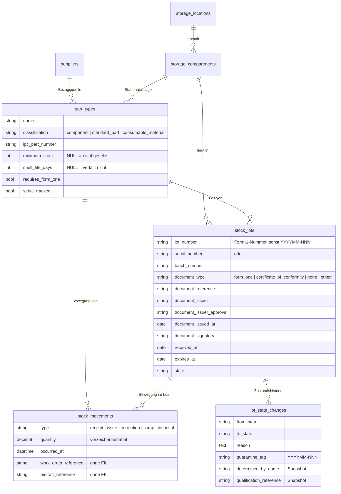

# Lagermodul

**Stand:** 2026-08-04 · Version 0.1.0 · gebaut und getestet

Die erste vertikale Scheibe von Aeronance und zugleich der Nachweis, dass der
Modulschnitt an echter Fachlichkeit trägt. Das Modul ist eigenständig: es
verlangt kein anderes und schließt keines aus. Ein Verein, der nur sein
Ersatzteillager verwalten will, installiert dieses eine Modul.

Die fachlichen Begründungen stehen in [`ANALYSE.md`](ANALYSE.md); dieses
Dokument beschreibt, was daraus gebaut wurde.

---

## 1. Das Datenmodell in einem Bild



**Was auffällt und Absicht ist:** Nirgends steht eine aktuelle Menge. Der
Bestand ist die Summe der Bewegungen (E1). Damit kann das Journal nicht mit
sich selbst uneins sein, eine Korrektur ist eine Gegenbuchung statt einer
Änderung, und die Historie ist das Journal — nicht ein Protokoll daneben, das
gepflegt worden sein mag oder nicht. Der Vorgänger hatte so ein Protokoll; es
war leer.

## 2. Zwei Führungsarten, entschieden vom Bauteiltyp

| | Sammelbestand | Losgeführt |
|---|---|---|
| Beispiel | Muttern, Schrauben | Ölfilter mit Form 1, Schleppkupplung mit S/N |
| Auslöser | keiner der drei rechts | Form 1 **oder** Lagerzeit **oder** Seriennummer |
| Bewegung bucht gegen | Bauteiltyp | Los |
| Frage „woher kam das?" | hat keine Antwort und braucht keine | muss beantwortbar sein |

Die Führungsart ist **abgeleitet**, nicht gespeichert: Sie folgt aus drei
Eigenschaften, die ohnehin existieren. Eine eigene Spalte könnte ihnen
widersprechen — ein als „Sammelbestand" markierter Typ mit Lagerzeit wäre ein
Zustand ohne sinnvolle Bedeutung.

**Seriennummerngeführte Teile sind kein dritter Mechanismus**, sondern der
Sonderfall „Los mit Menge 1". Das Einbuchen von drei Stück auf einmal wird
abgelehnt: die Seriennummer identifiziert genau eines.

## 3. Zustände eines Loses

```
                    ┌──────────── freigeben (qualifiziert) ──────────┐
                    ↓                                                │
            ┌──────────────┐  sperren   ┌─────────────┐  feststellen ┌────────────────┐
            │ serviceable  │───────────>│ quarantined │─────────────>│ unserviceable  │
            │  brauchbar   │<───────────│  gesperrt   │              │  unbrauchbar   │
            └──────────────┘ (qualifiz.)└─────────────┘              └────────────────┘
                    │                          │                             │
                    │       feststellen        │                             │
                    └──────────────────────────┴─────────────┬───────────────┘
                                                             ↓
                                                    ┌────────────────┐  entsorgen  ┌───────────┐
                                                    │ unsalvageable  │────────────>│ disposed  │
                                                    │  ausgemustert  │             │  entsorgt │
                                                    └────────────────┘             └───────────┘
                                                       kein Rückweg          Menge 0, Satz bleibt
```

**Die Trennlinie verläuft zwischen vorsorglich und festgestellt** — nicht
zwischen „gesperrt" und „ausgemustert":

| | Sperren | Feststellen |
|---|---|---|
| Anlass | Papier fehlt, Verdacht | fachliches Urteil |
| Qualifikation nötig | nein | **ja** (Part-66) |
| Rücknehmbar | ja | nur durch eine neue Feststellung |
| Im Datensatz | Verweis auf die Person | **Snapshot**: Name, Lizenz, Kategorie, Gültigkeit |
| Sperrzettel | `YYYYMM-NNN`, nie wiederverwendet | — |

Auch die **Rückgabe in den Bestand** ist eine Feststellung: Sie besagt, dass das
Teil in Ordnung *ist*, und dafür steht jemand ein.

`unsalvageable` ist final. Ein Teil mit erreichter Lebensdauergrenze oder nicht
reparablem Defekt darf nie zurück in den Bestand (145.A.42) — der Übergang
existiert schlicht nicht, auch nicht für Administratoren.

## 4. Rechte

Verben statt Bildschirmen. Der Vorgänger hatte vier undifferenzierte
Lagerrechte, die immer gemeinsam geprüft wurden; die Absicht war erkennbar
feinere Granularität.

| Recht | Was es erlaubt | Qualifikation nötig |
|---|---|---|
| `stock.view` | Bestand ansehen | |
| `stock.receive` | Wareneingang buchen | |
| `stock.issue` | entnehmen | |
| `stock.quarantine` | vorsorglich sperren | |
| `stock.quarantine.certify` | unbrauchbar feststellen, wieder freigeben | **ja** |
| `stock.scrap` | ausmustern, entsorgen | **ja** |
| `stock.report` | Auswertungen | |
| `parts.types.manage` | Bauteiltypen anlegen und ändern | |
| `storage.locations.manage` | Lagerorte und Fächer | |
| `suppliers.manage` | Lieferanten | |

Wareneingang und Bauteiltypverwaltung sind bewusst getrennt (E5): das eine ist
eine Routinehandlung am Regal, das andere eine Stammdatenentscheidung mit
regulatorischer Wirkung.

## 5. Was das Modul nicht ist

Keine Warenwirtschaft (E6). Bezugspunkt ist der Lufttüchtigkeitsnachweis, nicht
der kaufmännische Vorgang.

| Drin | Draußen |
|---|---|
| Los, Form 1, Seriennummer, Charge | Lieferscheine, Bestellungen, Rechnungen |
| Verfall, Mindest-/Maximalbestand | Bestellvorschläge, Lieferantenbewertung |
| Bestandsbewegungen, Rückverfolgbarkeit | Einkaufshistorie, Preisverläufe |
| Lieferant als Stammdatum | Inventurbewertung in Euro |

Ein Preisfeld existiert, ist aber rein informativ; nichts hängt daran.

Ebenfalls draußen: **Betriebszeiten**. Das Lager kennt ausschließlich
kalendarischen Verfall. Flugstunden, Landungen und Zyklen beginnen mit dem
Einbau und gehören ins Flottenmodul.

## 6. Grenzen zu anderen Modulen

`work_order_reference` und `aircraft_reference` an der Bewegung sind **freier
Text ohne Fremdschlüssel**. Arbeitskarten und Flotte müssen nicht installiert
sein; das Lager läuft allein und gewinnt an Bedeutung, wenn die anderen dazu
kommen (D4).

Der Form-1-Nachweis wandert nach vollständiger Ausbuchung in die
Lebenslaufakte. Weil **ein Los in mehreren Luftfahrzeugen enden kann** — vier
Ölfilter, vier Akten — ist die Übergabe eine Referenz und keine Verschiebung.
Deshalb bleiben die **Angaben** zum Nachweis dauerhaft am Los, auch wenn die
Datei geht (4.7 f). Der Übergabepunkt selbst kommt mit dem Flottenmodul.

## 7. Was beim Bauen gefunden wurde

Fünf Fehler, alle von Tests entdeckt und behoben statt umgangen:

1. **`issuable`-Scope fragte nach einem Verfallsdatum, das gleichzeitig leer und
   in der Zukunft liegt.** Kein Los konnte das erfüllen, FEFO schlug nie etwas
   vor.
2. **Ein fehlendes Recht meldete sich als fehlende Qualifikation.** Zwei ganz
   verschiedene Ursachen mit derselben Meldung — das hätte jeden an der
   falschen Stelle suchen lassen.
3. **Ein „Unter Mindestbestand"-Filter, der nichts filterte.** Die Regel, welche
   Bewegungen als verfügbar zählen, liegt jetzt an einer Stelle, mit einem Test,
   der anschlägt, wenn PHP- und SQL-Fassung auseinanderlaufen.
4. **Bestand im Sperrlager war entnehmbar.** Der Zustand blockierte, der
   physische Ort nicht.
5. **Ein deaktiviertes Konto behielt seine Rechte.** Anmelden ging nicht, aber
   jeder Codepfad, der nur „darf die Person?" fragte, sagte ja.

## 8. Dateiablage

Form-1-Scans und Konformitätsbescheinigungen hängen am Los, auf einer **privaten
Disk außerhalb des Webroots** (`storage/app/documents`). Ausgeliefert wird
ausschließlich über eine auth-geprüfte Route, die drei Dinge prüft:

1. Ist das Modul aktiv?
2. Darf die Person den Bestand sehen?
3. **Gehört die Datei zu genau diesem Los?**

Der dritte Punkt ist der wesentliche: Ohne ihn holt eine gültige Los-Kennung
plus einer fremden Datei-Kennung ein Dokument, das den Aufrufer nichts angeht.
Deshalb prüft der Controller die Beziehung, nicht die Datei allein.

Die Liste unterscheidet sichtbar zwischen *Nummer erfasst* und *Scan liegt vor* —
eine Nummer ohne Dokument reicht für die tägliche Arbeit, für ein Audit nicht.

### Was beim Hochladen geprüft wird

der Einwand war richtig: Eine Prüfung, die man durch Umbenennen aushebelt,
ist keine. (Zur Ehrenrettung des Bestands: Der Name war nie das Kriterium —
Filament und die Media Library fragen beide finfo, das den Inhalt liest. Nur ist
finfo ein Rater mit großer Tabelle und Hang zur Antwort.) Deshalb liest
`DocumentIntake` jetzt selbst:

| Prüfung | Was sie fängt |
|---|---|
| **Signatur** — `%PDF-`, `FF D8 FF`, `89 PNG` | alles, was nicht eines der drei Formate ist |
| **Struktur** — `%%EOF`, `FF D9`, `IEND` am Ende | die geliehenen ersten fünf Bytes, und den abgebrochenen Upload |
| **Endung gegen Inhalt** | ein echtes PNG namens `.pdf` — kein Versehen, das jemand zweimal macht |
| **Größe** | vor allem anderen, damit kein Scanner Riesiges gereicht bekommt |
| **ClamAV** | optional, siehe unten |

Was bewusst **nicht** passiert: PDFs nach `/JavaScript` oder `/OpenAction`
durchsuchen. Solche Prüfungen lehnen echte Dokumente echter Software ab, und
das, worauf sie zielen, ist an der richtigen Stelle gelöst — siehe unten.

SVG steht nicht auf der Liste und wird es nicht: ein Dokumentformat, das Skript
ausführt. Kein Form-1-Scan war je ein SVG.

### Virenprüfung

Aus, solange nichts eingerichtet ist — ein Vereins-LXC hat in der Regel keinen
clamd. Eingeschaltet über `AERONANCE_VIRUS_SCANNER=clamav`.

Gesprochen wird clamds **INSTREAM-Protokoll über einen Socket**, nicht
`clamscan` auf der Kommandozeile. Drei Gründe: `clamscan` lädt bei jedem Aufruf
die ganze Signaturdatenbank (Sekunden, viel Speicher), es gibt keine
Kommandozeile, die man falsch bauen kann — ein Dateipfad wird nie Teil eines
Shell-Strings —, und ein Socket funktioniert gleich, ob clamd auf demselben Host
läuft (Unix-Socket, LXC) oder im Nachbarcontainer (TCP, Docker).

**Ist der Scanner eingeschaltet und nicht erreichbar, wird abgelehnt.** Wer die
Prüfung einschaltet, will nicht, dass sie sich beim Absturz des Dienstes still
selbst abschaltet — das ist der Zustand, den man am wenigsten bemerkt. Umstellbar
über `AERONANCE_CLAMAV_FAIL_CLOSED=false`.

### Die Auslieferung ist der eigentliche Angriffspunkt

Diese Route liefert **vom Angreifer gelieferte Bytes aus der eigenen Origin**
aus. Überredet man einen Browser dazu, sie als HTML zu behandeln, läuft
enthaltenes Skript mit der Sitzung dessen, der die Datei geöffnet hat — Stored
XSS mit vollem Zugriff auf das Panel. Vier Header stehen zwischen diesen beiden
Sätzen:

- **`Content-Type` aus den ersten Bytes der Datei**, nicht aus der
  `mime_type`-Spalte. Eine Spalte kann falsch sein; die Bytes *sind* die Datei.
- **`X-Content-Type-Options: nosniff`** nimmt dem Browser die Entscheidung ab.
- **`Content-Security-Policy: default-src 'none'; object-src 'none'; sandbox`** —
  selbst wenn beides versagte, gibt es nichts zu laden und keine Origin zu
  handeln.
- **`Referrer-Policy: no-referrer`**.

Nicht Erkennbares geht als `application/octet-stream` mit `attachment` raus —
heruntergeladen, nicht dargestellt. Deshalb braucht es keine Heuristik gegen
Polyglots: Statt zu raten, was eine Datei vorhat, bekommt der Browser gar keine
Wahl.

### Zwei Fehler, die dabei rausfielen

- **Das Größenlimit widersprach sich:** 20 MB im Formular gegen 10 MB
  Paket-Standard der Media Library. Eine Datei dazwischen kam durch die
  Validierung und flog danach mitten im Buchungsvorgang mit `FileIsTooBig`
  auf die Nase. Beide lesen jetzt `AERONANCE_DOCUMENT_MAX_MB`.
- **Der Media-Library-Standard zeigte auf die öffentliche Disk.** Für die
  Nachweise am Los fiel das nicht auf, weil die Collection ihre Disk selbst
  setzt — die nächste Collection, die das vergisst, hätte im Web gelegen. Der
  Standard ist jetzt `documents`.

## 9. Was noch fehlt

**Braucht eine Entscheidung von Vorgabe: **

- **Losaufkleber (F36).** Vorgabe vom 2026-08-03: „wir brauchen losaufkleber für
  die Teile. kommen aus dem thermodrucker."

  **Nicht der Sperrzettel.** Der hängt an gesperrter Ware und ist binnen Wochen
  erledigt; der Losaufkleber klebt an eingelagerter Ware und liegt Jahre. Auch
  die Ausgabe ist eine andere: Bogenraster gegen Endlosrolle.

  **Zur Haltbarkeit entschieden:** Abschnitt 10 hält fest, dass
  Thermodirektdruck nach 3 bis 12 Monaten verblasst. Vorgabe: „bei den
  Losnummern gehe ich davon aus das diese nicht so lange liegen." Der
  Sperrzettel bleibt also beim Farblaser, der Losaufkleber darf aus dem
  Thermodrucker kommen. *Im Blick behalten:* Teile mit langer Lagerzeit —
  Gummi, Klebstoffe, Dichtungen — liegen sehr wohl Jahre; dafür genügt der
  Nachdruck.

  **Die Losnummer ist bereits gebaut** — siehe `LotNumber` und Abschnitt 16.

  **Zu entscheiden:** Gerät und Etikettenbreite · Inhalt (Vorschlag:
  Losnummer, Teilenummer, Bezeichnung, Lagerort und ein **Code zum Scannen** —
  keine Menge, die ist ab der ersten Entnahme falsch) · Druck beim Einbuchen
  automatisch oder auf Knopfdruck · Nachdruck muss möglich sein, Etiketten
  fallen ab.

  **Nicht zu entscheiden, weil schon entschieden:** der Ausgabeweg. HTML mit
  Millimeter-Geometrie wie beim Sperrzettel, kein PDF — die Begründung steht in
  Abschnitt 10 und gilt unverändert. Dazu ein Kalibrierbogen je Drucker.

- **Eingehende Bestellungen (F37).** Nur vorgemerkt, ausdrücklich nicht zu
  bauen. Siehe [`ANALYSE.md`](ANALYSE.md).

**Erledigt seit dem letzten Stand:**

- **Einheiten (F17)** — Auswahl statt freiem Text, gruppiert, mit Zoll, Fuß und
  Pfund; eigene Einheiten bleiben möglich. Siehe Abschnitt 17.
- **Dokumentart mit Freitext (F5)** — mit der Grenze, dass ein selbst benanntes
  Papier niemals als Form-1-Nachweis durchgeht. Siehe Abschnitt 17.
- **Wareneingang ohne Form 1 (F28 neu)** — wird nicht mehr gesperrt eingebucht,
  sondern gar nicht. Siehe Abschnitt 17.
- Sperrzettel (F34) — Nummernkreis, drei Layouts, Kalibrierbogen. Siehe
  Abschnitt 10.
- Inventurbericht und Erfassungsmaske (F16) — Stichtag, getrennte Felder für
  Fehl- und Mehrmengen. Siehe [`INVENTURBERICHT.md`](INVENTURBERICHT.md).
- **Ausbau** — Teile, die aus einem Luftfahrzeug kommen. Siehe Abschnitt 11
  und [`AUSGEBAUTE-TEILE.md`](AUSGEBAUTE-TEILE.md).
- **Zur Reparatur** — der Weg weg und zurück, und damit der einzige Weg, eine
  Luftfahrzeugbindung aufzulösen. Siehe Abschnitt 12.
- **Korrekturen und Vernichtung** — Gegenbuchungen, Bewegungsjournal,
  automatischer Verfall und der Weg für abgelaufenes Material. Siehe
  Abschnitt 13.
- **Umlagerung** zwischen Fächern, mit der Sperrlager-Regel. Siehe Abschnitt 14.

**Ohne Entscheidung baubar:** siehe Abschnitt 15.

---

## 10. Sperrzettel

Gedruckt wird als **HTML mit Millimeter-Geometrie**, nicht als PDF. Die übliche
PDF-Bibliothek ist doppelt blockiert: ihre ersten beiden Hauptversionen tragen
eine lange Liste von Sicherheitshinweisen, die dritte läuft noch nicht auf
PHP 8.5. Der Browser druckt stattdessen — mit Vorschau, ohne Serverabhängigkeit.

Das eine echte Risiko dabei ist ein Drucker, der die Seite stillschweigend
skaliert. Dagegen gibt es den **Kalibrierbogen**: ein Lineal über 100 mm und
Kästchen, die genau 90 × 50 mm messen müssen. Einmal je Drucker.

| Layout | Zweck |
|---|---|
| **Bogen** | Avery Zweckform T2002-10, 10 Anhänger je A4, mit Faden. Belegte Positionen lassen sich überspringen, damit ein einzelner Zettel nicht zehn kostet |
| **Einzeln** | ein Zettel mit Schnittmarke, für Blankokarton in Rot, Weiß oder Grün |
| **Kalibrierung** | Messbogen |

Auf dem Zettel: laufende Nummer, Bauteilbezeichnung, Los- und Seriennummer,
Kennzeichen und Muster, Datum, Name und eine Linie zum Unterschreiben.

**Eingefärbt wird der Kopf** — die Seite mit dem Loch, an der der Anhänger hängt,
bei T2002-10 die abgeschrägte. Genau die sieht man, wenn mehrere Anhänger
übereinander liegen oder gebündelt an einem Haken hängen; ein Band oben am
Zettel verschwindet dabei.

**Die Farbe kommt aus dem Datensatz**, nicht von der Person am Drucker. Damit
kann die falsche Farbe nicht versehentlich an einem Teil landen.

### Farbzuordnung

Voreingestellt ist die international verbreitete Konvention aus den
US-Militärvordrucken (DD 1574 ff.), die in der Branche weithin gelesen wird:

| Zustand | Farbe | |
|---|---|---|
| brauchbar | **gelb** | |
| gesperrt, Entscheidung offen | **blau** | wartet auf Prüfung |
| unbrauchbar | **grün** | ⚠ heißt *instandsetzbar*, nicht *gut* |
| ausgemustert | **rot** | |
| entsorgt | grau | |

**Vorgeschrieben ist davon nichts** — keine EASA-Vorschrift regelt
Anhängerfarben. Die Zuordnung steht deshalb in `config/aeronance.php` und lässt
sich ändern. Der Zettel trägt den Zustand ohnehin zusätzlich in Worten, damit
ein falsch gelesener Farbcode nicht zum falschen Schluss führt.

### Die drei Wege, an bunte Anhänger zu kommen

| | Weg | Bewertung |
|---|---|---|
| **A** | Weißer T2002-10, Farbe aus dem Farblaser | Ein Verbrauchsmaterial, Farbe kommt aus den Daten. Faden statt Draht, 90 × 50 mm. **Voreinstellung** |
| **B** | Vorgefertigte Anhänger aus farbigem Karton mit Metallöse und Draht, dazu ein aufgeklebtes Laseretikett | Deutlich robuster für die Werkstatt, Farbe steckt im Karton statt in der Tonerdecke, mehr Platz. Zwei Verbrauchsmaterialien, ein Klebeschritt, und die Farbe wird von Hand gegriffen — deshalb steht der Zustand auf dem Etikett auch in Worten. Gibt es als „QS-Warenanhänger" bei Anbietern für Qualitätssicherung |
| **C** | Etikettendrucker | Einzeldruck ohne Bogenverschnitt. **Nur Thermo*transfer*, nicht Thermodirekt** |

Zu **C** eine Präzisierung, weil der Unterschied hier entscheidet:
**Thermodirektdruck** hält 3 bis 12 Monate — Licht, Wärme und Reibung lassen ihn
verblassen. Für einen Zettel, der monatelang an einem Teil hängt, ist das
disqualifizierend, und der Einwand trifft genau zu. **Thermotransferdruck**
mit Harz-Farbband dagegen übersteht UV, Feuchtigkeit, Chemikalien und Abrieb;
zehn Jahre und mehr sind realistisch. Wer schon einen Thermotransferdrucker
hat, kann ihn also verwenden.

Gebaut sind **A** und **B** (`?layout=labels`); **C** braucht nur ein passendes
Etikettenformat in der Konfiguration.

Die Bogengeometrie steht in `config/aeronance.php` und nicht im Code:
Stanzmaße unterscheiden sich zwischen Herstellern und sogar Chargen, und ein um
zwei Millimeter verschobener Druck macht einen ganzen Bogen unbrauchbar. Die
Voreinstellung ist aus dem A4-Format errechnet und **vor dem ersten
Serieneinsatz einmal gegen ein echtes Blatt zu prüfen**.

---

## 11. Ausbau

Ein Los entsteht seit jeher beim Wareneingang. Jetzt entsteht es auch beim
**Ausbau aus einem Luftfahrzeug** — der Fall, den die Akaflieg für Instrumente
braucht: raus aus der D-KABC, ins Regal, später wieder rein.

`stock_lots.origin` unterscheidet die beiden Herkünfte (`supplier`, `removal`);
ein Ausbau-Los trägt zusätzlich Kennzeichen, Muster, Ausbaudatum und Grund.
Ansonsten ist es ein Los wie jedes andere — dieselbe Nummerierung, dieselben
Zustände, dieselbe Ausbuchung.

Drei Regeln, und jede hat einen Grund:

| Regel | Warum |
|---|---|
| **Brauchbar ausgebaut ist eine Feststellung** — Part-66-Lizenz nötig, Snapshot unveränderlich | Dieselbe Aussage wie „unbrauchbar", nur andersherum. Wer dafür einsteht, steht namentlich drin |
| **Ohne Feststellung → Sperrbestand** | Ein Teil unbekannten Zustands ist kein Fehler, den man wegwirft, sondern ein Zustand, den man erfasst |
| **TBR kommt nicht zurück** | Zündkerzen und Schläuche werden getauscht. Sie einzulagern lädt dazu ein, sie wieder einzubauen |

Und die vierte, die aus einer Vorgabe folgt — dass ein Vereinsbetrieb
keine Bauteile reparieren darf:

> **Ohne Form 1 geht ein ausgebautes Teil nur in dasselbe Luftfahrzeug zurück.**

Erzwungen bei der Ausbuchung, nicht bloß angezeigt. Kommt später ein Form 1
dazu, fällt die Einschränkung von selbst weg.

Die Einschränkung greift nicht erst beim Buchen, sondern schon bei der Auswahl:
Die Ausgabemaske blendet Lose aus, die zum eingetragenen Kennzeichen nicht
passen, und sagt darunter, wie viele und warum. Wird das Kennzeichen erst nach
der Loswahl eingetragen — die übliche Reihenfolge, denn das Feld steht weiter
unten —, wird ein nicht mehr passendes Los abgewählt und das gemeldet. Eine
Ablehnung erst beim Buchen wäre zwar richtig, aber zu spät: Dann ist das Los
gewählt, die Menge getippt, und die Wand kommt überraschend.

Wichtig für den Datenfluss: **Kennzeichen und Muster gehören dem Flottenmodul.**
Solange es fehlt, ist das freier Text. Danach liefert die Flotte die Angaben beim
Ausbau mit und das Lager schreibt sie fest — die Gegenrichtung zum Form 1, das
das Lager an die Lebenslaufakte abgibt.

---

## 12. Zur Reparatur

Der dritte Weg aus dem Lager, und weder eine Entnahme noch eine Ausmusterung.
Eine Entnahme beendet das Leben des Teils im Lager, eine Ausmusterung sein
Leben überhaupt. Das hier ist eine Reise, von der es zurückkommen soll — die
Buchung muss also einen Faden dranlassen.

**Warum das mehr ist als eine Komfortfunktion:** Festgelegt ist, dass
kein Verein eine Komponentenberechtigung hat und man erstmal davon ausgehen
soll, dass niemand eine hat. Damit ist das hier der **einzige legale Weg**, auf
dem ein an ein Luftfahrzeug gebundenes Teil wieder frei verwendbar wird: weg zu
einem Betrieb, der die Berechtigung hat, und zurück mit dessen Form 1. Die
Bindung wird nicht umgangen, sondern von jemandem aufgelöst, der das darf.

### Was das Lager dabei tut

Es führt keinen Reparaturablauf. Es beantwortet zwei Fragen: **Wo ist das
Teil, und kommt es wieder?** Alles Weitere ist Sache des Betriebs — oder des
Komponentenreparaturmoduls, falls es das je gibt.

Vorher fiel ein weggegebenes Teil in dem Moment aus den Büchern, in dem es ins
Paket ging. „Wo ist die Schleppkupplung?" hatte keine Antwort.

### Zwei Regeln, und nur zwei

| Regel | Warum |
|---|---|
| **Gesperrte und als unbrauchbar festgestellte Teile dürfen weg** | Das ist der Normalfall. Diese Aktion läuft bewusst **nicht** über `IssueStock::assertIssuable()` — das würde genau die Teile ablehnen, die repariert werden müssen |
| **Als nicht instandsetzbar festgestelltes darf nicht** | Diese Feststellung ist endgültig (145.A.42). Weggeben und Zurückbuchen wäre exakt der Rückweg ins System, den sie verhindern soll |

Eine Qualifikation braucht es **nicht**. Ein Teil ins Paket zu legen sagt nichts
über seine Lufttüchtigkeit; die Feststellung „unbrauchbar" ist vorher gefallen,
von jemandem mit Lizenz, und steht bereits im Datensatz.

### Was zurückkommt

Ein **neues Los**, nicht das alte wiederbelebt. Ein Los ist eine Menge unter
**einer** Bescheinigung, und nach der Reparatur ist die Bescheinigung ein
anderes Dokument von einem anderen Betrieb. Das alte Los wiederzuverwenden
würde das neue Papier an den alten Datensatz heften und stillschweigend
umschreiben, was der Nachweis des Teils einmal war.

Was auf dem Papier zurückkommt, entscheidet alles:

| Rückkehr | Zustand | Bindung |
|---|---|---|
| **mit Form 1** | brauchbar | **erledigt** — dafür ist es weggegangen |
| **ohne** | Sperrbestand | bleibt bestehen |

Der zweite Fall ist kein Fehlerpfad. Ein Betrieb schickt ein Teil auch mal
unangetastet zurück oder mit einem Kostenvoranschlag statt einer Bescheinigung,
und das muss buchbar sein. Nach ML.A.504 ist ein Teil, dessen Lufttüchtigkeit
sich nicht feststellen lässt, nicht brauchbar — und zu seinen Gunsten zu raten
ist genau die Vermutung, die man nicht anstellen darf.

Kommt es gar nicht zurück (Totalschaden, Postverlust, Kostenvoranschlag über
Neupreis), schließt **Abschreiben** den offenen Vorgang. Es bucht nichts zurück:
Die Menge ist beim Versand abgegangen und steht seitdem im Journal.

### Das Ziel

Zwei Antworten, von denen es heute nur eine gibt:

- **Externer Betrieb** — ins Paket. Der Normalfall und derzeit der einzige.
- **Eigene Komponentenwerkstatt** — nur mit dem Modul `component-repair`, das
  es nicht gibt. Die Option ist deklariert statt weggelassen, damit die Naht
  jetzt liegt und später nicht geschnitten werden muss.

### Die Liste

„In Reparatur" zeigt, was unterwegs ist, mit Zähler am Menüpunkt — nur die
offenen, denn ein Zähler, der alles je Zurückgekehrte mitzählt, ändert nach
einem Jahr seine Bedeutung nicht mehr. Überfällige färben ihn ein. Das ist
kein Fehler, Betriebe brauchen länger als angekündigt; aber an ein Teil, das
seit acht Monaten weg ist, denkt niemand mehr — und genau dann wird es im Kopf
abgeschrieben, während es in den Büchern noch steht.

---

## 13. Korrekturen und Vernichtung

Zwei Wege, die beide daran hingen, dass Bestand die Summe seiner Bewegungen ist
(E1) — und die beide fehlten.

### Die Korrektur

`reverses_movement_id` lag seit der ersten Migration im Schema, und **nichts hat
je hineingeschrieben**. Der einzige Weg, irgendetwas zu berichtigen, führte über
die Inventur. Jeder gewöhnliche Verdreher — falsches Los, doppelt gebucht,
vertippte Menge — musste sich als Zähldifferenz verkleiden.

**Eine Korrektur ist keine Änderung.** Die ursprüngliche Buchung bleibt, wo sie
ist, und daneben entsteht eine zweite, entgegengesetzte, die auf sie verweist.
Beide zusammen erklären, was passiert ist — so sieht eine Korrektur auf Papier
auch aus. Ein Journal, dessen Einträge man überschreiben kann, ist kein Journal;
das Modell selbst verweigert `update` und `delete`.

Zwei Verweigerungen tragen das Gewicht:

| | |
|---|---|
| **Eine Vernichtung lässt sich nicht zurücknehmen** | Die Gegenbuchung würde behaupten, das Teil liege wieder im Regal, während es in der Tonne ist. War die Vernichtung selbst falsch gebucht, ist das ein neuer Zugang mit Erklärung — keine Behauptung, sie hätte nie stattgefunden |
| **Nichts wird zweimal zurückgenommen** | Sonst lässt sich derselbe Fehler wiederholt korrigieren, jedes Mal weiter weg von der Wahrheit, und die Verweiskette bedeutet nichts mehr |

Dazu eine dritte, die beim Bauen dazukam: Ein **Zugang, aus dem seither entnommen
wurde**, lässt sich nicht mehr voll zurücknehmen — das Los ginge unter null. Der
Bestand ist nicht verschwunden, weil der Beleg falsch war; die ehrliche Antwort
ist eine Inventurdifferenz.

Reparaturabgänge und -rückkehren stehen bewusst nicht zur Korrektur: Sie haben
einen eigenen Weg, der den Reparaturvorgang mitführt.

### Das Journal

Es gab in der Oberfläche **keines**. Bewegungen waren nur in der Detailansicht
eines einzelnen Loses und im gedruckten Bericht zu sehen — „was ist im März mit
dem Teil passiert" hatte keinen Bildschirm. Jetzt gibt es ihn, lesend, mit
Filtern nach Art und Bauteil, und die Korrektur ist die einzige Aktion darin.
Angeboten wird sie nur dort, wo sie auch durchgeht; eine Aktion, die immer
dasteht und meistens ablehnt, erzieht dazu, Ablehnungen zu übersehen.

Beide Enden der Kette stehen am Eintrag: „Gegenbuchung zu #47" am einen,
„am 12.03. korrigiert" am anderen.

### Die Vernichtung

Es gab einen Weg, aber er hatte drei Löcher — und deine beiden Beispiele fielen
in alle drei:

| Loch | Folge |
|---|---|
| **Sammelbestand ging gar nicht** | `ChangeLotState` braucht ein Los. Eine korrodierte Kiste Muttern konnte nur als „Inventurdifferenz" verschwinden — Vernichtung unter Zählfehler abgelegt, genau die Vermischung, die ein Journal verhindern soll |
| **Nur ganze Lose** | Drei beschädigte Filter von zehn hatten keinen Weg |
| **Abgelaufenes Harz kostete drei qualifizierte Akte** | unbrauchbar → nicht instandsetzbar → entsorgt, für etwas, dessen Verfallsdatum das System selbst kennt. Das absehbare Ergebnis ist, dass es jemand wegwirft und nichts erfasst |

Vernichtung ist jetzt modelliert als **das, was sie ist**: eine Menge, die
abgeht, weil sie nicht mehr existiert. Der Loszustand folgt der Menge statt sie
zu führen — durch Vernichtung geleert ist das Los entsorgt, teilvernichtet
behält es seinen Zustand, weil der Rest unverändert ist.

**Der Datensatz bleibt.** Losnummer, Bescheinigungsdaten und Historie bei Menge
null, denn sonst geht der Nachweis, dass es das Teil je gab, mit dem Müll raus —
und genau danach fragt ein Audit.

Ein Detail, das ein Angreifer-Test erzwungen hat: Der **Zustandsautomat bleibt
eng**. „Brauchbar → entsorgt" im Zustandsfeld ist weiterhin abgelehnt, sonst
wird die Zustandsauswahl zum Löschknopf. Vernichten geht trotzdem — weil es
keine *Aussage über den Zustand* ist, sondern eine Handlung. Die Menge hat
aufgehört zu existieren; dass das Los danach „entsorgt" heißt, ist
Buchhaltungsfolge, keine Behauptung über Lufttüchtigkeit.

Der Bildschirm führt mit dem, **was bereits verfallen ist**. Das ist der
häufigste Grund, etwas wegzuwerfen, und der am leichtesten übersehene:
Verfallenes liegt im Regal und sieht aus wie alles andere. Ein Klick übernimmt
Los, Menge und Grund.

### Verfall läuft von allein

die Entscheidung, und sie räumt etwas ab, das still falsch war: Ein
abgelaufenes Los stand im Zustand **brauchbar**, während `isIssuable()` nein
sagte. Zwei Stellen erzählten verschiedene Geschichten über dieselbe Dose — und
gelesen wurde die falsche.

Jetzt setzt der Verfall den Zustand selbst:

```
Ablaufdatum überschritten ──► unbrauchbar   (nachts, ohne Person)
                                  │
                                  └─► vernichten   (ein menschlicher Akt)
```

**Warum das automatisch laufen darf, ist genau der Grund, warum es das soll:**
Es ist keine Feststellung. Niemand beurteilt, ob das Harz noch taugt — ein Datum
ist überschritten, und das Datum kennt das System selbst. E8 reserviert
Feststellungen für qualifiziertes Personal, weil es Urteile sind; Rechnen ist
keines. Also wird keine Lizenz festgeschrieben und `user_id` bleibt leer. Der
Eintrag sagt, dass das System es war, weil das System es war.

Damit fällt auch der Schritt weg, an dem du dich gestoßen hast: „nicht
instandsetzbar" wird nie gebraucht. Vernichten überspringt die Zustandskette
ohnehin, weil die Menge aufhört zu existieren, statt beurteilt zu werden.

**Eine Sicherung**, damit die Software nicht gegen einen Menschen arbeitet: Hat
jemand Qualifiziertes ein abgelaufenes Los bewusst wieder freigegeben — der
Hersteller hat die Lagerzeit verlängert, das Datum ist nur noch nicht gepflegt —
bleibt diese Entscheidung stehen. Der richtige Weg dort ist das Datum, nicht ein
nächtlicher Streit um den Zustand.

Läuft als `aeronance:expire-stock`, täglich um 04:00 — früh genug, dass ein über
Nacht verfallenes Los schon „unbrauchbar" liest, bevor der Erste am Regal steht.
Das Kommando fragt den ModuleManager, bevor es etwas tut; ein abgeschaltetes
Modul führt keine Jobs aus.

### Wer vernichten darf

Ebenfalls entschieden, und die Linie liegt da, wo die Vorschrift sie zieht:

| | Berechtigung | Part-66 |
|---|---|---|
| **Bauteil** | `stock.scrap` | **ja** |
| **Standard Part** | `stock.scrap` | nein |
| **Verbrauchsmaterial** | `stock.scrap` | nein |

Die Part-66-Bindung existiert für die **Statussetzung nach 145.A.42**, und die
betrifft Bauteile. Zu sagen, dass ein Bauteil nie wieder fliegt, ist ein Urteil,
für das jemand einsteht.

Eine Kiste korrodierter Muttern und eine Dose abgelaufenes Harz sind das nicht.
Dort ist die Regel das Datum oder das Offensichtliche, und eine Lizenz dafür zu
verlangen kauft nichts: Entweder macht der Lizenzinhaber Lagerarbeit, oder es
wird weggeworfen und nichts erfasst — genau das Ergebnis, das ein Journal
verhindern soll. Die Berechtigung greift weiterhin, Grund und Person werden so
oder so festgeschrieben.

Ein Schalter, eine Stelle: `DisposeStock::requiresQualification()`.

---

## 14. Umlagerung

Ein Los in ein anderes Fach zu stellen ist **keine Bestandsbewegung**: Es wird
nichts zugebucht, entnommen oder vernichtet, dieselbe Menge liegt nur woanders.
Im Journal wäre es falsch, denn dort ist jede Zeile eine Änderung daran, wie
viel da ist. Erfasst wird es trotzdem — über das Aktivitätsprotokoll, in das
`stock_lots` bis dahin als einziges Modell gar nicht geschrieben hat. Ein Los
konnte quer durchs Lager wandern, ohne dass irgendwo stand, von wem; dieselbe
Änderung am Bauteiltyp wird seit dem ersten Tag protokolliert.

Interessant ist nicht der Adresswechsel, sondern das **Sperrlager**. 145.A.42
will unbrauchbaren Bestand räumlich von brauchbarem getrennt haben, und die
Prüfung dazu gibt es schon — `IssueStock` lehnt ein Los aus einem Sperrfach ab,
selbst wenn sein Zustand etwas anderes sagt. Nur greift sie beim Entnehmen, und
bis dahin liegt das Teil monatelang zwischen dem guten Bestand.

Zwei Regeln, spiegelbildlich:

| Richtung | Was passiert |
|---|---|
| **ins Sperrlager** | sperrt das Los. Räumliche Trennung *ist* die Sperrung; der Zustand weiter auf „brauchbar" wäre wieder das Problem, das der Verfall hatte. Vorsorglich und umkehrbar, also ohne Qualifikation (E8) — mit nummeriertem Sperrzettel wie jede andere Sperrung |
| **heraus** | abgelehnt, solange das Los gesperrt ist. Sonst wird „stell es zurück ins Regal" zur Freigabe, die niemand erteilt hat |

### Wo ich die Regel erst zu breit gezogen hatte

Der erste Entwurf lehnte **jede** Umlagerung eines gesperrten Loses in normales
Lager ab. Die Tests haben gezeigt, warum das falsch war: Ein Los, das ohne Papier
ankommt, ist gesperrt und liegt trotzdem im gewöhnlichen Fach — die Regel hätte
es genau dort festgenagelt. Und ein Verein ohne eingerichtetes Sperrlager hätte
so ein Los überhaupt nicht mehr bewegen können.

Eine Umlagerung zu verbieten, die die Trennung gar nicht verschlechtert, bringt
nichts außer dass jemand die Kiste trotzdem trägt und nichts erfasst — dasselbe
Muster wie beim Harz. Verboten ist deshalb nur, eine **bestehende** Trennung
aufzuheben. Der Rest ist ein Hinweis: Wer gesperrten Bestand zwischen brauchbaren
stellt, bekommt gesagt, dass er ins Sperrlager gehört.

Die Aktion sitzt an der Zeile in der Losliste, nicht auf einer eigenen Seite —
man schaut das Los an, wenn man es umlagern will. Sammelbestand braucht nichts
Eigenes: Dessen Fach hängt am Bauteiltyp und ist dort seit jeher änderbar und
protokolliert.

---

## 15. Spätere Erweiterungen

Bewusst außerhalb des Lagermoduls, in der Reihenfolge, in der sie sinnvoll
werden:

- **Komponentenreparaturmodul (`component-repair`).** Grundannahme bleibt, dass
  kein Vereinsbetrieb Bauteile instand setzen darf — daraus folgen die
  Ausbau-Regel und der Reparaturweg oben. Ein Betrieb mit Komponenten-
  berechtigung dürfte es; daran hängt aber die vollständige Form-1-Dokumentation
  (Block 12/13, Berechtigungsumfang, Prüfnachweise, Zeichnungsberechtigte). Das
  ist ein eigenes Modul, kein Häkchen im Lager.

  **Die Naht liegt schon:** `RepairDestination::InHouse` existiert und ist auf
  genau diesen Modulnamen gehängt. Solange er nicht installiert ist, wird das
  Ziel nicht angeboten und eine Buchung dorthin abgelehnt. Kommt das Modul, wird
  aus der Reparatur eine interne Übergabe statt eines Pakets — ohne dass an
  Spalte oder Prüfung etwas zu ändern wäre.
- ~~**Übergabepunkt des Form 1 an die Lebenslaufakte**~~ — gebaut. Das Lager
  wirft `PartIssuedToAircraft`, die Flotte hört darauf
  (`RecordIssuedPartAsInstallation`) und legt den Einbau an. Der Ereignisweg ist
  dabei Absicht: keines der beiden Module greift in die Tabellen des anderen.
- **Preise, Bestellungen, Lieferantenvergleich** — als Zusatzmodul, ausdrücklich
  nicht im Lagerkern (E6).

---

## 16. Die Losnummer

> Vorgabe: „Als losnummer hätte ich gerne, soweit vorhanden, die Nummer vom
> Form 1. Wenn nicht müssen wir eine andere nehmen."

Wer im Regal steht und wissen will, welches Papier zu diesem Teil gehört, liest
die Nummer ab und findet sie auf dem Dokument wieder — ohne Umweg über eine
zweite, hausgemachte Nummer, die nur dieses System kennt.

Gebaut in `LotNumber`, benutzt von allen vier Wegen, auf denen ein Los
entsteht:

| Weg | Nummer |
|---|---|
| **Wareneingang** | Form-1-Nummer, sonst `YYYYMM-NNN` |
| **Rückkehr aus der Instandsetzung** | Form-1-Nummer des Betriebs, sonst laufend |
| **Ausbau aus einem Luftfahrzeug** | immer laufend — der Nachweis ist die Feststellung, und die hat keine Zertifikatsnummer |
| **Fund bei der Inventur** | immer laufend — ein gefundenes Teil *hat* kein Form 1, das ist ja der Grund |

### Drei Dinge, die nicht offensichtlich waren

**1. Ein Form 1 kann mehrere Lose decken.** Die Blöcke 6 bis 12 des Vordrucks
sind eine *Tabelle* — ein Zertifikat trägt mehrere Positionen, und jede wird
hier ein eigenes Los. Die Losnummer ist aber eindeutig, weil sie auf dem
Aufkleber steht und ein Regal nicht zweimal dasselbe Schild verträgt. Die
zweite Position bekommt deshalb `-2`, die dritte `-3`.

**2. Form-1-Nummern sind nur beim Aussteller eindeutig.** Zwei Betriebe dürfen
dieselbe schlichte „12345" vergeben, und irgendwann treffen sich die beiden im
selben Lager. Derselbe Zähler löst auch das.

**3. Nachträglich wird nicht umnummeriert.** Kommt die Ware vor dem Papier
(F28), bekommt das Los eine erzeugte Nummer und **behält sie**, auch wenn das
Form 1 später eintrifft. Eine Nummer, die sich ändert, ist keine Nummer: Sie
steht dann schon auf einem Aufkleber, in Bewegungen und womöglich in einer
Freigabe. Die Form-1-Nummer ist über `document_reference` ohnehin durchsuchbar
— beide Wege führen zum selben Los.

Sonderzeichen werden gefiltert, **Schrägstriche und Punkte aber nicht**:
„24/0815" und „240815" sind zwei verschiedene Nummern, und sie gleichzumachen
wäre schlimmer als ein ungewohntes Zeichen auf dem Etikett. Zu lange Nummern
werden gekürzt — die Losnummer muss auf ein Etikett passen und von Hand
abschreibbar sein — und bekommen dann den Zähler, damit aus zwei verschiedenen
langen Nummern nicht dieselbe kurze wird.

---

## 17. Nachweis, Einheiten und der Wareneingang

*Drei Änderungen vom 2026-08-04, die zusammengehören: Sie betreffen alle die
Frage, was ein Los über sich selbst behauptet.*

### Ohne Form 1 wird nicht eingebucht

> Vorgabe: „ein los geht erst dann ins lager wenn das form1 da ist. vorher liegt
> es im wareneingang und ist noch nicht verbucht."

Vorher entstand in diesem Fall ein Los im Zustand **gesperrt**. Das war eine
Stufe zu weit: Ein gesperrtes Los *ist* Lagerbestand. Es hat eine Losnummer,
steht in Listen, wird bei der Inventur gezählt und muss von jemandem entsperrt
werden. Der Karton im Wareneingang ist nichts davon — er ist schlicht noch
nicht angekommen.

`ReceiveStock` verweigert die Einbuchung jetzt, **bevor irgendetwas entsteht**:
kein Los, keine Bewegung. Verweigert wird nur, was auch verlangt ist — Standard
Parts und Verbrauchsmaterial ohne `requires_form_one` gehen unverändert direkt
ins Regal.

**Damit bleibt die Sperre das, wofür sie gedacht ist:** ein Urteil über ein
Teil, das im Lager ist. Die Wege dorthin sind unverändert Ausbau, Inventurfund,
Verfall und die ausdrückliche Sperrung.

### Einheiten: Liste mit Ventil

`UnitsOfMeasure` — gruppiert nach Stück, Länge, Fläche, Volumen und Masse.
**Zoll, Fuß und Pfund sind dabei**, weil Luftfahrtteile in imperialen Maßen
kommen; und es wird **nicht umgerechnet**: „3,048 m Draht" statt „10 ft" ist im
Regal nicht wiederzuerkennen.

Eine eigene Einheit bleibt möglich und **verschwindet nach dem Speichern nicht
aus der Auswahl** — sonst ersetzte das nächste Bearbeiten sie stillschweigend
durch eine andere.

### Dokumentart: dieselbe Form, andere Schärfe

`DocumentTypes` — die drei aus F33 plus selbst benannte Papiere. Der
Unterschied zu den Einheiten ist die Folge eines Fehlers:

> **Ein selbst benanntes Papier gilt NIEMALS als Form-1-Nachweis** — auch dann
> nicht, wenn es „Form 1" heißt.

`document_type === 'form_one'` steuert die Nachweislogik: `hasRequiredDocument()`,
die Sperre bei fehlendem Nachweis, ob ein ausgebautes Teil in ein *anderes*
Luftfahrzeug darf. Ein frei eingetragenes „EASA Form 1" wäre für den Menschen
dasselbe Wort und für das System ein anderer Wert — und ein Los, das nach
Nachweis aussieht und keinen hat, ist genau der Zustand, den ML.A.504
verhindern will.

Getragen wird die Grenze von einem Präfix (`other:`), das niemand von Hand
tippt, ohne es zu merken; die Prüfung auf Form 1 vergleicht unverändert exakt.
Einmal benannte Papiere tauchen in der Auswahl wieder auf, damit aus einem
Papier nicht fünf Schreibweisen werden.
